# 2.1. Working with gapped records (EDF+D)

## Describing EDF+D segments

Having [previously run](index.md) `HEADERS`, we can confirm that some files are EDF+D:

```{ .sh .codeL }
destrat out.db +HEADERS -v EDF_TYPE
```
```
ID     EDF_TYPE
F01    EDF+D
F02    EDF
F03    EDF
F04    EDF
F05    EDF
F06    EDF
F07    EDF
F08    EDF
F09    EDF
F10    EDF+D
M01    EDF
M02    EDF
M03    EDF
M04    EDF
M05    EDF
M06    EDF
M07    EDF
M08    EDF
M09    EDF
M10    EDF+D
```

To explore the structure of `F01`, `F10` and `M10`, we can use
the [`SEGMENTS` command](https://zzz.bwh.harvard.edu/luna/ref/summaries/#segments),
which reports on EDF+D segment/gap structure and
timing (note: the `id` option tells Luna only to run for these three individuals):

```{ .sh .codeL }
luna harm1.lst -o out.db id=F01,F10,M10 -s SEGMENTS
```

As a reminder, you can get a listing of the available tables and variables contained in an Luna output database:

```{ .sh .codeL }
destrat out.db
```
```
--------------------------------------------------------------------------------
out.db: 1 command(s), 3 individual(s), 9 variable(s), 489 values
--------------------------------------------------------------------------------
  command #1:	c1	Tue Sep  3 10:21:47 2024	SEGMENTS	sig=*
-------------------------------------------------------------------------
distinct strata group(s):
  commands      : factors    : levels        : variables 
----------------:------------:---------------:---------------------------
  [SEGMENTS]    : .          : 1 level(s)    : NGAPS NSEGS
                :            :               : 
  [SEGMENTS]    : SEG        : 30 level(s)   : DUR_HR DUR_MIN DUR_SEC START 
                :            :               : START_HMS STOP STOP_HMS
                :            :               : 
  [SEGMENTS]    : GAP        : 30 level(s)   : DUR_HR DUR_MIN DUR_SEC START 
                :            :               : START_HMS STOP STOP_HMS
                :            :               : 
----------------:------------:---------------:---------------------------
```

The _baseline_ level (i.e. `.` factors, obtained by just specifying
the appropriate `+COMMAND`) gives the number of segments and gaps per
individual:

```{ .sh .codeL }
destrat out.db  +SEGMENTS
```
```
ID   NGAPS   NSEGS
F01     30      30
F10      2       3
M10      2       2
```

Looking at the individual segments (with `-r SEG`) one individual at a time (with the
`-i` option) and extracting only a subset of available variables (with
the `-v` option):

```{ .sh .codeL }
destrat out.db +SEGMENTS -r SEG -v DUR_MIN START_HMS STOP_HMS -i F01
```
```
ID    SEG  DUR_MIN     START_HMS        STOP_HMS
F01     1    9.5    22:41:30.000    22:51:00.000
F01     2    0.5    23:40:30.000    23:41:00.000
F01     3    4.5    23:41:30.000    23:46:00.000
F01     4    5      23:46:30.000    23:51:30.000
F01     5    3      23:52:00.000    23:55:00.000
F01     6    1      23:56:00.000    23:57:00.000
F01     7    1      23:58:00.000    23:59:00.000
F01     8    2.5    23:59:30.000    00:02:00.000
F01     9    15.5   00:02:30.000    00:18:00.000
F01    10    2      00:29:00.000    00:31:00.000
F01    11    0.5    00:33:00.000    00:33:30.000
F01    12    0.5    00:34:00.000    00:34:30.000
F01    13    1.5    00:39:30.000    00:41:00.000
F01    14    0.5    00:41:30.000    00:42:00.000
F01    15    1      00:42:30.000    00:43:30.000
F01    16    3.5    00:44:00.000    00:47:30.000
F01    17    0.5    00:48:30.000    00:49:00.000
F01    18    2.5    01:13:30.000    01:16:00.000
F01    19    6.5    01:22:30.000    01:29:00.000
F01    20    14.5   01:29:30.000    01:44:00.000
F01    21    4.5    01:50:00.000    01:54:30.000
F01    22    0.5    02:03:30.000    02:04:00.000
F01    23    0.5    02:05:00.000    02:05:30.000
F01    24    0.5    02:07:00.000    02:07:30.000
F01    25    1      02:08:00.000    02:09:00.000
F01    26    36.5   02:09:30.000    02:46:00.000
F01    27    46     03:14:30.000    04:00:30.000
F01    28    9      04:40:30.000    04:49:30.000
F01    29    5.5    04:50:00.000    04:55:30.000
F01    30    0.5    04:57:30.000    04:58:00.000
```

For `F01`, we see 30 distinct (contiguous) segments in the EDF, from
across the night and all in multiples of 30 seconds (i.e. epoch size).

In contrast, the other two recordings have fewer segments (and correspondingly fewer gaps): for `F10`:

```{ .sh .codeL }
destrat out.db +SEGMENTS -r SEG -v DUR_MIN START_HMS STOP_HMS -i F10
```
```
ID  SEG   DUR_MIN      START_HMS       STOP_HMS
F10   1    5.0166   22:00:00.000   22:05:01.000
F10   2   161.666   22:05:11.200   00:46:51.200
F10   3   294.083   00:52:18.600   05:46:23.600
```
And for `M10`:
```{ .sh .codeL }
destrat out.db +SEGMENTS -r SEG -v DUR_MIN START_HMS STOP_HMS -i M10
```
```
ID   SEG   DUR_MIN      START_HMS       STOP_HMS
M10   1     8.8666   22:00:22.300   22:09:14.300
M10   2    436.733   22:16:18.557   05:33:02.557
```

Based on the first segment starting at `22:00:22.3`
(noting that due to deidentification, start times for all EDFs was set
to `22.00.00`) and the number of gaps versus number of segments in
`M10`, we can infer that there was a gap at the beginning of the
recording. We can look at gaps explicitly with `-r GAP`:

```{ .sh .codeL }
destrat out.db +SEGMENTS -r GAP -v DUR_MIN START_HMS STOP_HMS -i M10
```
```
ID   GAP   DUR_MIN      START_HMS       STOP_HMS
M10    1   0.37166   22:00:00.000   22:00:22.300
M10    2   7.07095   22:09:14.300   22:16:18.557
```

(Note that whereas the EDF header specification requires `22.00.00`,
as this is respected by Luna when creating new files, Luna output
often tends to use `22:00:00`, formats, possibly with fractional
seconds. Inputs can be written either way.)


!!!info "Converting EDF+D to EDF"
    The EDF+D format, which is supported by Luna, is explicitly designed
    to handle discontinuous recordings. In the context of a sleep
    study, this means those with gaps in the recording.  However, it can be
    inconvenient to work with gapped recordings for a number of reasons:

      - other software may not accept the EDF+ format

      - staging annotations may not temporally align across the night,
        which can cause issues with certain analyses, in the mapping of
        epochs to stages

      - it may obscure the estimation of whole-night
        hypnogram-based statistics (i.e. how are the gaps handled?)

     Therefore, although not a requirement, it may be convenient to
     translate a gapped recording to a standard, continuous EDF.  This
     is especially true when (as is often the case), the gap is
     relatively small (e.g. at the start of the recording between
     calibration and sleep intervals, or reflecting a bathroom visit
     in the middle of the night, etc).

## Visualizing EDF+D segments

Commands such as `EPOCH`, `SEGMENTS`, `ANNOTS` and `SPANNING` can be
used to tabulate the structure of an EDF+D and the alignment of stage
annotations across EDF+D segments.  It is often easier to visulize
records, however.  Here we'll use Luna's Python interface
[`lunapi`](https://zzz.bwh.harvard.edu/luna/lunapi/).

Following the instructions above, either locally or in Docker, you should be able to pull up
an instance of a JupyterLab notebook and `import` the `lunapi` Python module (a Python module with bindings
to the C/C++ Luna library), in which you can read in the `harm1.lst` sample list (`proj.sample_list()`) and then
attach the signals and annotations for `F01` with the `proj.inst()` function:

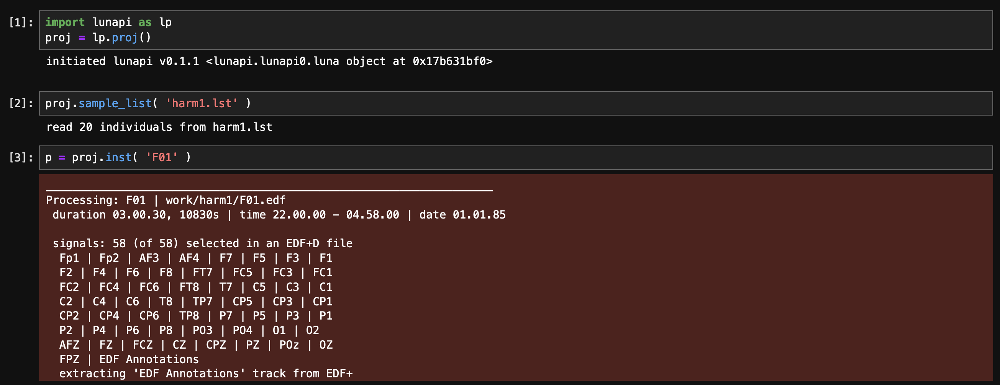

You can use the viewer `lp.scope()` (which takes as an argument the
individual _instance_ returned by `proj.inst()`) to view the file.
This shows a 30-second epoch with selected signals; the blue band at
the top indicates that this is an N2 epoch. The top shows a hypnogram
based on all present stage annotations too):

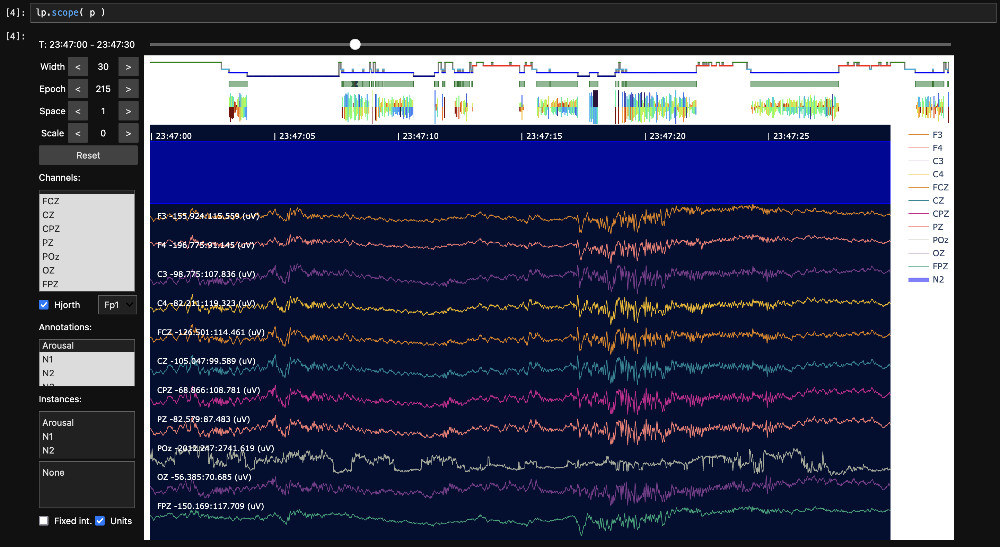

Zooming out (by increasing the `Width` button, here to 3840 seconds, i.e. just over an hour, 3840 / 60 = 64 minutes) we can see _gaps_ in the display (i.e. black/gray boxes with no signal data):

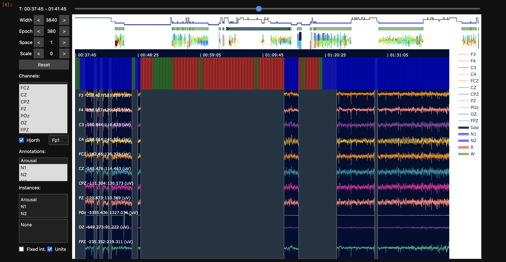

In the above, we can also see red (REM) and green (Wake) epochs seem
to span the gapped region. N1 sleep is represented by a shade of blue,
but looks quite similar in this view, i.e. see around `01:20:25`.
Noting the very subtle difference between N1 and N2 color schemes, it
appears that the segments for `F01` appear only for N2 epochs -
consistent with what `HYPNO` reported for this individual: i.e. it only
contains N2 sleep.

To confirm this, we can select only the N2 annotation (middle left combo box) so it doesn't plot N1, N3, R and W annotations, and then zoom out so the display covers the whole night: 

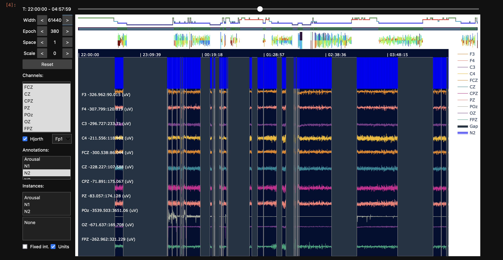

Here we see a perfect alignment between signals and N2 epochs.

---

What about `F10`?  If we edit and re-run this cell to attach `F10` (and then re-run the `lp.scope(p)` cell too, to update the viewer to show this new recording):

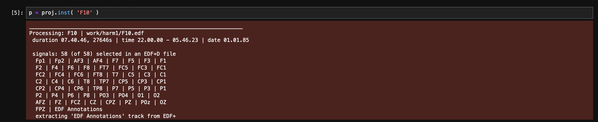

Selecting a few midline channels and clicking on the annotations, if
we scroll around and resize the `Width` window, we'll come across the
first gap (of two) for this individual (note the green bar at the top
represents segments of the EDF+D).  We can see this appears quite
different from the `F01` example - here the gap does not align with
the end of an annotation epoch, i.e. suggesting that the gap happened
naturally while recording, rather than as some post-processing step
after staging, as above.  However, the next stage annotation (each
blue rectangle is 30 seconds in this example) seems to align with the
start of the new segment.  i.e.  this may reflect a recording where
_within each segment_ staging annotations are aligned (to the start of
that segment).

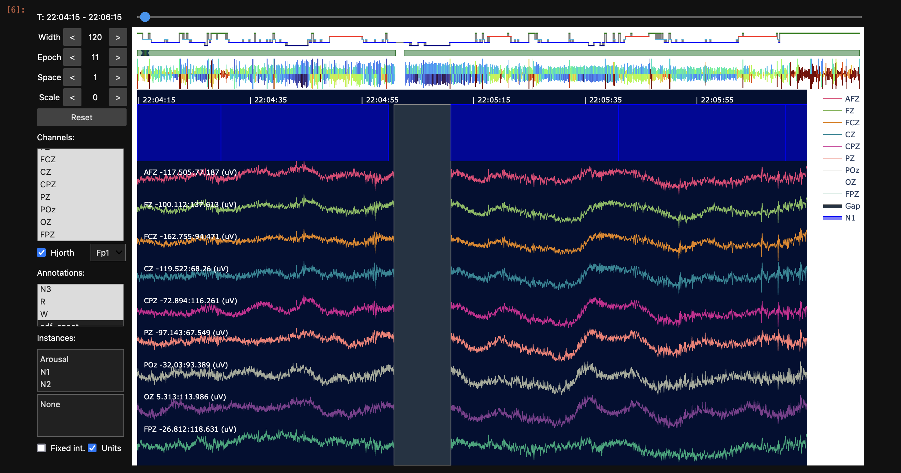

Scanning forward to see the next gap (about two-fifths of the way
through the night, and visible in the green bar at the top), we see a
similar pattern:

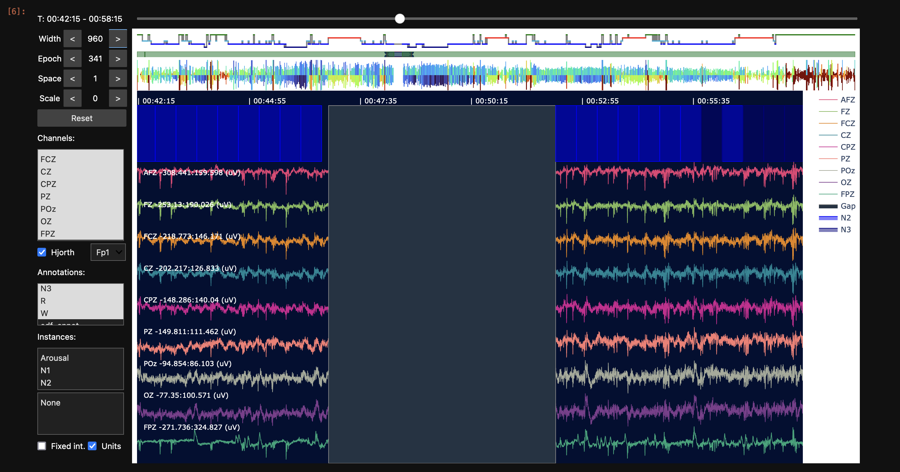

---

In contrast, `M10` presents a different mode of EDF+ segment/gap and stage/epoch alignment.   Repeating the
above steps but this time to attach `M10` and re-running the `lp.scope(p)` option:

!!!info "Speeding up scope initialization"
    In order to render whole-night
    (high-density) EEG recordings well, `scope` does a few things
    _behind the scenes_, e.g.  downsampling, anti-aliasing and storing
    the data more efficiently _before_ rendering the window.  This can
    take e.g. 10 or so seconds for a long recording with many (high
    sample rate) channels.  If you know you only want a few channels
    to visualize, you can speed up the initial step by specifying them
    with `chs` explicitly:
    ```
    lp.scope( p , chs = [ 'FZ', 'CZ' , 'PZ' , 'OZ' ] ) 
    ```
    and this will only take 2-3 seconds to open up the viewer. 

For `M10`, the gap is right at the start of the recording, and we see
that stage annotations (i.e. green boxes representing wake epochs at
the top) align to the "official" EDF start time (10pm) and march
forward in a uniform way, ignoring the segment boundaries of the
EDF+D:


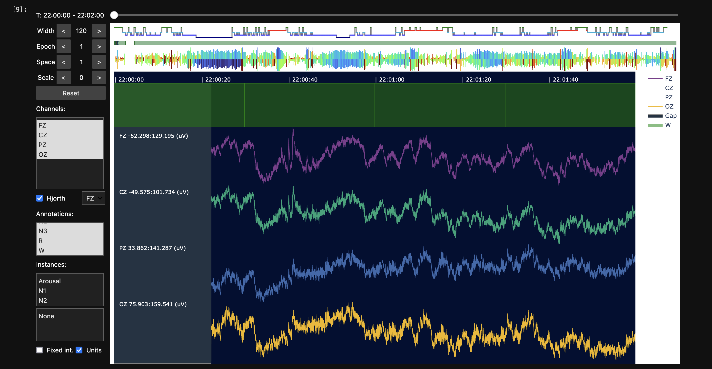

We see a similar thing for the second gap:  the staging seems aligned with clock-time from the EDF start, rather than within each segment of the EDF+D:

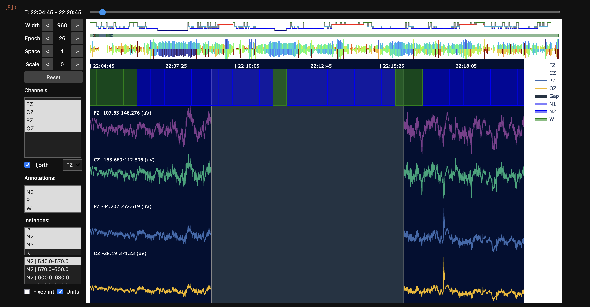

In the above example, we've also clicked on the _Instances_ annotation
tab (lower left boxes) which shows the annotations with start-stop
times in seconds; you can click on those instances and the viewer will
jump to that position in the recording.

---

In summary, visualizing the EDFs we see three quite distinct modes of "gap" with respect to the stage information:

 - `F01` only contains N2 epochs, with many gaps, but all segments
   have full, complete staged epochs

 - `F10` has fewer gaps and staging annotations aligned within each
   segment; there are some small "unannotated" portions of the data
   where we have signals but no spanning annotations (i.e. for a few
   seconds before the EDF+D segment gap starts)

 - `M10` also has fewer gaps, but staging annotations are similar to
   the standard EDF files (i.e. evenly spaced in 30-second intervals
   from the EDF start of 10pm); segment/gap boundaries do not fall
   cleanly with respect to staging annotations, however


## Hypnogram statistics on EDF+D

To illustrate some issues that can occur working with gapped recordings, we'll try to estimate hypnogram statistics
for these records, e.g. stage durations.  (We'll explore the `HYPNO`
command in more detail later in this walkthrough.)

```{ .sh .codeL }
luna harm1.lst -o out.db id=F01,F10,M10 -s HYPNO
```

The first two records are processed without warning, but `M10` gives
warning about conflicting intervals and the message:

```
  *** found 211 epoch(s) of 890 with conflicting spanning annotations
  *** check that epochs and annotations align as intended
  *** see EPOCH 'align' or 'offset' options
```

This is also reflected in `HYPNO`'s `CONF` (conflict) variable, which means
that an epoch has more than one conflicting stage annotation that
overlap it:

```{ .sh .codeL }
destrat out.db +HYPNO -v CONF
```
```
ID    CONF
F01   0
F10   0
M10   211
```

Typically, we assume staged sleep recordings have aligned epochs and
stage annotations: e.g. both starting at the EDF start (i.e. 0 elapsed
seconds) and incrementing cleanly in 30 second intervals across the
night.  Luna does not require a strict one-to-one correspondence
between epochs and stages (e.g. a stage annotation may be 60, 90, 120,
etc seconds and span multiple epochs). But for hypnogram-based
analyses, it does critically assume _that any one epoch does not have more than
one spanning stage annotation_.  If an epoch is spanned by multiple,
distinct stage annotations, this generates the _conflict_ warnings
seen above.


For `M10`, this arises because the first segment in the EDF+D is
`22:00:22.3`.  By default, 30-second epochs for this recording would
start at `22:00:22.3`, then `22:00:52.3`, then ``22:01:22.3`, etc.  In contrast, the
annotations for `M10` are not aligned with these epochs:
```{ .sh .codeL }
head work/harm1/M10.annot
```
```
class  instance  channel  start    stop    meta
W      .         .        0.000    30.000     .
W      .         .        30.000   60.000     .
W      .         .        60.000   90.000     .
W      .         .        90.000   120.000    .
W      .         .        120.000  150.000    .
W      .         .        150.000  180.000    .
...
```

which is defined relative to the EDF start time (`22:00:00`), _not_
the start of the first segment (`22:00:22.3`).  The first and middle set of columns
reflect the stage annotations and default epochs for this gapped EDF+D (`M10`), showing
the lack of alignment:

```
M10 segments

   EDF start      : 22:00:00
   First segment  : 22:00:22.3    --  22:09:14.3
   Second segment : 22:16:18.557  --  05:33:02.557 
```
```
M10 staging and epoch times

.annot file             Default epochs               Stage-aligned epochs
===============     ============================      =======================
SS Start   stop     E    HMS      START     STOP      E    HMS    START  STOP
W      0     30     .     .         .        .        .     .         .     .
W     30     60     1 22:00:22.3   22.3     52.3      1  22:00:30    30    60
W     60     90     2 22:00:52.3   52.3     82.3      2  22:01:00    60    90
W     90    120     3 22:01:22.3   82.3    112.3      3  22:01:30    90   120
W    120    150     4 22:01:52.3  112.3    142.3      4  22:02:00   120   150
W    150    180     5 22:02:22.3  142.3    172.3      5  22:02:30   150   180
W    180    210     6 22:02:52.3  172.3    202.3      6  22:03:00   180   210
W    210    240     7 22:03:22.3  202.3    232.3      7  22:03:30   210   240
W    240    270     8 22:03:52.3  232.3    262.3      8  22:04:00   240   270
W    270    300     9 22:04:22.3  262.3    292.3      9  22:04:30   270   300
W    300    330    10 22:04:52.3  292.3    322.3     10  22:05:00   300   330
W    330    360    11 22:05:22.3  322.3    352.3     11  22:05:30   330   360
W    360    390    12 22:05:52.3  352.3    382.3     12  22:06:00   360   390
N1   390    420    13 22:06:22.3  382.3    412.3     13  22:06:30   390   420
N1   420    450    14 22:06:52.3  412.3    442.3     14  22:07:00   420   450
N1   450    480    15 22:07:22.3  442.3    472.3     15  22:07:30   450   480
N1   480    510    16 22:07:52.3  472.3    502.3     16  22:08:00   480   510
N1   510    540    17 22:08:22.3  502.3    532.3     17  22:08:30   510   540
N2   540    570     .    .         .       .        .      .       .     .
N2   570    600     .    .         .       .        .      .       .     .
N2   600    630     .    .         .       .        .      .       .     .
N1   630    660     .    .         .       .        .      .       .     .
N1   660    690     .    .         .       .        .      .       .     .
W    690    720     .    .         .       .        .      .       .     .
N1   720    750     .    .         .       .        .      .       .     .
N1   750    780     .    .         .       .        .      .       .     .
N2   780    810     .    .         .       .        .      .       .     .
N1   810    840     .    .         .       .        .      .       .     .
N2   840    870     .    .         .       .        .      .       .     .
N2   870    900     .    .         .       .        .      .       .     .
N2   900    930     .    .         .       .        .      .       .     .
N2   930    960     .    .         .       .        .      .       .     .
W    960    990     .    .         .       .        .      .       .     .
W    990   1020    18 22:16:18  978.557 1008.557   18  22:16:30    990  1020
N1  1020   1050    19 22:16:48 1008.557 1038.557   19  22:17:00   1020  1050
N1  1050   1080    20 22:17:18 1038.557 1068.557   20  22:17:30   1050  1080
N2  1080   1110    21 22:17:48 1068.557 1098.557   21  22:18:00   1080  1110
N2  1110   1140    22 22:18:18 1098.557 1128.557   22  22:18:30   1110  1140
...
```

!!!hint "Generating epoch intervals" 
    The epoch times above can be generated by adding `verbose` to the `EPOCH` command (note that `EPOCH`
    is often run implicitly if a command (such as `HYPNO` requires epoched data):

    ```{ .sh .codeL }
    luna harm1.lst -o out.db id=M10 -s EPOCH verbose
    ```
    ```{ .sh .codeL }
    destrat out.db +EPOCH -r E -v HMS START STOP
    ```

As suggested in the message from `HYPNO` above, one solution is to add `EPOCH
align` before running `HYPNO`; here we will see the implied epochs
(rightmost set of columns in the table above, _Stage-aligned epochs_),
generated by:

```{ .sh .codeL }
luna harm1.lst -o out.db id=M10 -s EPOCH align verbose
```
```{ .sh .codeL }
destrat out.db +EPOCH -r E -v HMS START STOP | head
```

The impact of this is to effectively set the first analysis epoch to
`22:00:30`, the start of the first whole stage annotation in the
first segment, rather than `22:00:22.3`, the start of the first
segment.  Note that alignment from `EPOCH align` happens within each
segment (i.e. in the second segment, the first epoch starts at
`22:16:30`).  Also keep in mind that _within_ each segment, Luna assumes
uniform staging that will align with epochs, i.e. the _alignment_
action is only performed once for each segment, based on the start of
the first staging annotation found.


---

Re-running `HYPNO` but now explicitly requesting that all epochs are aligned with stage annotations: 
```{ .sh .codeL }
luna harm1.lst -o out.db id=F01,F10,M10 -s 'EPOCH align & HYPNO'
```
we now do not observe any conflicts for these records:
```{ .sh .codeL }
destrat out.db +HYPNO -v CONF
```
```
ID    CONF
F01   0
F10   0
M10   0
```

We can now view hypnogram statistics for all records, e.g. stage durations:
```{ .sh .codeL }
destrat out.db +HYPNO -r SS/N1,N2,N3,R,W -v MINS
```
```
ID    SS  MINS
F01   N1  0
F01   N2  180.5
F01   N3  0
F01   R   0
F01   W   0

F10   N1  40.5
F10   N2  213
F10   N3  42
F10   R   73.5
F10   W   91.5

M10   N1  83.5
M10   N2  199.5
M10   N3  40
M10   R   57
M10   W   57.5
```

For individual `F01`, we see that only N2 epochs are present, as
appeared to be the case from visual review.  If encountered in real
data, this would presumably indicate that the recording was subsetted
(_masked_ in Luna terminology) prior to EDF export: here, the only
option is to retrieve the original _unmanipulated_ data (i.e. from the `v1` folder).


## EDF-MINUS

For `F10` and `M10`, both of which have only small gaps, we may still want
to use Luna's `EDF-MINUS` command to generate standard, continuous
EDFs. Rather than simply ignoring the time-track (i.e. reading an EDF+D _as if_ it is a standard EDF),
`EDF-MINUS` does a few additional things:

 - extracts selected segments and aligns them to existing annotations
   (e.g. stages)

 - aligns segments to EDF record boundaries

 - can either remove (splice) or fill (zero-pad) gaps 
 
 - if needed, adjusts annotations so they align consistently with the new standard EDF

Of the two supported _policies_ for handling gaps: __splicing__ makes
sense when annotations are aligned with respect to segment starts, but
not to clocktime. In contrast, __zero-padding__ may make sense when
annotations are consistently aligned with respect to clocktime.

From our visual review of `F10` and `M10` above, we can see that
splicing (change annotations to match signals) may make more sense to
"fix" `F10`, whereas zero-padding (change signals to match
annotations) may be better suited for dealing with gaps in `M10`.


If it does not already exist, make a temporary folder `tmp/` with:
```{ .sh .codeL }
mkdir tmp
```

Starting with `F10`, we'll write the new EDFs to `tmp/`;

```{ .sh .codeL }
luna harm1.lst id=F10 -o out.db -s EDF-MINUS policy=splice out=tmp/F10b
```
Among the console output, we see how Luna sees the gapped recording, and it is worth stepping through in some detail
to check the steps (you can scroll the box left-right if the output is too wide):
```
dataset contains 57 signals and 7 annotation classes (1052 instances)
specified 6 annotation classes (?,N1,N2,N3,R,W) for alignment (921 instances found)

aligning segment 0.00->301.00 start to 0 secs based on annotation W = 0.00->30.00
& aligning segment end to 300 based 10 whole intervals of 30s from aligned start at 0s
aligned segment 1 : 0.00-301.00 --> 0.00-300.00

aligning segment 311.20->10011.20 start to 311 secs based on annotation N1 = 311.20->341.20
& aligning segment end to 10001 based 323 whole intervals of 30s from aligned start at 311s
aligned segment 2 : 311.20-10011.20 --> 311.20-10001.20

aligning segment 10338.60->27983.60 start to 10338 secs based on annotation N2 = 10338.60->10368.60
& aligning segment end to 27978 based 588 whole intervals of 30s from aligned start at 10338s
aligned segment 3 : 10338.60-27983.60 --> 10338.60-27978.60
```

For example, note how the first `aligned segment 1` is one second
shorter (up to 300 rather than 301 seconds) because the default policy
is to align segments to (whole) annotation boundaries.

_If you do
not want such changes to be made, then simply don't use `EDF-MINUS` - the
overall logic is that making a handful of small edits to a recording
and subsequently treating it as continuous will -- in most practical
cases -- constitute a reasonable strategy. This command also outputs new annotations to indicate
where the gaps/padded sections are, so you can still elect to treat those specially if certain analyses demand that._

The next section of the output details which segments are retained, and how they are merged together.  Because of the (default) option to align retained segments with stage boundaries, the final extracted recording is 16 seconds shorter:


```
found 3 segment(s)
  [ original segments ] -> [ aligned, editted ] --> [ final segments ]
 ++ seg #1 : 0.00-301.00 (301s) [included] --> 0.00-300.00 --> 0.00-300.00 (1s shorter)
  - gap #2 : 301.00-311.20 (10.2s) [spliced]
 ++ seg #2 : 311.20-10011.20 (9700s) [included] --> 311.20-10001.20 --> 300.00-9990.00 (10s shorter)
  - gap #3 : 10011.20-10338.60 (327.4s) [spliced]
 ++ seg #3 : 10338.60-27983.60 (17645s) [included] --> 10338.60-27978.60 --> 9990.00-27630.00 (5s shorter)
original total duration = 27646s
retained total duration = 27630s (16s shorter)
```

```
creating a new EDF tmp/F10b.edf with 57 channels
retaining original EDF start-time of 22.00.00
retaining original EDF start-date of 1.1.1985
created an empty EDF of duration 27630 seconds
creating annotation file tmp/F10b.annot with 1052 annotations from 6 classes
data are not truly discontinuous
writing as a standard EDF
writing 57 channels
saved new EDF, tmp/F10b.edf
writing annotations (.annot format) to tmp/F10b.annot
```

The `EDF-MINUS` command also records key outputs in the standard database as well as the console log:

```{ .sh .codeL }
destrat out.db +EDF-MINUS -r SEG
```
```
ID   SEG   DUR_EDIT  DUR_ORIG                 EDIT  INCLUDED                 ORIG
F10    1        300       301         0.00->300.00         1         0.00->301.00
F10    2       9690      9700     311.20->10001.20         1     311.20->10011.20
F10    3      17640     17645   10338.60->27978.60         1   10338.60->27983.60
```

More detailed information, e.g. on the number of _alignment annotations_ observed in each segment is also stored here: 

```{ .sh .codeL }
destrat out.db +EDF-MINUS -r SEG ANNOT
```
```
ID  ANNOT  SEG N_ALL N_REQ
F10     ?    1     0     0
F10    N1    1     3     3
F10    N2    1     0     0
F10    N3    1     0     0
F10     R    1     0     0
F10     W    1     7     7
F10     ?    2     0     0
F10    N1    2    43    43
F10    N2    2   170   170
F10    N3    2    31    31
F10     R    2    42    42
F10     W    2    37    37
F10     ?    3     0     0
F10    N1    3    35    35
F10    N2    3   256   256
F10    N3    3    53    53
F10     R    3   105   105
F10     W    3   139   139
```

See the [documentation](https://zzz.bwh.harvard.edu/luna/ref/manipulations/#edf-minus) for more information.

---

The [`SPANNING` command](https://zzz.bwh.harvard.edu/luna/ref/annotations/#spanning)
gives information on the extent to which 
EDF records are spanned by one or more of a set of annotations
(typically, but not necessarily, stage annotations).  Applying this to
the newly created `F10b.edf` and `F10b.annot` (note: specifying these
two files directly on the command line with `annot-file`, rather than using a sample
list, also note `\` characters indicate continuation of the command over a newline for the shell):

```{ .sh .codeL }
luna tmp/F10b.edf annot-file=tmp/F10b.annot \
     -o out.db \
     -s SPANNING annot=N1,N2,N3,R,W
```
```{ .sh .codeL }
destrat out.db +SPANNING | behead
```
```
               ID   tmp/F10b            
        ANNOT_HMS   07:40:30.000        
          ANNOT_N   921                 
    ANNOT_OVERLAP   NO                  
        ANNOT_SEC   27630               
        INVALID_N   0                   
      INVALID_SEC   0                   
            NSEGS   1                   
          REC_HMS   07:40:30.000        
          REC_SEC   27630               
      SPANNED_HMS   07:40:30.000        
      SPANNED_PCT   100                 
      SPANNED_SEC   27630               
    UNSPANNED_HMS   00:00:00.000        
    UNSPANNED_PCT   0                   
    UNSPANNED_SEC   0                   
          VALID_N   921                 
 
```
That is, see have a single segment (`NSEGS`) with 27630 seconds of annotated signal, which spans 100% of the avaialble signal.

In contrast, the original (EDF+D) has 3 segments, with the same duration of _annotated_ signal, but a small percentage (16 seconds) or recording not spanned by an annotation, as we'd noted above. 

```{ .sh .codeL }
luna harm1.lst id=F10 -o out.db -s SPANNING annot=N1,N2,N3,R,W
```

```{ .sh .codeL }
destrat out.db +SPANNING | behead
```

```
               ID   F10                 
        ANNOT_HMS   07:40:30.000        
          ANNOT_N   921                 
    ANNOT_OVERLAP   NO                  
        ANNOT_SEC   27630               
        INVALID_N   0                   
      INVALID_SEC   0                   
            NSEGS   3                   
          REC_HMS   07:40:46.000        
          REC_SEC   27646               
      SPANNED_HMS   07:40:30.000        
      SPANNED_PCT   99.9421254431021    
      SPANNED_SEC   27630               
    UNSPANNED_HMS   00:00:16.000        
    UNSPANNED_PCT   0.0578745568979189  
    UNSPANNED_SEC   16                  
          VALID_N   921                 
```

As above, both are valid files but the former can be simpler to work with for aforementioned reasons.

---

Turning to `M10`, here we'll adopt a _zero-padding_ policy, i.e. to fill the gaps in the signals rather than splice
them out and change the annotations:


```{ .sh .codeL }
luna harm1.lst id=M10 -o out.db -s EDF-MINUS policy=zero-pad out=tmp/M10b
```
```
  dataset contains 57 signals and 7 annotation classes (1117 instances)
  specified 6 annotation classes (?,N1,N2,N3,R,W) for alignment (891 instances found)

  aligning segment 22.30->554.30 start to 30 secs based on annotation W = 30.00->60.00
  & aligning segment end to 540 based 17 whole intervals of 30s from aligned start at 30s
  aligned segment 1 : 22.30-554.30 --> 30.00-540.00

  aligning segment 978.56->27182.56 start to 990 secs based on annotation W = 990.00->1020.00
  & aligning segment end to 27180 based 873 whole intervals of 30s from aligned start at 990s
  aligned segment 2 : 978.56-27182.56 --> 990.00-27180.00
```

To keep things "tidy", the zero-padding (by default) operates in units
of the default alignment-annotation width (i.e. 30 seconds): thus,
rather than zero-padding by 22.3 seconds at the beginning, Luna
inserts a 30 second zero-padded gap (i.e. noting it is 7.7 seconds
longer).  Likewise, some segments may be truncated if they would
otherwise include partial stage annotations:

```
  found 2 segment(s)
    [ original segments ] --> [ aligned, editted final segments ]
    - gap #1 : 0.00-22.30 (22.3s) [zero-padded] --> 0.00-30.00 (7.7s longer)
   ++ seg #1 : 22.30-554.30 (532s) [included] --> 30.00-540.00 (22s shorter)
    - gap #2 : 554.30-978.56 (424.257s) [zero-padded] --> 540.00-990.00 (25.743s longer)
   ++ seg #2 : 978.56-27182.56 (26204s) [included] --> 990.00-27180.00 (14s shorter)
  original total duration = 26736s
  retained total duration = 27146.6s (410.557s longer)
```

```
  creating a new EDF tmp/M10b.edf with 57 channels
  updating EDF start-time from 22.00.00 to 22.00.30
  retaining original EDF start-date of 1.1.1985
  created an empty EDF of duration 27180 seconds
  creating annotation file tmp/M10b.annot with 1117 annotations from 6 classes
  data are not truly discontinuous
  writing as a standard EDF
  writing 57 channels
  saved new EDF, tmp/M10b.edf
  writing annotations (.annot format) to tmp/M10b.annot
```

Both splice and zero-padding policies may make small adjustments to
align things with EDF record sizes too (of 1 second) and should
typically "do the right thing".  (If you encounter strange behavior,
please let us know with an example.)

Reviewing the output for `M10`:

```{ .sh .codeL }
destrat out.db +EDF-MINUS -r SEG
```
```
ID  SEG   DUR_EDIT   DUR_ORIG               EDIT  INCLUDED               ORIG
M10   1        510        532      30.00->540.00         1      22.30->554.30
M10   2      26190      26204   990.00->27180.00         1   978.56->27182.56
```

```{ .sh .codeL }
destrat out.db +EDF-MINUS -r SEG ANNOT
```
```
ID  ANNOT SEG  N_ALL N_REQ
M10     ?   1     0      0
M10    N1   1     5      5
M10    N2   1     1      0
M10    N3   1     0      0
M10     R   1     0      0
M10     W   1    13     12
M10     ?   2     0      0
M10    N1   2   162    162
M10    N2   2   399    399
M10    N3   2    80     80
M10     R   2   114    114
M10     W   2   104    103
```

i.e. the first segment contained only 6 sleep annotations, but only 5
of which (along with 12 wake epochs) were fully included in the first
segment.  Reviewing this type of output can be useful - e.g. if it
indicates that some segments are unscored or only contain wake, you
may want to specifically drop them (the `EDF-MINUS` command has
options for only retaining certain segments).

Note that some annotations (`segment` and `gap`) are added and output by `EDF-MINUS` to
help track what was done: i.e. in period from 30 to 540 seconds in the final, standard EDF correspond
to time-stamps 22.30 to 554.30 seconds in the original:

```{ .sh .codeL }
grep seg tmp/M10b.annot 
```
```
segment  1    .     30.000     540.000    orig=22.30->554.30
segment  2    .    990.000   27180.000    orig=978.56->27182.56
```

```{ .sh .codeL }
grep gap tmp/M10b.annot 
```
```
gap      1    .      0.000      30.000    adj=0|orig_dur=30
gap      2    .    540.000     990.000    adj=0|orig_dur=450
```


<!--

Finally, we'll check the new `M10b` files with `SPANNING` as before:

```{ .sh .codeL }
luna tmp/M10b.edf annot-file=tmp/M10b.annot -o out.db -s SPANNING annot=N1,N2,N3,R,W
```

```{ .sh .codeL }
destrat out.db +SPANNING | behead
```

```
               ID   tmp/M10b            
        ANNOT_HMS   07:25:30.000        
          ANNOT_N   891                 
    ANNOT_OVERLAP   NO                  
        ANNOT_SEC   26730               
        INVALID_N   0                   
      INVALID_SEC   0                   
            NSEGS   1                   
          REC_HMS   07:33:00.000        
          REC_SEC   27180               
      SPANNED_HMS   07:25:30.000        
      SPANNED_PCT   98.344
      SPANNED_SEC   26730               
    UNSPANNED_HMS   00:07:30.000 
    UNSPANNED_PCT   1.655    
    UNSPANNED_SEC   450                 
          VALID_N   891                 
```

Note that we see some unspanned intervals, but these were present in the original - at the end of the
file


--->


---

Finally, let's visualize _before and after_ images for `F10` and `M10`:

For `F10`, here is one of the gaps before:


and the spliced (i.e. removed) version; the red line in the annotation track indicates where the gap was; note how
retained signals now have aligned annotations (i.e. by splicing out gaps but also partial staged epochs; note, color and order of channels is arbitrarily differs between the two pictures):

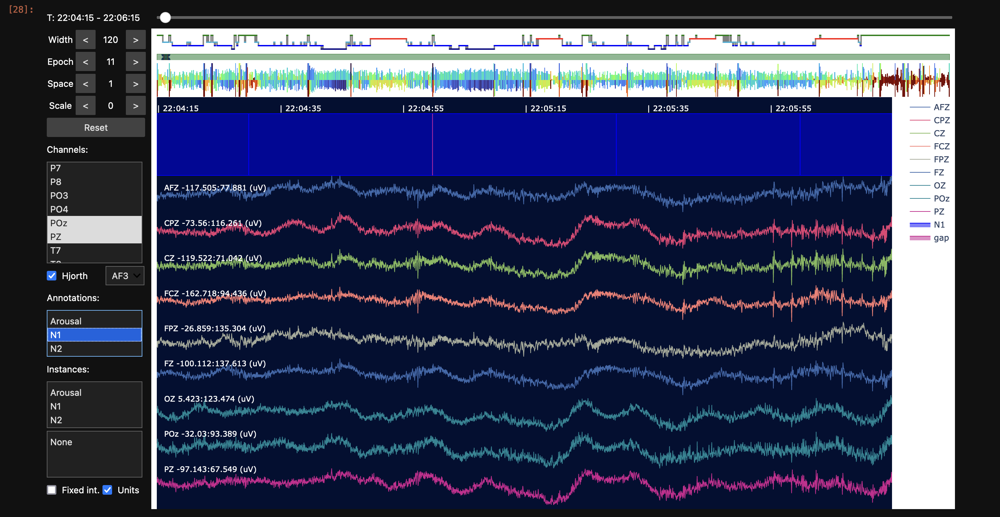

---

Here is a gap from `M10`:

and now with zero-padding - again, note how the zero-padding is extended such that we only have whole staged epochs: 
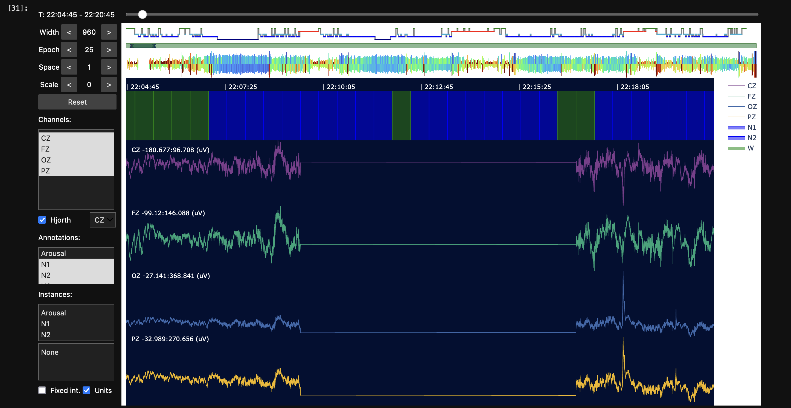

If one [`MASK`ed](https://zzz.bwh.harvard.edu/luna/ref/masks/#mask)
based on the `gap` annotation for `M10b` (which spans the visible
zero-padded area exactly), it would remove the whole zero-padded
insert (and actually, internally, revert to being an EDF+D within
Luna's representation).

---

Note, when we don't have a sample list, we can directly attach and EDF and annotation file(s) as follows (i.e. first clearing
any internally attached sample list, meaning that `proj.inst()` will generate an empty instance, whatever the ID used):

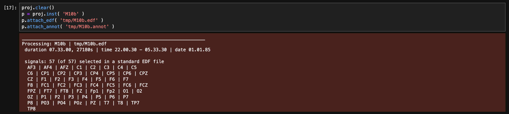


---

Wrapping up, we've seen how to detect and describe gapped EDFs, how to
visualize those segments/gaps (with `lunapi`), and how to consider different issues
that may arise if segments, stage annotations, analytic epochs (and/or
EDF record boundaries) misalign in various ways.   We've used the EDF-MINUS to "correct"
these issues for `F10` and `M10` in principled ways -- although in this walkthorugh, we'll actually
revert to the `v1` originals for all three gapped recordings, for simplicity. 

We'll now go on to [detect possible flat/duplicate channels](dupes.md) across EDFs.