# 2.3. Signal review

Next, we'll calculate some summary statistics for the EEG, at this
stage only for the purpose of general QC:

 - do the signals have numerical distributions/ranges broadly as expected for
   micro-volt scaled human scalp sleep EEG (i.e. on the order of 10s to 100s of
   units around a mean typically near zero)?
  
 - are there obvious parts of the recording (signals and/or epochs)
   that appear aberrant?

 - as a first-pass frequency-based description of the data, do we
   roughly see the expected 1/_f_ pattern for the EEG power spectra?
   Are there many obvious spikes or other signs of contamination,
   e.g. due to electrical noise?

We'll approach this in two stages: first, with some whole-night
visualizations based on [Hjorth
parameters](https://en.wikipedia.org/wiki/Hjorth_parameters); second,
looking only at epochs annotated as N2 sleep (i.e. to remove the often
very large sources of variation in signals that arise from stage
differences, especially if noisy leading/trailing wake epochs are
included).

## Whole-night Hjorth statistics

Hjorth statistics are simple and useful summaries for time-series data.  There are three parameters:

 - _activity_: the typical amplitude of the signal (effectively similar to variance or root mean square)

 - _mobility_: a measure of modal frequency of the signal (based on the first derivative of the signal)

 - _complexity_: a measure of change in frequency of the signal (based on the second derivative), which can be indicative
 of how variable/predictable a signal is 

As a first pass to review signals, we will calculate these metrics per
channel and per epoch for all recordings, using Luna's `SIGSTATS`
command, from the first-round harmonized data (`harm1.lst`):

```{ .sh .codeL }
luna harm1.lst -o out.db -s ' SIGSTATS epoch sig=${eeg} '
```

This will take a minute or so to run for all subjects.  
    
!!!hint "Keeping track of output"
    For simplicity, in this walkthrough, we
    tend to overwrite a single `out.db`, which probably isn't the best
    practice for real, larger studies, where it might take a
    non-trivial time to generate the output, and where reproducibility is 
    important.  Feel free to swap in different outputs as desired, and
    amend the downstream steps accordingly, e.g. if we have a folder named `out`, one
    might instead have used `-o out/hjorth.db` here (and `destrat out/hjorth.db` below).

We can then extract all values from the output database to a single plaintext file (`hjorth.1`):
```{ .sh .codeL }
destrat out.db +SIGSTATS -r E CH   > tmp/hjorth.1
```

---

Here we'll use [R](https://www.r-project.org/) to visualize the output, along with the lunaR library for some
convenience plot features used below.  Whether you're using a native terminal or JupyterLab, it is a good
idea to keep a second window open for analyses in R (mainly visualization), ensuring it has the same working
folder as the current main project.

```{ .R .codeR }
library(luna)
```
```{ .R .codeR }
d <- read.table( "tmp/hjorth.1" , header=T, stringsAsFactors=F)
head(d)
```
```
   ID  CH E        H1        H2        H3
1 F01 Fp1 1 1504.2979 0.1250687 1.2803008
2 F01 Fp1 2 2916.4841 0.1043487 1.1756639
3 F01 Fp1 3  844.3133 0.1806248 1.1284717
4 F01 Fp1 4 1041.5858 0.1365578 1.1829702
5 F01 Fp1 5 1520.9025 0.1116944 1.1538875
6 F01 Fp1 6  813.8810 0.1815717 0.9670462
```

The data frame `d` has 997,176 rows, which reflects the 20 people x 57
EEG channels x 800-900 or so epochs each person has.

The three Hjorth parameters are labelled `H1`, `H2` and `H3`, defined for every individual/channel/epoch.  We can review the
broad distributions of each:

<!---
png( file="imgs/hjorth1.png", width=1000, height=400 , res = 100 )
--->

```{ .R .codeR }
par(mfcol=c(1,3))
hist( d$H1 , breaks=100, main="H1" )
hist( d$H2 , breaks=100, main="H2" )
hist( d$H3 , breaks=100, main="H3" ) 
```

<!---
dev.off()
cp imgs/hjorth1.png vig/docs/imgs/
--->

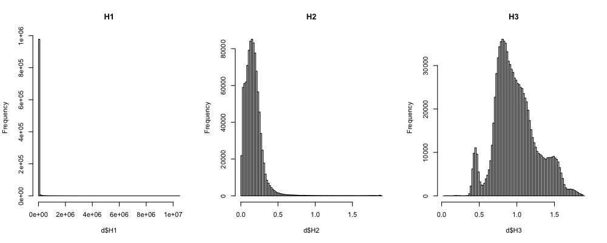

It appears that `H1` (activity) is very skewed.  Often a
log-transformation is applied to raw activity scores:

```{ .R .codeR }
d$H1 <- log( d$H1 )
```
which yields this revised figure:

<!---
png( file="imgs/hjorth2.png", width=1000, height=400 , res = 100 )
---
```{ .R .codeR }
par(mfcol=c(1,3))
hist( d$H1 , breaks=100, main="H1" )
hist( d$H2 , breaks=100, main="H2" )
hist( d$H3 , breaks=100, main="H3" )
```

<!---
dev.off()
cp imgs/hjorth2.png vig/docs/imgs/
--->

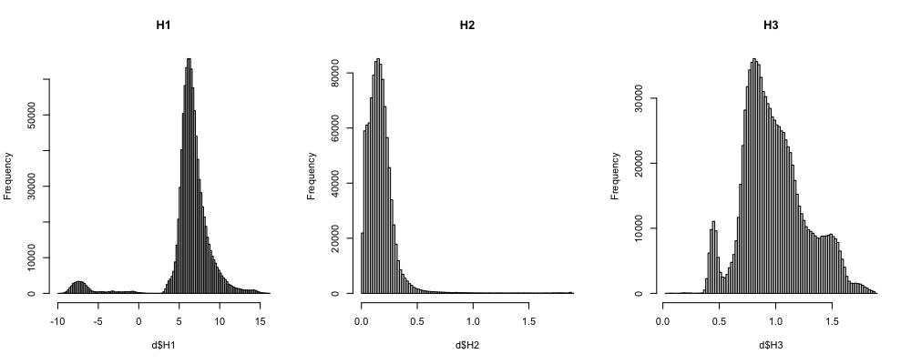


Of note, both (log-transformed) `H1` and `H3` metrics shows clear multi-modality,
presumably reflecting differences between sleep stages as well as
channels and/or individuals.

We can review per individual:
<!---
png( file="imgs/hjorth3.png", width=600, height=600 , res = 100 )
--->

```{ .R .codeR }
par(mfcol=c(3,1))
barplot( tapply( d$H1, d$ID, mean ), col = lturbo(100), las=2, main="H1" )
barplot( tapply( d$H2, d$ID, mean ), col = lturbo(100), las=2, main="H2" )
barplot( tapply( d$H3, d$ID, mean ), col = lturbo(100), las=2, main="H3" ) 
```

<!---
dev.off()
cp imgs/hjorth3.png vig/docs/imgs/
--->

Of note, `F04` appears to be a gross outlier for the `H1` (activity)
metric (note, this is on a log-scale).  

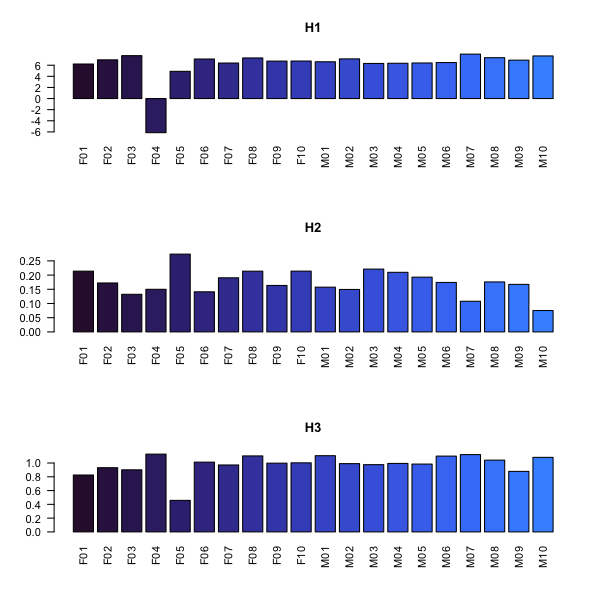

We also see that `F05` perhaps appears to be a bit of an outlier.
We'll see what is going on more directly via spectral analysis, but
when we consult the [table of signal
manipulations](../data.md#signal-manipulations) we note that this was
the only recording to be band-pass filtered (1-20 Hz).

With respect to `F04` - we can confirm visually that the lower activity values hold for _all_ channels, e.g.
here averaging over epochs:

<!---
png( file="imgs/hjorth4.png", width=1000, height=350 , res = 100 )
--->

```{ .R .codeR }
a <- aggregate( d$H1 , by = list( CH = d$CH, ID = d$ID  ) , FUN = mean ) 
plot(a$x, col=as.factor(a$ID), pch=20, ylab="mean H1", xlab="Indiv/channel" )
```

<!---
dev.off()
cp imgs/hjorth4.png vig/docs/imgs/
--->

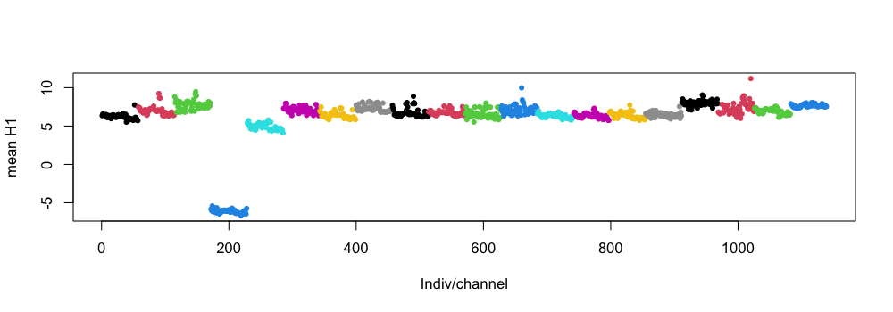

The points are ordered by individual, then channel (and colored by
individual ID); we can clearly see the fourth (blue) set (`F04`) has
low mean H1 values (across all epochs) for all channels.  (We could
have simply looked at the output not stratified by epoch above too,
i.e. `destrat out.db +SIGSTATS -r CH`).


We can take a look at the EDF headers again to look at the range of
EEG signals for `F04` (going back to command line):

```{ .sh .codeL }
luna harm1.lst -o out.db -s HEADERS
```

Here we extract the physical units, minimum and maximum _based on the
EDF headers_ (i.e. technically, the smallest/largest _possible_ values
in the EDF, whether or not there is actually an instance that
extreme), here only for channel FZ (to reduce output clutter):

```{ .sh .codeL }
destrat out.db +HEADERS -r CH/FZ -v PDIM PMIN PMAX 
```
```
ID   CH  PDIM      PMAX       PMIN
F01  FZ   uV    223.325   -361.057
F02  FZ   uV    1654.70   -1694.12
F03  FZ   uV    1221.58   -466.484
F04  FZ   uV    2.00623   -2.97696
F05  FZ   uV    376.299   -452.115
F06  FZ   uV    3502.42   -1607.19
F07  FZ   uV    994.355   -799.459
F08  FZ   uV    3663.41   -3002.94
F09  FZ   uV    1704.35   -4028.45
F10  FZ   uV    1747.34   -2111.80
M01  FZ   uV    3436.70   -1238.57
M02  FZ   uV    3350.84   -1933.89
M03  FZ   uV    1658.28   -2111.74
M04  FZ   uV    3856.32    -4326.5
M05  FZ   uV    2782.60   -3417.32
M06  FZ   uV    1074.79   -1703.58
M07  FZ   uV    2401.71   -1082.80
M08  FZ   uV    839.666   -559.385
M09  FZ   uV    3380.85   -2664.17
M10  FZ   uV    3958.20   -701.840
```

The range appears to be about three orders-of-magnitude smaller for
`F04` than for all other recordings, _despite_ all channels having
nominally similar units (`uV`).  There is quite a lot of variability
in the ranges (from ~200 to ~4000) but it is noteworthy that if
multiplied by 1000 (i.e. the scaling difference between milli-volts
and micro-volts, then `F04` would sit about right in the middle of all
individuals, in terms of EDF header physical min/max for this channel.

It is also worth noting, however, that EDF headers can have extreme
values (e.g. 4000 uV) because they contain artifact, in the
signal. etc.  Therefore, to more realistically compare distributions,
it can be useful to a) restrict to parts of the signal scored as sleep
if available (i.e. less artifact, movement, etc) and b) look at
e.g. 5/95th percentile values rather than absolute (theoretical)
min/max values.  We can do this with the [`STATS` command](https://zzz.bwh.harvard.edu/luna/ref/summaries/#stats)
(here just for FZ for simplicity):

```{ .sh .codeL }
luna harm1.lst -o out.db -s 'MASK ifnot=N2 & RE & STATS sig=FZ '
```
```{ .sh .codeL }
destrat out.db +STATS -r CH -v P05 P95 -p 4 
```
(Note that `-p 4` here specifies the number of digits displayed by
`destrat`)

```
ID    CH         P05        P95
F01   FZ    -13.1118    75.7381
F02   FZ    -45.0810    94.6767
F03   FZ    -36.4508    96.7964
F04   FZ     -0.1658     0.2606
F05   FZ    -28.4717    29.0819
F06   FZ    -36.5317    94.8438
F07   FZ    -76.2127    13.7586
F08   FZ    -35.3029    94.9012
F09   FZ    -78.6046    19.0196
F10   FZ    -18.7311    82.4363
M01   FZ    -75.6559    82.7190
M02   FZ    -12.4852    87.0243
M03   FZ    -24.2644    67.7210
M04   FZ    -34.3746    63.3922
M05   FZ    -28.8629    87.7847
M06   FZ    -15.8691    71.9313
M07   FZ    -75.0649    152.556
M08   FZ    -29.6307    72.0292
M09   FZ    -35.4833    82.8620
M10   FZ    -103.682   133.1061
```

As before, we see these are still orders-of-magnitude lower than for
the other individuals: _as we're blessed with omniscience for
certain aspects of this walkthrough_, we in fact know that `F04` had
[altered signal units](../data.md#signal-manipulations), i.e. it was
actually recorded in milli-volts (`mV`) but incorrectly labelled as
micro-volts (`uV`) which are 1000-times smaller.  Looking at strange
(esp. order-of-magnitude off) ranges can be a clue to this type of
issue.

!!!info "Multiple errors and dependencies in stages of QC"
    As it turns out, `F04` has __both__
    [manipulated (swapped)
    staging](../data.md#annotation-manipulations) __as well as__
    purposefully [altered signal
    units](../data.md#signal-manipulations).  This will impact the
    above comparison (i.e. although we don't know it at this stage of
    the walkthrough, the "N2" won't really be N2 for `F04` and so this
    procedure (of restricting to N2 epochs to evaluate signals) may
    have issues.  _However_, we've purposefully included both these
    issues together: a) in reality, there is nothing that precludes a
    single file from having multiple sources of error or bias,
    etc. and b) it underscores the more general point that there can
    be chicken-and-egg dependencies in the ordering of QC steps
    (e.g. if one requires valid signals in order to review/check
    staging annotations, and vice versa). 

---


As the sleep EEG contains qualitatively distinct stages, whole-night
summaries of metrics have limited value: we really want to see how
things change, as well as channel-specific variation.  To this end,
we'll go back to R to generate a series of plots that reflect the Hjorth statistics
varying over time (epochs) and channel.

!!!hint "Interleaving R and command-line commands"
    If you quit R to run the above Luna command, you can start up R again
    and type the following:
    ```{ .R .codeR }
    library(luna)
    d <- read.table( "tmp/hjorth.1" , header=T, stringsAsFactors=F)
    d$H1 <- log( d$H1 )
    ```
    In general, it is a good idea to keep different terminal windows open (or, if using Jupyter notebooks, a separate _Terminal_ tab)
    to be able to go between different tools interactively.

We'll do this separately for each of the 20 individuals:

```{ .R .codeR }
ids  <- unique( d$ID )
```

We can then make these plots for any individual, e.g. `F06`:
And make a simple loop, e.g. for visual inspection

<!---
png( file="vig/docs/imgs/hjorth5.png", width=800, height=800 , res = 100 )
--->

```{ .R .codeR }
dd <- d[ d$ID == "F06" , ]           
par(mfcol=c(3,1), mar=c(0.5,0.5,0.5,0.5))
lheatmap( dd$E , dd$CH , dd$H1 )
lheatmap( dd$E , dd$CH , dd$H2 )
lheatmap( dd$E , dd$CH , dd$H3 )
```

<!---
dev.off()
--->

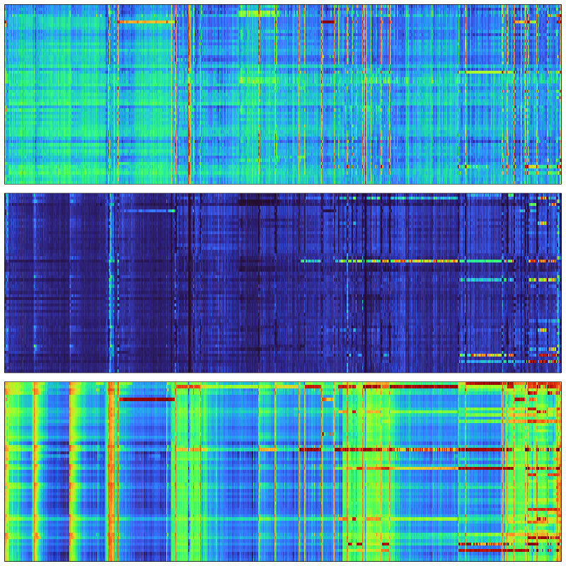

Above, we have three heatmaps for the three Hjorth parameters, with
x-axes representing time (epochs) and y-axes representing channels.
It is evident in these plots that there are a) clear vertical stripes (i.e. gross,
global artifact for that epoch that impact most/all channels), b)
horizontal stripes (i.e. channel-specific artifact that may impact
some or all of the recording, but often (in this example) starts later
in the night and continues to the end, as well as c) evidence of
broader "banding", especially for the H3 metric, that likely track
with true ultradian physiology, i.e. sleep cycles.  

We'll be unpacking these components below.  This is not
necessarily the most intuitive form of plot, however. In large part, this is because
we've lost the information about channel position in the y-axes
(i.e. is hard to add visible labels, but more importantly, the current
order is arbitrary/alphabetical).  Note: if manual staging is present,
it is always good to review these types of plots alongside the
hypnograms, but we'll skip looking at hypnograms until a later section
here.  Nonetheless, we can still make some more informative types of
plot here.

One simple extension is to use lunaR's `ltopo.xy()` convenience
function, to make X-Y scatter plots for each channel, but present them
in a layout consistent with the scalp topography (for the same file, `F06`):

```{ .R .codeR }
par(mfcol=c(3,1), mar=c(0.5,0.5,0.5,0.5))
ltopo.xy( dd$CH , dd$E , dd$H1 , z = dd$H1 , pch=20 , col = lturbo( 100 ) , cex=0.2 , xlab="Epoch", ylab="log(H1)" )
ltopo.xy( dd$CH , dd$E , dd$H2 , z = dd$H2 , pch=20 , col = lturbo( 100 ) , cex=0.2 , xlab="Epoch", ylab="H2" )
ltopo.xy( dd$CH , dd$E , dd$H3 , z = dd$H3 , pch=20 , col = lturbo( 100 ) , cex=0.2 , xlab="Epoch", ylab="H3" )
```

<!---
png( file= paste( "vig/docs/imgs/hjorth6a.png", sep="") , width=800, height=600 , res = 125 )
par(mfcol=c(1,1), mar=c(0.5,0.5,0.5,0.5))
ltopo.xy( dd$CH , dd$E , dd$H1 , z = dd$H1 , pch=20 , col = lturbo( 100 ) , cex=0.2 , xlab="Epoch", ylab="log(H1)" )
dev.off()

png( file= paste( "vig/docs/imgs/hjorth6b.png", sep="") , width=800, height=600 , res = 125 )
par(mfcol=c(1,1), mar=c(0.5,0.5,0.5,0.5))
ltopo.xy( dd$CH , dd$E , dd$H1 , z = dd$H2 , pch=20 , col = lturbo( 100 ) , cex=0.2 , xlab="Epoch", ylab="H2" )
dev.off()


png( file= paste( "vig/docs/imgs/hjorth6c.png", sep="") , width=800, height=600 , res = 125 )
par(mfcol=c(1,1), mar=c(0.5,0.5,0.5,0.5))
ltopo.xy( dd$CH , dd$E , dd$H1 , z = dd$H3 , pch=20 , col = lturbo( 100 ) , cex=0.2 , xlab="Epoch", ylab="H3" )
dev.off()

--->

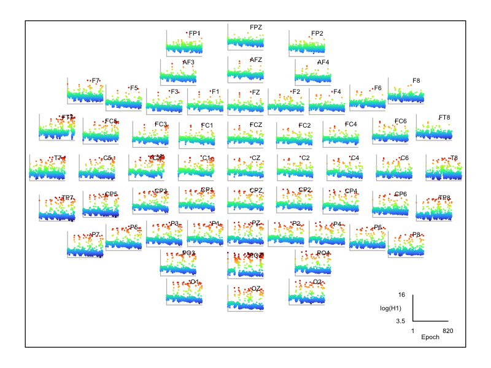
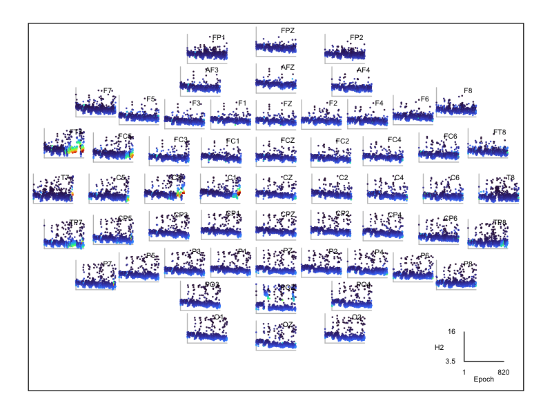
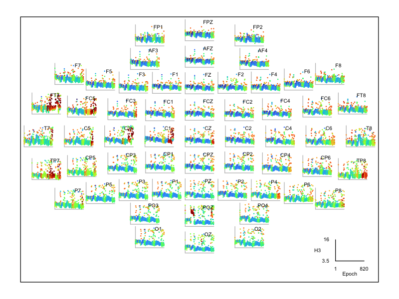

The three plots are ordered for H1, H2 and H3 respectively. These
plots make the topographical locations of the artifact much clearer,
especially for H2 it is evident that FT7 has extreme values towards
the end of the night.  Note that
these plots will also reflect a degree of true sleep physiology
dynamics, e.g. especially those that impact all/many channels and
change slowly over the course of minutes/hours.

As a further example of some potential artifact - and note, these
factors _were not introduced in the manipulated dataset_ -- this is
all present from the original (`v1`) recording.  For `F10` we see that
FC2 and FC6 look bad towards the end of the night, in particular for
H2:

<!---
png( file= paste( "vig/docs/imgs/hjorth-" , id , ".png", sep="") , width=1000, height=800 , res = 150 )
--->

```{ .R .codeR }
id="F10"
dd <- d[ d$ID == id , ]
par(mfcol=c(1,1), mar=c(0.5,0.5,0.5,0.5))
ltopo.xy(dd$CH, dd$E, dd$H2, z=dd$H2, pch=20, col=lturbo(100), cex=0.2, xlab="Epoch", ylab="H2")
```

<!---
id="F10"
dd <- d[ d$ID == id , ]
png( file= paste( "vig/docs/imgs/hjorth-" , id , ".png", sep="") , width=1000, height=800 , res = 150 )
par(mfcol=c(1,1), mar=c(0.5,0.5,0.5,0.5))
ltopo.xy(dd$CH, dd$E, dd$H2, z=dd$H2, pch=20, col=lturbo(100), cex=0.2, xlab="Epoch", ylab="H2")
dev.off()
--->

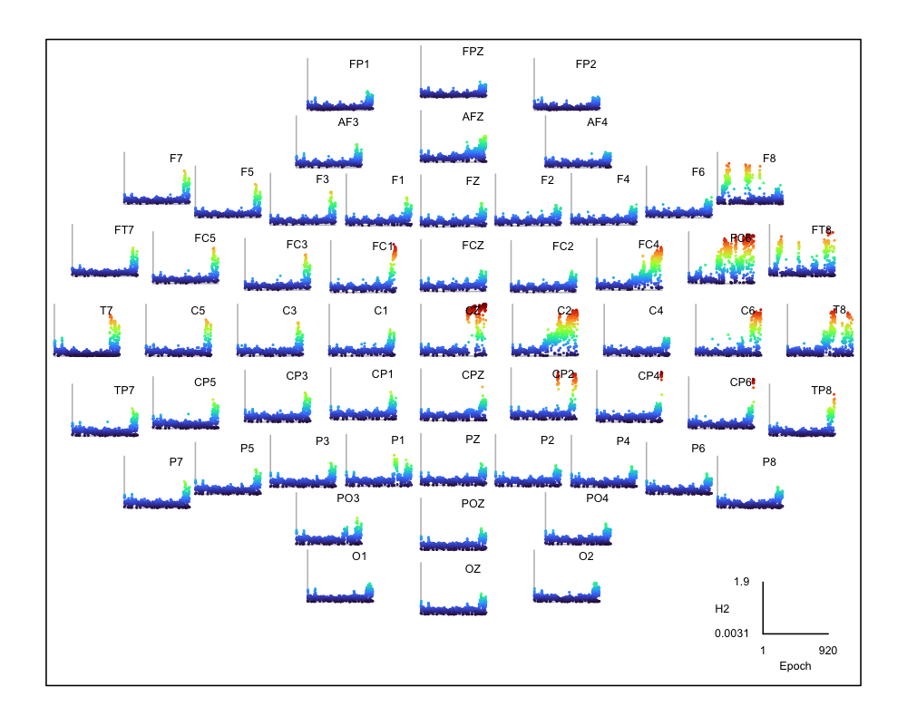

We can use `lunapi` and `scope()` to view these signals at different
points in the night: here looking at selected EEG channels 
earlier in the night (see position of the dot
at the top) where all channels appear of comparable, high quality
(this shows a quarter-epoch view, 7.5 seconds):

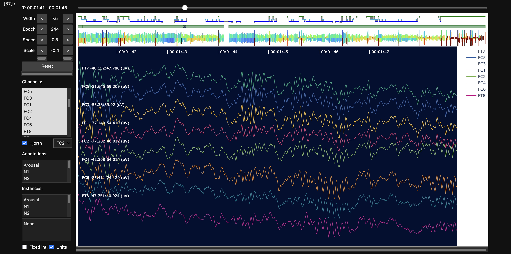

In contrast, later in the same recording, some of the same channels show
clear artifact, consistent with high frequency line noise:

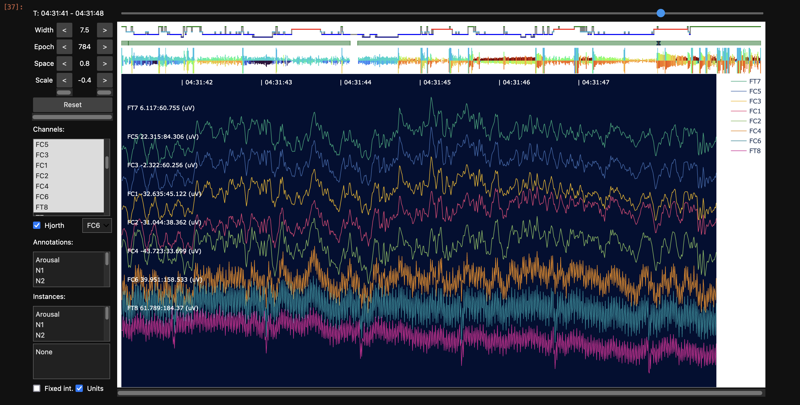


Later in the walkthrough we'll revisit these types of plots to assess
quality after interpolation, filtering (which will remove very high
frequency artifact in any case), removing extreme/aberrant epochs and
restricting to a single sleep stage.  In general, it can be useful to
perform these types of plots/checks both on "original" signals (as
that can more clearly point to the source/nature of artifact prior to
altering the signals) but also the "final" analysis-ready datasets (as
those, after all, are the ones on which analyses will be based...)


## N2 statistics

As a complement to the whole-night QC visualization, it can also be
useful to restrict it to a single stage (or at least exclude
leading/trailing wake/unknown periods if they are excessively long).
In this way, differences between individuals and/or channels can
become clearer, after removing one natural source of variation
(differences in sleep stage).

To this end, we'll return to the shell command line and run this
script. It picks 10 N2 epochs at random, however, keep in mind, that
we do this just to speed up analysis in the context of this
walkthrough. Naturally, for real projects, you'd want to use all
available data. This script also applies a bandpass filter before
calculating spectral statistics per individual/channel (as noted
above, if you want to save the prior output, use distinct filenames
other than `out.db` - this holds throughout the walkthrough, but we
won't repeat it going forward):

```{ .sh .codeL }
luna harm1.lst -o out.db \
  -s ' EPOCH align & MASK ifnot=N2 & MASK random=10 & RE
       FILTER bandpass=0.3,35 tw=0.5,5 ripple=0.01,0.01
       PSD spectrum dB sig=${eeg} max=25 '
```

We'll extract this individual/channel level output to a text
file containing power spectra for representative/random N2 epochs,
calculated now for filtered signals:

```{ .sh .codeL }
destrat out.db +PSD -r F CH > tmp/s.spec
```

In R, we'll now load these spectral statistics:

```{ .R .codeR }
d <- read.table( "tmp/s.spec" , header=T , stringsAsFactors = F )
head(d)
```
```
   ID  CH    F      PSD
1 F01 Fp1 0.50 20.57150
2 F01 Fp1 0.75 21.23700
3 F01 Fp1 1.00 20.23428
4 F01 Fp1 1.25 18.31134
5 F01 Fp1 1.50 16.94335
6 F01 Fp1 1.75 15.76659
```

As we added `dB` to Luna's [PSD command](https://zzz.bwh.harvard.edu/luna/ref/power-spectra/#psd) that implements the Welch spectral
method, the output power density values will already be log-scaled.  The output contains frequency bins from 0.5 to 25 Hz in 0.25 Hz steps: 

<!---
png( file="vig/docs/imgs/psd1.png", width=600, height=600 , res = 150 )
--->

```{ .R .codeR }
ids <- unique( d$ID )
fxs <- unique( d$F )
a <- setNames( aggregate( d$PSD , by=list(ID=d$ID, F=d$F), FUN=mean, na.rm=T),
               c("ID","F","PSD") ) 
ylim <- range( a$PSD )
plot( fxs , fxs , type="n" , ylim = ylim ,
      xlab = "Frequency (Hz)" , ylab = "log(Power)" , main = "" )
for (id in ids )
  lines( fxs , a$PSD[ a$ID == id ] , lwd=2 , col = rgb( 0,0,255,100,max=255) )
lines( fxs , a$PSD[ a$ID == "F04" ] , lwd=2 , col = rgb( 255,0,0,100,max=255) )
lines( fxs , a$PSD[ a$ID == "F05" ] , lwd=2 , col = rgb( 0,255,0,100,max=255) )
```

<!---
dev.off()
--->

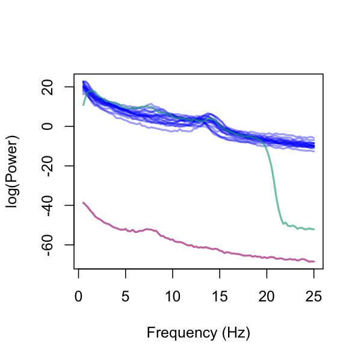


In this plot, we highlighted `F04` in maroon and `F05` in green, with the
remaining individuals shown in blue. It’s clear that `F04` and `F05` are
outliers, while the spectral power curves of the other individuals
appear quite uniform. To examine this further, we will remove the two
outliers and regenerate the plot:

<!---
png( file="vig/docs/imgs/psd2.png", width=600, height=600 , res = 150 ) 
--->

```{ .R .codeR }
d2 <- d[ ! ( d$ID == "F04" | d$ID == "F05" ) , ] 
a <- setNames( aggregate( d2$PSD, by=list(ID=d2$ID, F=d2$F), FUN=mean, na.rm=T ),
               c("ID","F","PSD") )
ylim <- range( a$PSD )

plot( fxs , fxs , type="n" , ylim = ylim ,
      xlab = "Frequency (Hz)" , ylab = "log(Power)" , main = "" )

for (id in unique(a$ID) )
  lines( fxs , a$PSD[ a$ID == id ] , lwd=2 , col = rgb( 0,0,255,100,max=255) ) 
```

<!---
dev.off()
--->

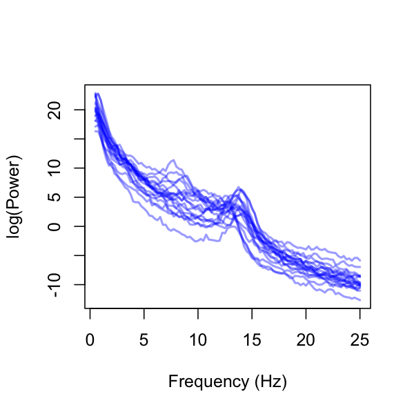


Alternatively, we can average over individuals to plot one line per channel:

<!---
png( file="vig/docs/imgs/psd3.png", width=600, height=600 , res = 150 )
--->

```{ .R .codeR }
d2 <- d[ ! ( d$ID == "F04" | d$ID == "F05" ) , ]
a <- setNames( aggregate( d2$PSD, by=list(ID=d2$CH, F=d2$F), FUN=mean, na.rm=T ) ,
               c("CH","F","PSD") )
ylim <- range( a$PSD )
chs <- unique( a$CH )
nchs <- length( chs ) 
pal <- lturbo( nchs )

plot( fxs , fxs , type="n" , ylim = ylim ,
      xlab = "Frequency (Hz)" , ylab = "log(Power)" , main = "" )

for (ch in 1:nchs )
  lines( fxs , a$PSD[ a$CH == chs[ch] ] , lwd=1 , col = pal[ ch ] )
```

<!---
dev.off()
--->

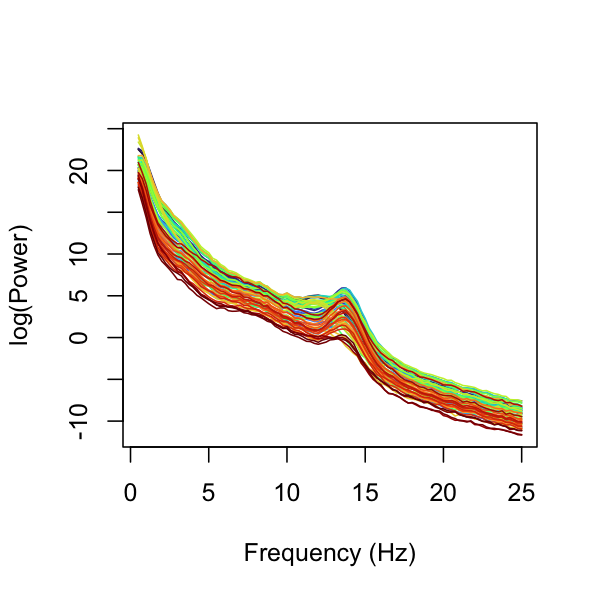


In the above plot, now that outlier subjects have been removed, a
1/_f_ pattern in the EEG power spectra as well as clear sigma (11-15
Hz) peaks are visible for all channels, consistent with typical N2 sleep EEG.

Finally, having looked at the means, for a small sample size such as
this, we can plot the full set of power spectra for each individual.
Here, we'll generate a grid of 20 figures (per individual), in each
plotting the mean power (across channels) in either red or blue (for
female and male subjects) as well as the channel-specific N2 power
spectra (remembering, this is based only on 10 randomly-selected epochs):

<!---
png( file="vig/docs/imgs/psd4.png", width=800, height=800 , res = 150 )
--->

```{ .R .codeR }
a <- setNames( aggregate(d$PSD, by=list(ID=d$ID, F=d$F), FUN=mean),
               c("ID","F","PSD") )
ylim <- range( a$PSD )
ids <- unique(a$ID)

par(mfrow=c(4,5),mar=c(0.1,0.1,1,0.1))

for (id in ids ) {
  di <- d[ d$ID == id , ] 

  plot( fxs , a$PSD[ a$ID == id ], ylim=ylim, type="n",
        main=id, axes=T, xaxt='n', yaxt='n')

  chs <- unique( di$CH )
  for (ch in chs)
    lines( fxs , di$PSD[ di$CH == ch ] , lwd=1 ,
           col = rgb(100,100,100,100,max=255) )

  lines( fxs , a$PSD[ a$ID == id ] , lwd=2 ,
         col = ifelse( substr(id,1,1) == "M" , "blue", "red") )

  abline( v = c(5,10,15) , lty=2 , col = "lightgray" , lwd=1 )
}
```

<!---
dev.off()
--->

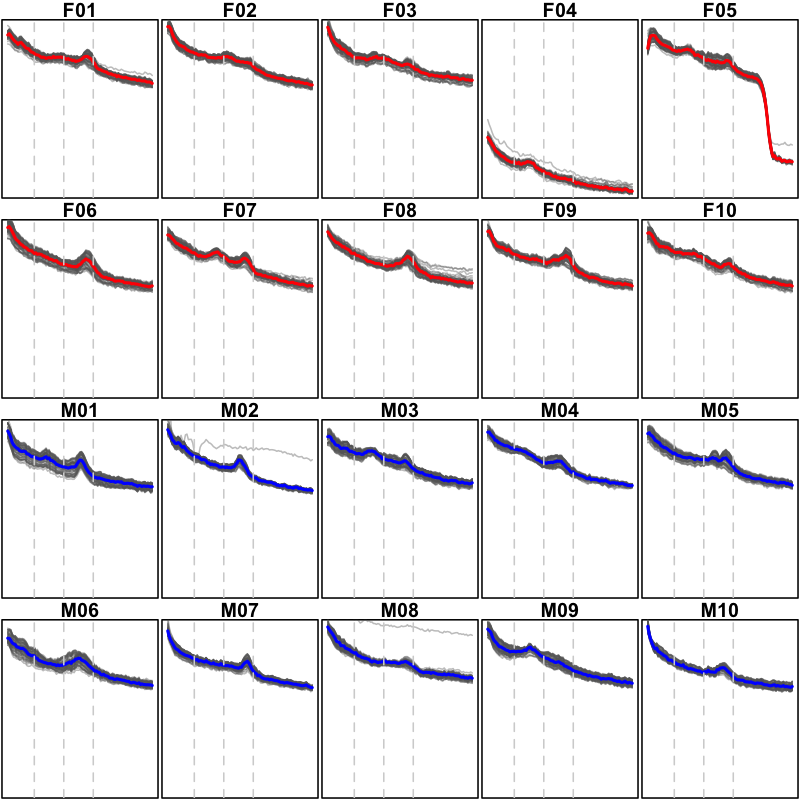

These plots have the y-axes constrained to be equal across all individuals, which is useful for highlighting the differences between individuals.   We can
alternatively make the same set but allow the y-axis to vary according to each individual's data, to make the between-channel effects clearer:

<!---
png( file="vig/docs/imgs/psd5.png", width=800, height=800 , res = 150 )
--->

```{ .R .codeR }
a <- setNames( aggregate(d$PSD, by=list(ID=d$ID, F= d$F), FUN=mean),
               c("ID","F","PSD") )

par(mfrow=c(4,5),mar=c(0.1,0.1,1,0.1))

for (id in ids ) {
  di <- d[ d$ID == id , ]
  ylim = range( di$PSD )

  plot( fxs , a$PSD[ a$ID == id ], ylim=ylim, type = "n",
        main=id, axes=T, xaxt='n', yaxt='n')
  
  chs <- unique( di$CH )
  for (ch in chs)
    lines( fxs , di$PSD[ di$CH == ch ] , lwd=1 ,
           col = rgb(100,100,100,100,max=255) )

  lines( fxs , a$PSD[ a$ID == id ] , lwd=2 ,
         col = ifelse( substr(id,1,1) == "M" , "blue", "red") )

  abline( v = c(5,10,15) , lty=2 , col = "lightgray" , lwd=1 )
}
```

<!---
dev.off()
--->

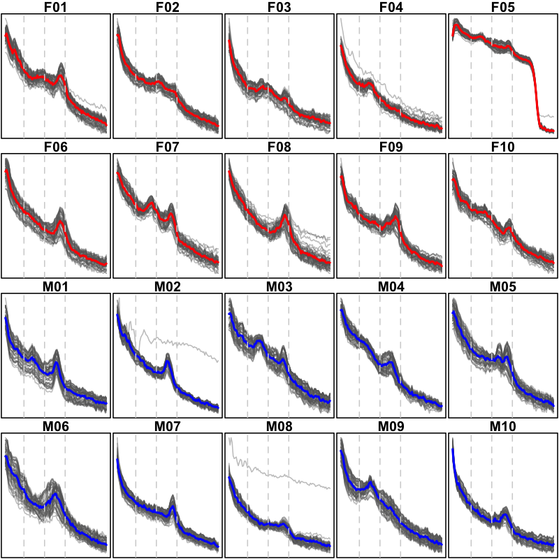

---

Having reviewed these EEG signals we've concluded the following:

 - `F04` appears to have incorrect units (uV but should be mV) for raw
   scalp EEG, relative to the other 19 individuals

 - based on epoch-wise, channel-specific Hjorth statistics, we've
   generated plots that indicate the likely presence of line-noise or
   other types of extreme artifact

 - focusing on N2 power spectra, we see the typical 1/f slope for the
   log-scaled PSD curves as well as evidence of peaks around sigma
   range, indicative of (true) physiological spindle activity

 - when looking person-by-person at the power spectra, some
   individuals appear to have spectral peaks at other modes (when
   averaging over all channels); we'll return to these details later,
   although for now we'll note that we have yet to confirm the
   accuracy/correctness of sleep staging annotations, which could
   naturally impact the interpretation of these plots

Next, we'll look at [EEG polarity](pol.md) to scan for potentially flipped signals. 