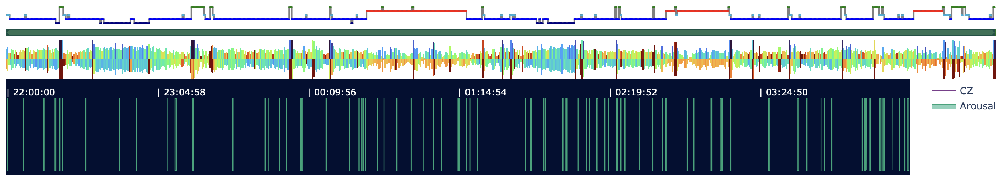
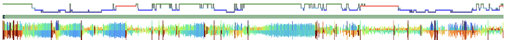
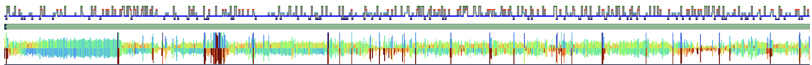
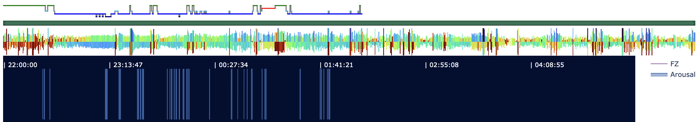

# 3.1. Annotation summary statistics

## Simple tabulations

Luna's [`ANNOTS`](https://zzz.bwh.harvard.edu/luna/ref/annotations/#annots) command can be used to generate
simple statistics (e.g. counts, durations) for the _annotations_ associated with a recording:

```{ .sh .codeL }
luna harm1.lst -o out.db -s ANNOTS
```

Here we'll output a table that is simply _all_ annotations (i.e. as if we simply concatenated the information
from the .annot files):

```{ .sh .codeL }
destrat out.db +ANNOTS -r ANNOT INST T > tmp/ann.1
```

and then look at these in R:

```{ .R .codeR }
d <- read.table( "tmp/ann.1" , header=T , stringsAsFactors=F)
```

This dataframe contains 16675 total annotations; the column headings
should mostly be self-evident.  Start/stop times are either in elapsed
seconds, clock-time (`_HMS`) or elapsed time in H:M:S format
(`_ELAPSED_HMS`).  Luna distinguishes two levels of annotation ID in
the .annot format, _class_ (here `ANNOT`) and _instance_ (here
`INST`); you can ignore the instance-level information here.  Finally,
`T` is a string representation of the annotation time-period in Luna's
internal time-point units (1 time-point is 10e-9 seconds).

```{ .R .codeR }
head(d)
```
```
   ID ANNOT INST                         T CH DUR START START_ELAPSED_HMS
1 F01     W    W             0_30000000000  .  30     0          00:00:00
2 F01     W    W   30000000000_60000000000  .  30    30          00:00:30
3 F01     W    W   60000000000_90000000000  .  30    60          00:01:00
4 F01     W    W  90000000000_120000000000  .  30    90          00:01:30
5 F01     W    W 120000000000_150000000000  .  30   120          00:02:00
6 F01     W    W 150000000000_180000000000  .  30   150          00:02:30
  START_HMS STOP STOP_ELAPSED_HMS STOP_HMS
1  22:00:00   30         00:00:30 22:00:30
2  22:00:30   60         00:01:00 22:01:00
3  22:01:00   90         00:01:30 22:01:30
4  22:01:30  120         00:02:00 22:02:00
5  22:02:00  150         00:02:30 22:02:30
6  22:02:30  180         00:03:00 22:03:00
```

Counting the total number of annotations: 

```{ .R .codeR }
table( d$ANNOT )
```
```
Arousal      N1      N2      N3       R       W 
   1232    1317    7444    1805    1942    2935 
```

We can extract the counts stratified by individual:

```{ .R .codeR }
table( d$ID, d$ANNOT )
```     
```
      Arousal  N1  N2  N3   R   W
  F01      86  55 361 148 118 161
  F02      97  36 431 145 180  69
  F03       0  41  40  15   6  36
  F04       0  36  65  18  19  45
  F05     105  78 380 141 114 183
  F06       0  24  36  18  18  21
  F07      83  25 426  42 141 310
  F08     159 108 366 103 132 134
  F09      81  44 477  63 147  48
  F10     131  81 426  84 147 183
  M01     132 102 592  61  42  79
  M02      41  30 304  11  17  97
  M03       0  82 434 120 180 122
  M04       0  99 344 160 103 245
  M05       0  84 593  83  75  98
  M06       0  71 435  63 132 212
  M07       0  40 434  97  64 363
  M08       0  64 421  96  71 330
  M09      91  45 472 257 122  81
  M10     226 172 407  80 114 118
```

Note: because of how the annotation/staging information was supplied
(e.g. via .eannot files only in some cases), some individuals do not
have any marked arousals: it is naturally always important to know
whether `0` in this context means truly no arousals detected, versus
that they were included/measured for only some individuals.

Also note that `F01` now has stages other than just N2 as we retrieved the original file for this (and for `F05`, `F10` and `M10`)
[just prior to this step](../p2/revised.md)

Finally, we can look at the average duration of each annotation class:
```{ .R .codeR }
round( tapply( d$DUR , list( d$ID , d$ANNOT ) , mean ) ,2 ) 
```
```
    Arousal    N1     N2     N3      R      W
F01   11.03 30.00  30.00  30.00  30.00  30.00
F02   11.31 30.00  30.00  30.00  30.00  30.00
F03      NA 56.34 168.00 344.00 510.00 251.67
F04      NA 42.50 174.46 281.67 217.89  89.33
F05   13.03 30.00  30.00  30.00  30.00  30.00
F06      NA 56.25 371.67 225.00 253.33  55.71
F07   12.74 30.00  30.00  30.00  30.00  30.00
F08   11.72 30.00  30.00  30.00  30.00  30.00
F09   12.39 30.00  30.00  30.00  30.00  30.00
F10   11.10 30.00  30.00  30.00  30.00  30.00
M01   11.62 30.00  30.00  30.00  30.00  30.00
M02   12.34 30.00  30.00  30.00  30.00  30.00
M03      NA 30.00  30.00  30.00  30.00  30.00
M04      NA 30.00  30.00  30.00  30.00  30.00
M05      NA 30.00  30.00  30.00  30.00  30.00
M06      NA 30.00  30.00  30.00  30.00  30.00
M07      NA 30.00  30.00  30.00  30.00  30.00
M08      NA 30.00  30.00  30.00  30.00  30.00
M09   13.74 30.00  30.00  30.00  30.00  30.00
M10   12.09 30.00  30.00  30.00  30.00  30.00
```
The above types of descriptives can be useful to spot obvious outliers or errors. For example, here we see:

 - manually scored arousals (when present, otherwise mean duration of
   `NA`) are typically on the order of 10 seconds, which is reasonable

 - for staging, most individual stage annotations are in units of 30
   seconds. This need not be the case however, e.g. as we saw for
   `F03` - `F06`, they had annotation files generated where contiguous
   intervals of the same stage were represented as a single annotation
   (e.g. 90 seconds = three 30 second epochs, etc).  From Luna's
   perspective, either representation is fine for all commands.  The
   point of this type of review is to check we don't have nonsensical/nonstandard
   values, e.g. mean stage annotation durations less than 1 second,
   etc.


## Visualizing annotations

We'll get to hypnogram visualization and quantification more fully in
the [next step](hypno.md), but it is important to note here that
visualizing _all_ annotations can be very useful.

For example, using the previously-introduced `lp.scope()` viewer in _lunapi_, we can see cases
were things look "as expected" - e.g. the arousal annotations (green lines) are spread across the night,
the derived hypnogram (which is based on the supplied manual staging here, looks sensible - and it also aligns
with the broad patterns in the [Hjorth summary plot](https://zzz.bwh.harvard.edu/luna/apps/moonlight/#hjorth) below:



That is, where the Hjorth plot is taller, it reflects greater EEG amplitudes, and this typically tracks with deeper NREM sleep.

In contrast, here is a case where the hypnogram and Hjorth plots are not so clearly aligned:



Further, there can be clear cases where annotations/staging look unusual:



Also, there can be cases where annotations appear truncated versus the EDF, which might potentially reflect an error:



These are given just as examples to motivate visual inspection of annotations as well as signals when feasible. 

---

We'll explore these staging-signal inconsistencies when considering
the `SOAP` command [in a step below](soap.md). But before that, we'll
continue with what we started above and move on to [visualizing and
summarizing hypnograms](hypno.md).
