# 3.4. Automated staging (POPS)

The recordings in this walkthrough have been manually staged and we'll
use those stagings for all subsequent analyses. However, if manual
staging did not exist, rather than performing the [previous SOAP
step](soap.md) one would instead need to generate stage labels per
epoch.  Luna offers the POPS stager, which can be (re)trained on
various different montages and using different feature sets. Here we
focus on the default single central EEG adult model (called `s2`),
which is included in the `auxiliary/` folder of this walkthrough. For this
example, we'll only work with the `s2` model, which was trained on
over 3000 central EEG leads from [NSRR](https://sleepdata.org)
recordings.


<!--

## Obtaining the POPS model(s)

If you are running Luna in a Docker/Jupyter lab environment, you
likely already have POPS models available. If not, downloaded
them from
[http://zzz.bwh.harvard.edu/dist/luna/pops.zip](http://zzz.bwh.harvard.edu/dist/luna/pops.zip).
Here we use `wget`, but you can also download them via your browser and save `pops.zip` to the current folder:

```{ .sh .codeL }
wget http://zzz.bwh.harvard.edu/dist/luna/pops.zip 
```

If you've downloaded `pops.zip` into the current working directory and `unzip` it, you should see the following files, or something like this: 

```{ .sh .codeL }
unzip pops.zip 
```
```
Archive:  pops.zip
   creating: pops/
  inflating: pops/s2.ftr             
  inflating: pops/s2.conf            
  inflating: pops/s2.spec2a.svd      
  inflating: pops/s2.spec2c.svd      
  inflating: pops/s2.rspec1.svd      
  inflating: pops/s2.spec1.svd       
  inflating: pops/s2.priors          
  inflating: pops/s2.mod             
  inflating: pops/s2.spec2b.svd      
  inflating: pops/s2.rspec2.svd      
  inflating: pops/s2.ranges          
  inflating: pops/s2.spec2.svd       
```

--->


## Single channel prediction

We can use the `RUN-POPS` Luna command to apply this model to our
sample. `RUN-POPS` currently assumes the `s2` model by default,
so we only need to point to the folder we've just created with the `s2`
model files and tell it to use the EEG `C4` channel.
(This model was trained on `C3` and `C4` channels.)

__To clarify the presentation and evaluation of POPS, we'll apply it
to the original (`v1`) dataset rather than the manipulated `v2`
dataset__.  Also, the `s2` model was trained on central EEGs with
contra-lateral mastoid rereferencing whereas the `harm1.lst` datasets
are now linked-mastoid referenced (although we don't expect this
to make any major differences in performance).

We'll use `s.lst` that points to the `v1` data and
tell `RUN-POPS` to re-reference to contra-lateral mastoids (i.e. to use C4-A1):

```{ .sh .codeL }
luna s.lst -o out.db -s RUN-POPS sig=C4 ref=A1 path=work/data/auxiliary/pops
```

This runs quite quickly: on this laptop, for all 20 individuals the
above completed in 44 seconds, or 2.2 seconds per EDF, when based on
this single EEG channel.

For each individual, the console log will report key summaries of the
staging: e.g. a confusion matrix and kappa statistic:

```
  running POPS
  reading feature specification from ./pops/s2.ftr
   396 level-1 features, 109 level-2 features
   113 of 505 features selected in the final feature set
  ...
  feature matrix: 951 rows (epochs) and 113 columns (features)
  set 20 ( prop = 0.000186111) data points to missing
  adding POPS annotations (pN1, pN2, pN3, pR, pW, p?)

  kappa = 0.792083; 3-class kappa = 0.883651 (n = 951 epochs)
  Confusion matrix: 
         Pred:      W      R      N1      N2      N3     Tot
  Obs:  W         218      5      11      10       1     0.26
        R           0    100       0       3       0     0.11
        N1          8     13      15      62       1      0.1
        N2          2      5       2     319      16     0.36
        N3          0      0       0       7     153     0.17
        Tot:     0.24   0.13    0.03    0.42    0.18     1.00

```

We can retrieve the summaries across all individuals:

```{ .sh .codeL }
destrat out.db +RUN-POPS -v K K3 ACC ACC3 -p 2 
```
```
ID      ACC    ACC3       K      K3
F01    0.86    0.90    0.80    0.80
F02    0.85    0.92    0.79    0.82
F03    0.80    0.90    0.74    0.79
F04    0.79    0.87    0.73    0.78
F05    0.76    0.91    0.68    0.83
F06    0.82    0.91    0.73    0.78
F07    0.71    0.83    0.60    0.73
F08    0.84    0.93    0.78    0.86
F09    0.84    0.94    0.75    0.87
F10    0.87    0.96    0.81    0.93
M01    0.76    0.83    0.59    0.50
M02    0.81    0.91    0.68    0.80
M03    0.83    0.90    0.77    0.80
M04    0.85    0.94    0.79    0.88
M05    0.84    0.89    0.71    0.70
M06    0.88    0.93    0.82    0.88
M07    0.82    0.86    0.74    0.75
M08    0.85    0.92    0.79    0.84
M09    0.77    0.86    0.66    0.56
M10    0.73    0.86    0.62    0.70
```

Overall, performance is good: the median (mean) 5-class kappa is 0.74 (0.73).
The median (mean) 3-class kappa is 0.80 (0.78).

!!!info "Kappas and automated staging"
    Remember that the primary use
    case of automated staging will be when prior (manual) staging data
    do not exist.  As such, Luna will naturally not be able to output
    any kappa/accuracy statistics.  When manual staging doesn't exist,
    it can be useful to visually review the hypnograms and hypnodensity
    plots generated.  In particular, very fragmented hypnograms, or
    cases of low _confidence_ (i.e. the maximum posterior probabilities
    tend to be relatively low across many epochs, i.e. rather than all near 1.0) are signs
    that the automated staging is less likely to be accurate.  In these
    circumstances it can be worth checking the original signal data
    (i.e. are the signals massively corrupt), ensuring that excess
    wake/artifact periods have been trimmed (i.e. if getting data from
    24 hour recordings), and/or using more than one stager.  At least
    for POPS, most errors will be in the classification of REM and N1 -
    confident assignments of NREM (N2 or N3) sleep are likely to be
    highly specific.
   

## Multiple channels

Although all features in this model are based on a single EEG channel,
you can still apply it (sequentially) to multiple, broadly comparable
channels. Luna does this automatically and compiles the results across
channels, to provide a single set of predictions.  By default, Luna
reports the mean of the posterior probabilities, each weighted by the
confidence for that channel.

Given we have hd-EEG, we'll apply the same model to six channels per
individual: in addition to C4, we will add the adjacent FC4 and CP4
channels, as well as the corresponding contra-lateral left hemisphere
channels:

```{ .sh .codeL }
luna s.lst -o out.db \
 -s ' RUN-POPS sig=C4,CP4,FC4,C3,CP3,FC3 ref=A1,A1,A1,A2,A2,A2
               path=work/data/auxiliary/pops args="mean" ' 
```

Here `sig` and `ref` take a vector of channels, where the
_i<sup>th</sup>_ `sig` is referenced against the _i<sup>th</sup>_
`ref`. This takes a little longer (now 10 seconds per study).
Is it worth the extra effort?  We can review the kappa statistics as
before:

```{ .sh .codeL }
destrat out.db +RUN-POPS -v K K3 ACC ACC3 -p 2 
```
```
ID    ACC  ACC3       K    K3
F01  0.86  0.91    0.82  0.83
F02  0.85  0.91    0.78  0.81
F03  0.81  0.90    0.74  0.80
F04  0.83  0.91    0.78  0.85
F05  0.77  0.91    0.69  0.83
F06  0.85  0.92    0.78  0.79
F07  0.76  0.87    0.66  0.78
F08  0.83  0.92    0.77  0.84
F09  0.85  0.93    0.75  0.85
F10  0.87  0.96    0.81  0.92
M01  0.79  0.85    0.62  0.54
M02  0.83  0.91    0.71  0.80
M03  0.81  0.88    0.74  0.78
M04  0.85  0.95    0.80  0.90
M05  0.85  0.90    0.72  0.72
M06  0.89  0.94    0.84  0.89
M07  0.84  0.88    0.77  0.78
M08  0.87  0.93    0.80  0.87
M09  0.82  0.90    0.73  0.71
M10  0.75  0.87    0.64  0.72
```

Preliminary analyses based on these samples would suggest so: the
average kappa for this six-channel application of the same `s2`
model is significantly higher than than kappa from the single-channel C4 model (paired
_t_-test _p_ = 0.002; _K_ = 0.75 vs 0.73).


<!--

luna s.lst -o out.db  -s ' RUN-POPS sig=C4,CP4,FC4,C3,CP3,FC3 ref=A1,A1,A1,A2,A2,A2 path=./pops args=" mean " '
destrat out.db +RUN-POPS -v K K3 ACC ACC3 > tmp/pops.multi

luna s.lst -o out.db -s RUN-POPS sig=C3 ref=A2 path=./pops
destrat out.db +RUN-POPS -r E  > o.c3

destrat out.db +RUN-POPS -v K K3 ACC ACC3 > tmp/pops.c4
destrat out.db +RUN-POPS -v K K3 ACC ACC3 > tmp/pops.c3
R
d3 <- read.table( "tmp/pops.c3", header=T, stringsAsFactors=F)
d4 <- read.table( "tmp/pops.c4", header=T, stringsAsFactors=F)
dm <- read.table( "tmp/pops.multi", header=T, stringsAsFactors=F)

t.test( d3$K , d4$K , paired=T )
t.test( d3$K , dm$K , paired=T )
t.test( d4$K , dm$K , paired=T )

t.test( d3$K3 , d4$K3 , paired=T )
t.test( d3$K3 , dm$K3 , paired=T )
t.test( d4$K3 , dm$K3 , paired=T )

summary( d3$K )
summary( d4$K )
summary( dm$K )

summary( d3$K3 )
summary( d4$K3 )
summary( dm$K3 )

-->


## Reviewing outputs

We can extract epoch-level predictions from the previous multi-channel run:

```{ .sh .codeL }
destrat out.db +RUN-POPS -r E  > o.1
```

In R:
```{ .R .codeR }
library(luna)
d <- read.table( "o.1" , header=T, stringsAsFactors=F)
ids <- unique( d$ID )
```

We can generate plots for each individual, e.g. via a simple loop:

<!---
png(file=paste( "vig/docs/imgs/pops-" , id , ".png" , sep="") , res=150 , width=1000, height=400 )
dev.off()
--->

```{ .R .codeR }
for (id in ids) {
 par(mfcol=c(3,1), mar=c(3,3,0.5,0.5) )
 dd <- d[ d$ID == id , ]
 lhypno( dd$PRIOR )
 lhypno( dd$PRED )
 lpp( dd )
}
```

The plots generated are shown below.  For each individual, the top hypnogram
shows the observed, manual staging; the lower hypnogram shows the POPS-predicted (most
likely) staging; the bottom plot shows the posterior probabilities
from POPS.

From a cursory visual inspection, these predictions look highly consistent with
the manual staging for these 20 recordings.

__F01__
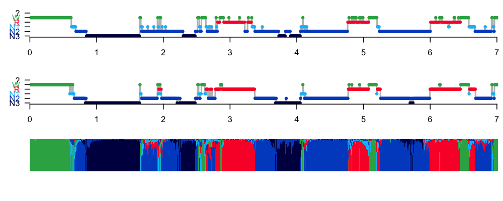
__F02__
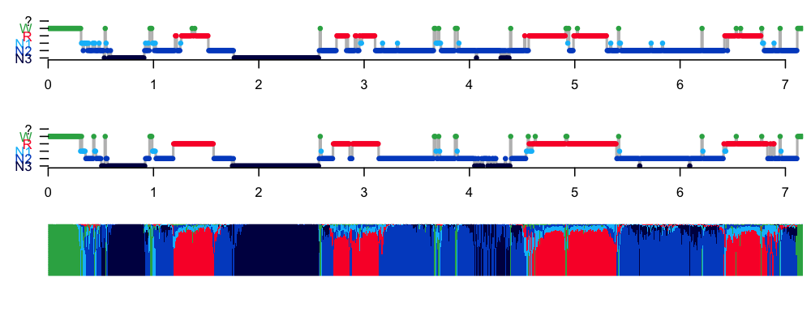
__F03__
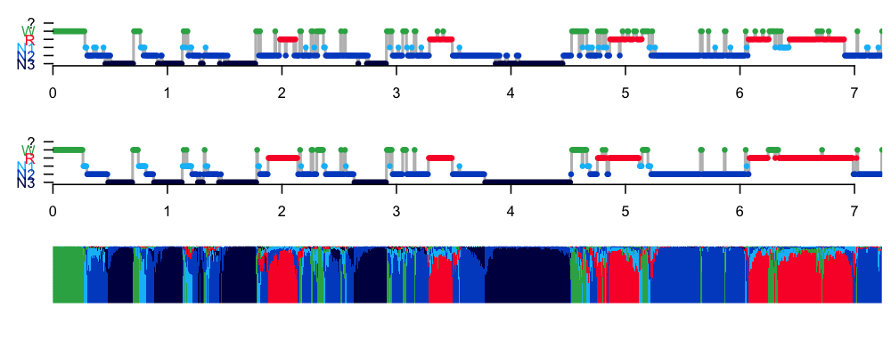
__F04__
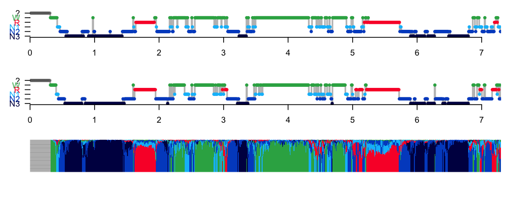
__F05__
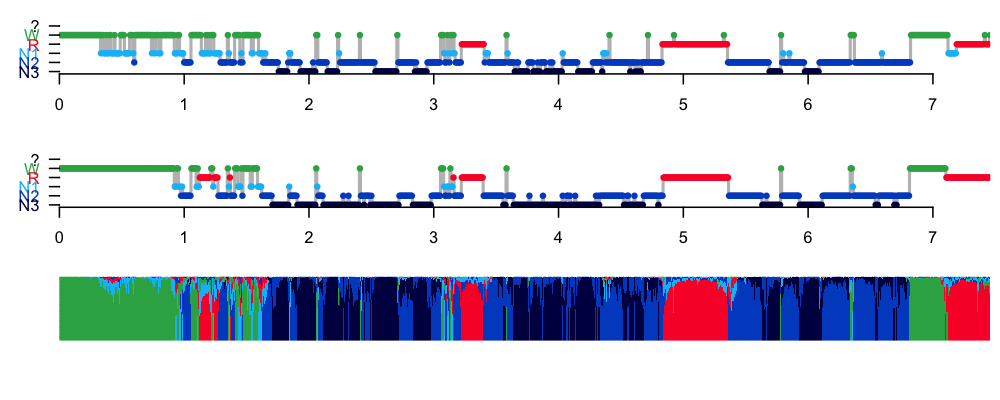
__F06__
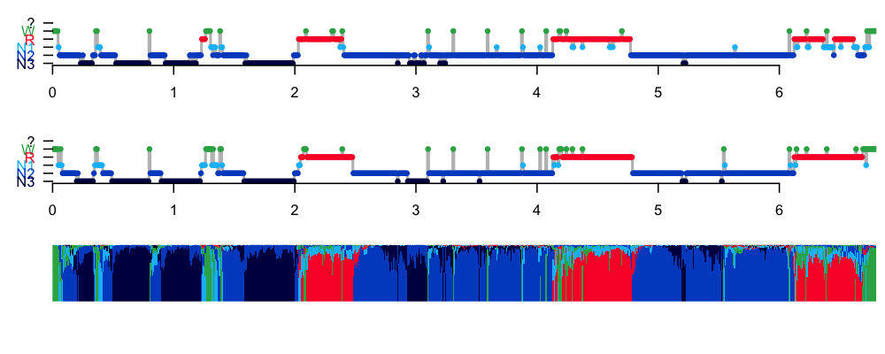
__F07__
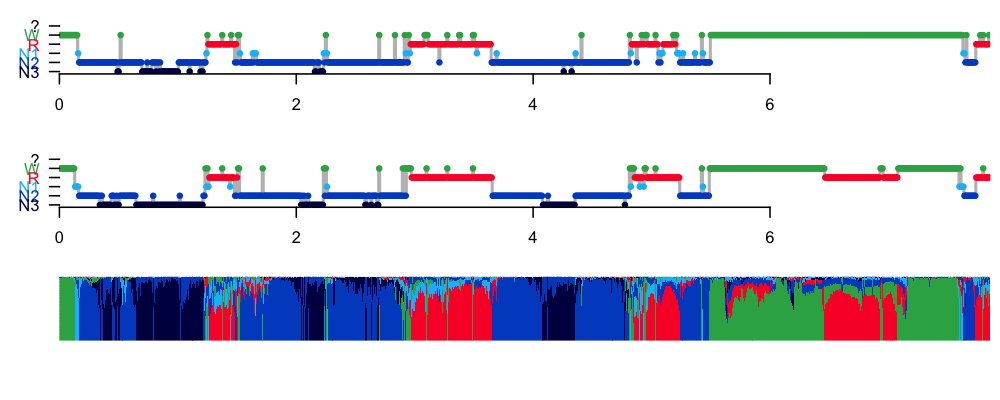
__F08__
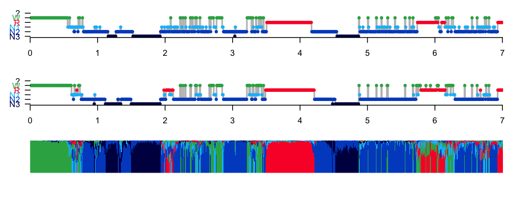
__F09__
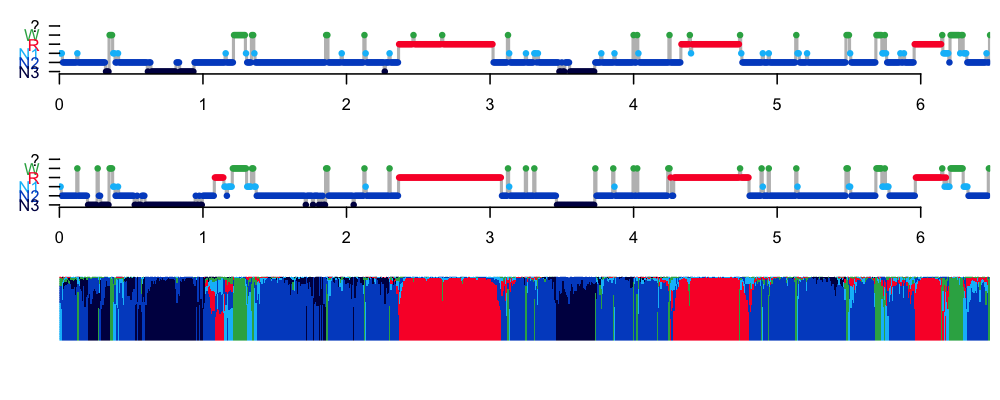
__F10__
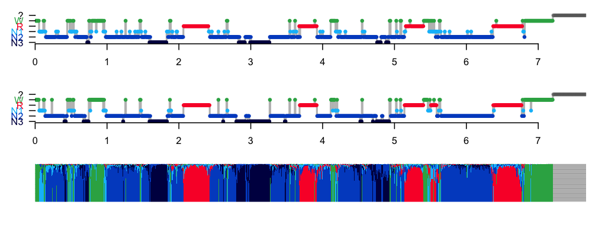

__M01__
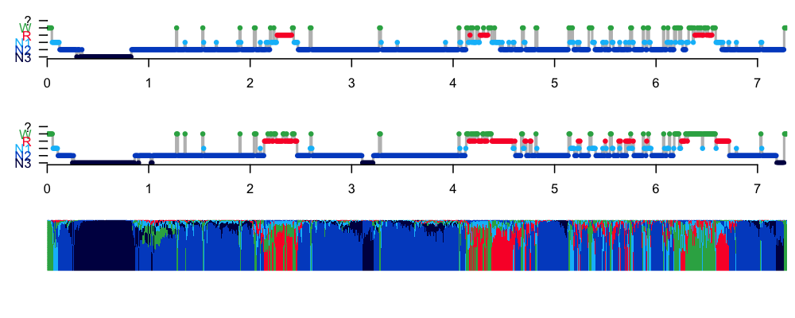
__M02__
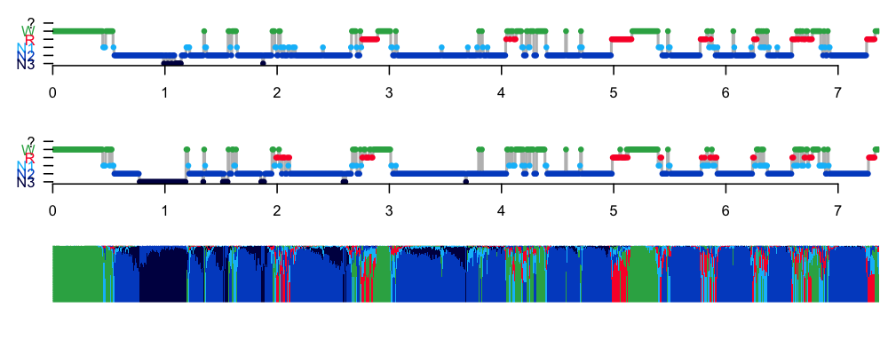
__M03__
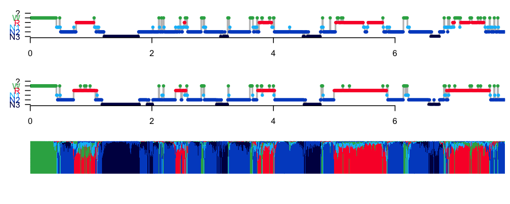
__M04__
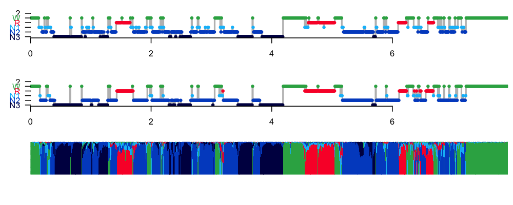
__M05__
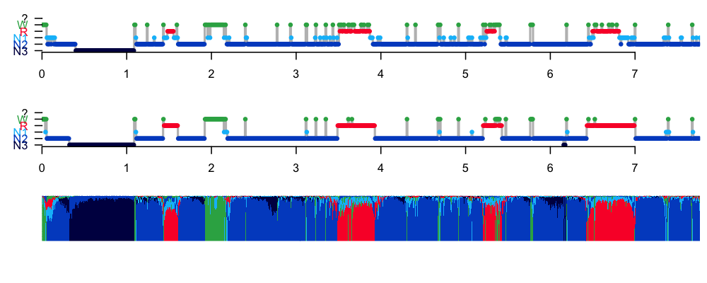
__M06__
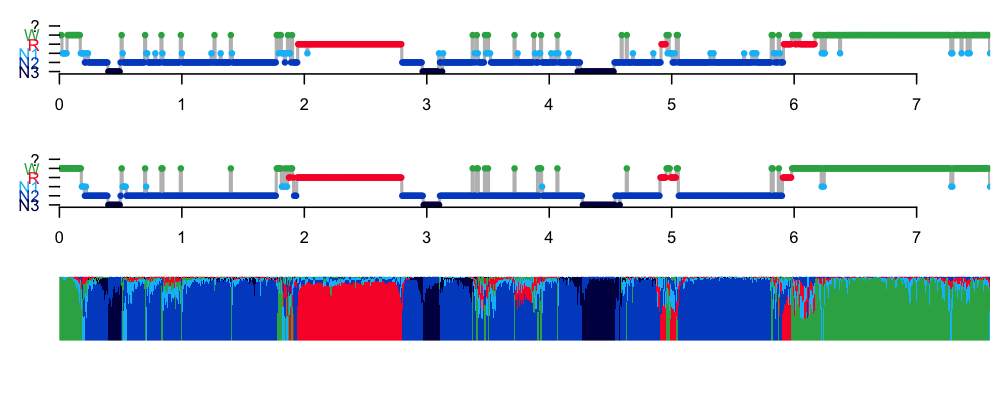
__M07__
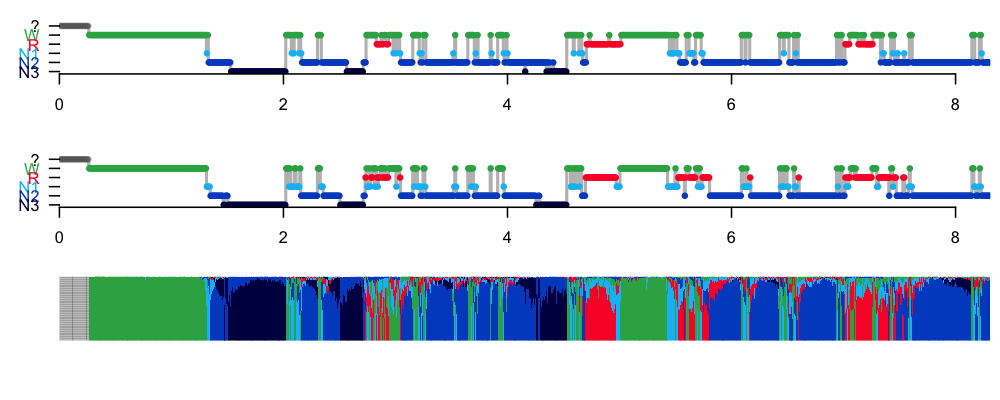
__M08__
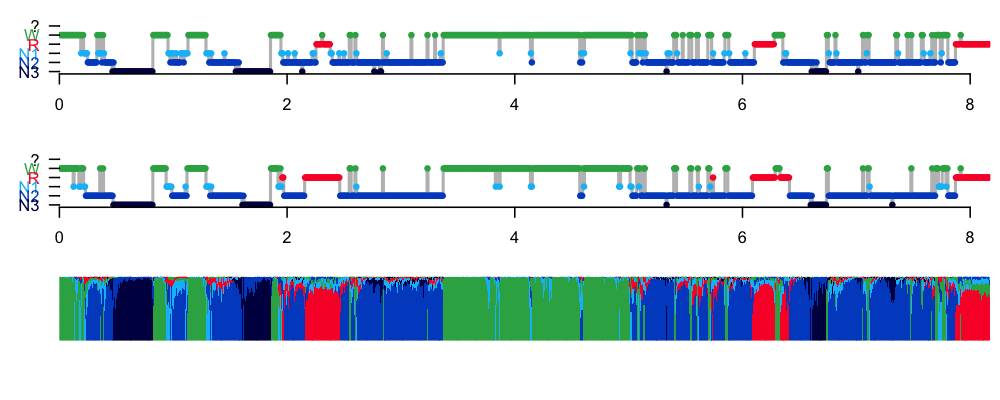
__M09__
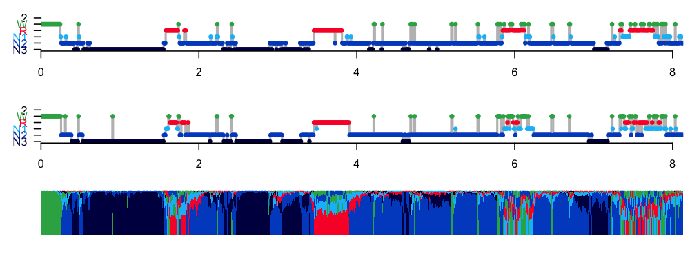
__M10__
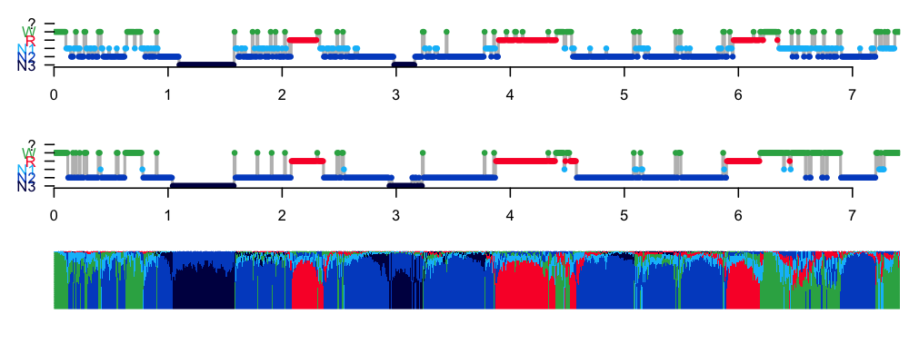

POPS, by default, adds a set of annotations to the attached EDF, with
the labels `pN1`, `pN2`, `pN3`, `pR` and `pW` in this case.  One could
write those out by adding a `WRITE-ANNOTS` command after `RUN-POPS`,
if one wanted to save and use those stagings downstream.

## Summary

If it had been necessary, applying POPS to this set of individuals
instead of manual staging would have been successful, based on the
high kappa statistics and the review of hypnograms.  Visual
inspection of manually and automatically staged hypnograms shows
a fundamental alignment across all 20 individuals.

We'll now move on to [the final step of QC](../p4/index.md).

