# 3.3. Evaluating staging/signal quality (SOAP)

As described
[here](https://zzz.bwh.harvard.edu/luna/vignettes/soap-pops/#evaluating-overall-staging-quality),
Luna's [SOAP](https://zzz.bwh.harvard.edu/luna/ref/soap/) command can
quickly evaluate whether there are gross misalignments
or other inconsistencies between staging and signal (typically, but to necessarily EEG) data.

In brief, `SOAP` tries to predict existing staging given one or more
(EEG) signal. If the prediction _within a single
individual_ is poor (a low _kappa_), this suggests that the signal(s)
and/or staging annotations are problematic (i.e. assuming the signals are
normally expected to covary with true sleep stage).

Internally, SOAP performs a spectral analysis (Welch PSD) per epoch,
then applies dimension reduction (PCA) over the epochs. It selects the
components that are associated with stage labels.  It then fits a
linear discriminant analysis (LDA) model to predict stage given the
PCs (just for that one individual), and compares the
fitted to the observed values to obtain measures of accuracy (e.g. kappas,
etc).

_Note that this is a qualitatively different exercise than automated
staging_ (which we address in the [next segment](pops.md)).  Here we
are using a "prediction-like" approach only to assess the general
association between _existing_ staging and signals. As such, the kappa
should not be interpreted in the same manner as is typically done for
automated staging (true prediction).

## Evaluating stage consistency

Here we'll run `SOAP` for a single channel (C3):

```{ .sh .codeL }
luna harm1.lst -o out.db -s ' SOAP sig=C3 '
```

!!!note "Restrictions using SOAP"
    In a previous
    step, we replaced one `v2` recording (`F01`) that only had N2 epochs
    with the correct, original version: if we hadn't done this, we'd
    have to skip `F01` here, as `SOAP` would fail, as the
    `SOAP` model relies of _intra-individual variation between
    different stages_ to build a model. 

    Also note that we've resolved issues with misaligned staging already: if
    we hadn't done this, we'd need to add `EPOCH align` before running
    `SOAP`.

We now extract the _per-channel_ output for a subset of variables; (the `-p 2` option restricts output
to two decimal places):

```{ .sh .codeL }
destrat out.db +SOAP -r CH -v NSS K K3 ACC ACC3 -p 2 
```
```
ID   CH   ACC  ACC3     K    K3   NSS
F01  C3  0.86  0.92  0.80  0.84  5.00
F02  C3  0.64  0.76  0.42  0.44  5.00
F03  C3  0.46  0.68  0.26  0.40  5.00
F04  C3  0.50  0.71  0.16  0.17  5.00
F05  C3  0.85  0.92  0.79  0.83  5.00
F06  C3  0.85  0.93  0.77  0.82  5.00
F07  C3  0.88  0.92  0.82  0.87  5.00
F08  C3  0.78  0.88  0.70  0.76  5.00
F09  C3  0.90  0.95  0.83  0.87  5.00
F10  C3  0.82  0.89  0.75  0.79  5.00
M01  C3  0.89  0.93  0.78  0.72  5.00
M02  C3  0.91  0.96  0.82  0.90  5.00
M03  C3  0.82  0.89  0.74  0.79  5.00
M04  C3  0.85  0.93  0.80  0.86  5.00
M05  C3    NA    NA    NA    NA -1.00
M06  C3  0.88  0.93  0.82  0.87  5.00
M07  C3  0.87  0.92  0.81  0.86  5.00
M08  C3  0.88  0.95  0.83  0.91  5.00
M09  C3  0.82  0.91  0.74  0.75  5.00
M10  C3  0.81  0.94  0.73  0.84  5.00
```

The `K` variables are the _kappa_ statistics for `SOAP`; the `ACC` are
the corresponding simple accuracy metrics.  The variables `K3` and
`ACC3` are the corresponding values for a three-class (NR vs R vs W)
classification, instead of the default 5-class one.  `NSS` is the number of unique
stages observed (those with at least a
minimum required number of observations/epochs to allow `SOAP` to construct a
predictive model, 10 by default, set by `req-epochs`).

We see that `M05` has a value of `-1` for `NSS` and no values for the kappa/accuracy
statistics.  Here, `-1` is a special code that means no components were retained that
were sufficiently associated with observed stage, a prerequisite for building the LDA model.
If we look at the console output, you'll see the error thrown:

```
 CMD #1: SOAP
   options: sig=C3
  using LDA for primary predictions
  ------------------------------------------------------------
  fitting SOAP model for single channel C3
  read 1 feature specifications (99 total features on 1 channels) from _1
  set epochs to default 30 seconds, 933 epochs
  set 0 leading/trailing sleep epochs to '?' (given end-wake=120 and end-sleep=5)
  applying Welch with 4s segments (2s overlap), using median over segments
  expecting 99 features (for 933 epochs) and 1 channels
  standardizing X
  final feature matrix X: 99 features over 933 epochs
  of 933 total epochs, valid staging for 933, and of those 933 passed outlier removal
  outlier counts: flat, Hjorth, components, trimmed -> total : 0, 0, 0, 0 -> 0
  re-standardizing X after removing bad epochs
  epoch counts: N1:84 N2:593 N3:83 R:75 W:98
  final epoch counts: N1:84 N2:593 N3:83 R:75 W:98
  final count of valid epochs is 933
  0 p<0.01 stage-associated components, bailing
  *** fewer than 2 non-missing stages for this individual, cannot complete SOAP
```

By default, `SOAP` only uses components that are nominally (_p_ < 0.01)
associated with staging when running the LDA.  With very unusual recordings,
it can sometimes happen that no components meet this criterion (which is itself
a warning about potentially poor staging).  If you see an `NSS` of -1 and
no emitted kappa statistics, you can assume there is a _catastrophic_
problem with the signal/staging consistency (i.e. extreme low
kappas). We can force `SOAP` to build a model by altering the _p_ < 0.01
threshold, e.g. setting to 1 or a very high p-value means that
most/all will be included :

```{ .sh .codeL }
luna harm1.lst id=M05  -o out.db -s ' SOAP sig=C3 pc=0.9 '
```
```
  retaining 9 of 10 PSCs, based on ANOVA p<0.9

  Confusion matrix: 5-level classification: kappa = 0.00, acc = 0.64, MCC = 1.00

           Obs:   N1      N2     N3      R      W      Tot
  Pred: N1         0       0      0      0      0     0.00
        N2        84     593     83     75     98     1.00
        N3         0       0      0      0      0     0.00
        R          0       0      0      0      0     0.00
        W          0       0      0      0      0     0.00
        Tot:    0.09    0.64   0.09   0.08   0.11     1.00


  Confusion matrix: 3-level classification: kappa = 0.00, acc = 0.81, MCC = 1.00

           Obs:  NR     R     W     Tot
  Pred: NR      760    75    98     1.00
        R         0     0     0     0.00
        W         0     0     0     0.00
        Tot:   0.81  0.08  0.11     1.00
```


Now we see that kappa/accuracy statistics have been calculated, but
the kappas are zero as all epochs have the same prediction (N2).  In
other words, this is telling us that SOAP was completely unable to
model the signal/staging relationship, and so will always output the
most common stage label (N2) as the best guess.  (This is also a good
reminder why we look at kappa statistics and not accuracy values,
i.e. accuracy is still 0.81 in the 3-class case.)


<!--

destrat out.db +SOAP -r CH -v NSS K K3 ACC ACC3 > o.1
R
d <- read.table("o.1",header=T,stringsAsFactors=F)
png( file="vig/docs/imgs/soap1.png" , res=150 , width=800, height=600) 
pal <- rep( "gray" , 20 )
pal[ c(2:4,15) ] <- "red" 
d$K[ is.na( d$K ) ] <- 0 
plot( d$K , col = pal , pch=20, xlab="Individual" , ylab="SOAP kappa" , main = "" , cex=1.2, ylim=c(0,1) ) 
abline( h = 0.5 , lty=2 ) 
dev.off()

-->

Plotting the `K` kappa statistic (fifth column from above, and setting
the `NA` value to 0 for `M05`), we can see four individuals who appear
to be clear outliers: points colored red `F02`, `F03`, `F04` and
`M05`:

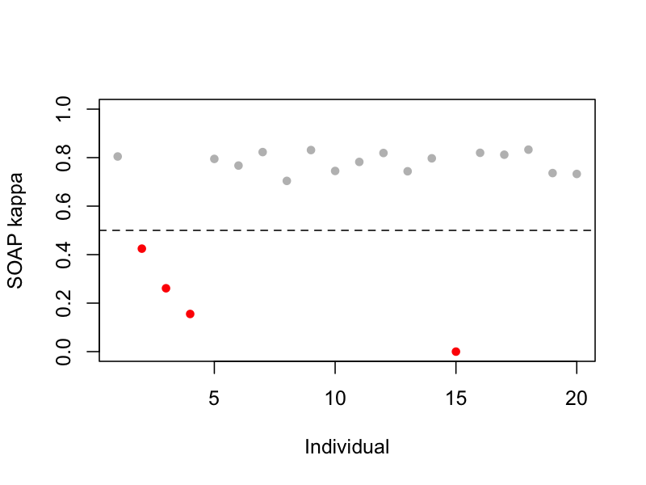

This suggests that four recordings likely have some issue with their
staging/signal consistency, which we'll investigate below.

Indeed, if we [consult the details of manipulations](../data.md#annotation-manipulations), we'll see that all four individuals
had some _major_ type of issue with their staging:

 - `F02`: staging epochs were shifted by 22 epochs (>10 minutes)
   relative to the true signal times (e.g. which can be easily caused by
   the EDF start time being misspecified, etc)

 - `F03` and `F04` had their annotation files literally swapped with one another

 - `M05` had all staging information _scrambled completely at random_

As such, it is interesting to note that `SOAP` saw `M05` as the "most
severe" class of problem, with a kappa of 0 (and with it initially
refusing even to build a model, returning `NSS` of `-1`).  This is
because the swapped/shifted stagings still broadly approximate a
"typical" hypnogram, and so will tend to show a non-trivial level of
correspondence to another (typical) sleeper's.

Note that `SOAP` won't pick up _every possible_ type of problem with staging: for
example, `M02` has severely truncated staging (about half the night missing), but
this class of error is effectively invisible to `SOAP`. (Of course, this particular
issue would be trivial to detect by other means, e.g. simply viewing hypnograms or counting the
number of missing/lights-on epochs).

!!!info "Interpreting SOAP kappa statistics"
    For `SOAP` "low" kappa
    statistics mean roughly below 0.5 or so.  This indicates a likely
    only-modest relationship between the properties of signal (EEG)
    and staging.  As we expect sleep EEG to track with staging (after
    all, it is the primary basis for determining stage, whether by eye
    or automatically...), this could be due to a) a
    bad/noisy/misaligned signal, b) bad/misaligned staging, or c)
    both.  The threshold of 0.5 should not be considered to be fixed in
    stone, however.  For example, individuals with short or unusual
    sleep periods may yield relatively low kappa values, as might cases where only
    nonstandard signals are available (e.g. a bipolar montage that
    doesn't captured stage-dependent activity well).


## Epoch-level review

If we add the `epoch` flag to `SOAP`, it outputs epoch-level
information: the observed stage label (`PRIOR`) plus the posterior
probabilities (`PP_N1`, `PP_N2`, etc) and predicted stage (`PRED`).
This is turned off by default as the outputs can get large for very
large datasets.  We'll also add `pc=0.9` so that `SOAP` emits
values for `M05`:

```{ .sh .codeL }
luna harm1.lst -o out.db -s ' SOAP sig=C3 epoch pc=0.9 '
```

Now we see an additional `E`-by-`CH` stratum in the output:
```{ .sh .codeL }
destrat out.db 
```
```
--------------------------------------------------------------------------
out.db: 1 command(s), 20 individual(s), 32 variable(s), 187291 values
--------------------------------------------------------------------------
  command #1:	c1	Sat Sep  7 09:45:46 2024    SOAP	epoch sig=C3
--------------------------------------------------------------------------
distinct strata group(s):
  commands  : factors         : levels      : variables 
------------:-----------------:-------------:---------------------------
  [SOAP]    : CH              : 1 level(s)  : ACC ACC3 F1 F13 F1_WGT K K3 MCC
            :                 :             : MCC3 NSS PREC PREC3 PREC_WGT RECALL
            :                 :             : RECALL3 RECALL_WGT
            :                 :             : 
  [SOAP]    : E CH            : (...)       : DISC DISC3 INC PP_N1 PP_N2 PP_N3
            :                 :             : PP_NR PP_R PP_W PRED PRIOR
            :                 :             : 
  [SOAP]    : CH SS           : 6 level(s)  : DUR_OBS DUR_PRD F1 PREC RECALL
            :                 :             :
            :                 :             : 
  [SOAP]    : CH VAR          : 10 level(s) : INC PV
            :                 :             : 
  [SOAP]    : CH SS ETYPE     : 36 level(s) : ACC N
            :                 :             : 
  [SOAP]    : CH NSS PRED OBS : 34 level(s) : N P
            :                 :             : 
------------:-----------------:-------------:---------------------------
```

Extracting the epoch-level outputs, we can visualize in R:

```{ .sh .codeL }
destrat out.db +SOAP -r E CH > o.1
```

In R, we'll use a convenience plotting function (`lpp2()`) from lunaR:
```{ .R .codeR }
library(luna)
d <- read.table("o.1",header=T,stringsAsFactors=F)
```
First looking at a "clean" record with a high kappa, e.g. `M06`:
<!---
png(file="vig/docs/imgs/soap-m06-epochs.png", res=150, width=1000, height=250) 
--->

```{ .R .codeR }
lpp2( d[ d$ID == "M06" , ]  )
```

<!---
dev.off()
--->

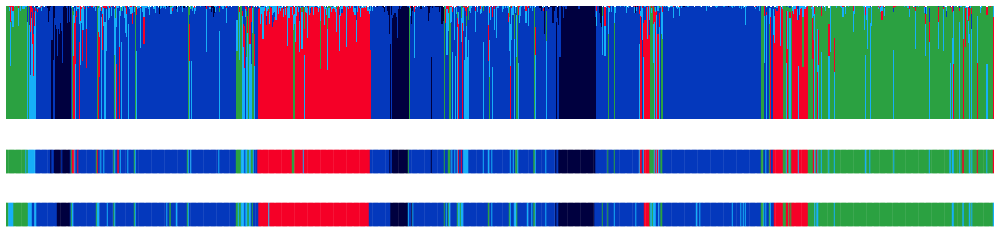

In the above plot, from bottom to top:

 - the lower row encodes the observed stages (`PRIOR`) using the usual Luna stage colors (green/blues/red = W/N1,N2,N3/REM)

 - the middle row encodes the predicted stage (`PRED`)

 - the top row shows the posterior probabilties (i.e. `PRED` is simply the stage with the highest posterior probability)

In the above plot, there is a clear correspondence between the
observed stages and what the simple C3-based model is able to recontruct,
which is reflected in the high kappa statistics for this individual.  Most
(N=16) of the plots look something like the above, i.e. with
probabilties where a) the maximum is typically near 1.0 for each epoch
(high model confidence) and b) the predictive stages tend to
broadly align with the observed data, as expected.

In contrast, let's look at the four cases were we had very low kappas:

First, here is `M05`, for which the stage labels
were completely scrambled in our manipulation:


<!---
png(file="vig/docs/imgs/soap-m05-epochs.png", res=150, width=1000, height=250)
dev.off()
--->

```{ .R .codeR }
lpp2( d[ d$ID == "M05" , ]  )
```

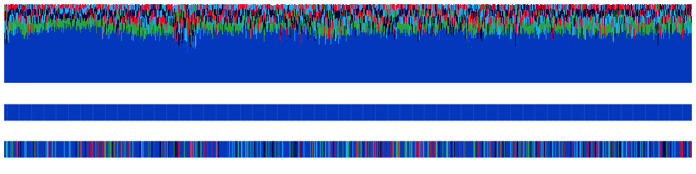

Here we see how every epoch is predicted to be N2: the model basically has no information. 

Next, we'll look at `F03` and `F04` - these were both "valid" hypnograms (versus being completely scrambled), but were 
incorrectly assigned to the wrong individuals:

<!---
png(file="vig/docs/imgs/soap-f03-epochs.png", res=150, width=1000, height=250)
dev.off()
--->

```{ .R .codeR }
lpp2( d[ d$ID == "F03" , ]  )
```

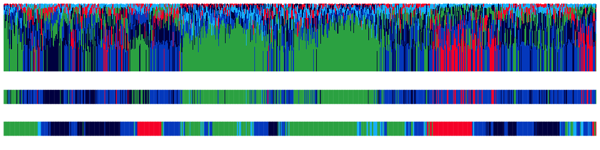

We see a generally "messy" posterior distribution - lot's of low
confidence predictions and a lack of alignment.  We see a similar
picture for `F04`:

<!---
png(file="vig/docs/imgs/soap-f04-epochs.png", res=150, width=1000, height=250)
dev.off()
--->

```{ .R .codeR }
lpp2( d[ d$ID == "F04" , ]  )
```

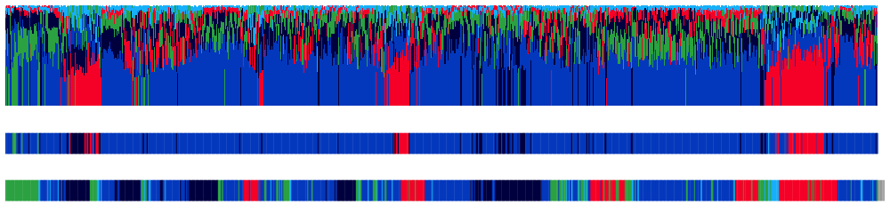

Finally, let's look at a more subtle case: for `F02`, we simply shifted the stage labels by about 10 minutes:

<!---
png(file="vig/docs/imgs/soap-f02-epochs.png", res=150, width=1000, height=250) 
dev.off()
--->

```{ .R .codeR }
lpp2( d[ d$ID == "F02" , ]  )
```
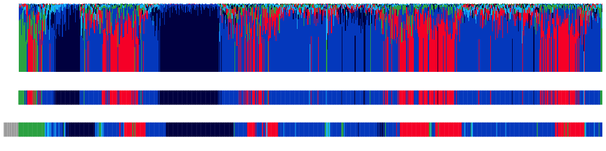

Because of the shifting, you can see how the first portion of the
lower plot is gray, meaning it is unstaged (and thus not analyzed by
`SOAP`).  We see a general lack of alignment -- although, simply by
eye it does appear (in this particular case) that the predictions are
shifted in time, meaning enough valid epochs must have overlapped to
build some kind of valid model.  We can leverage this fact to
realign signals and staging, as we'll do below.

## Multi-channel SOAP

Looking at the patterns of SOAP coefficients across multiple channels
can be informative in the hd-EEG case:

 - if all channels have low kappas, then the problem is likely with
   the staging

 - if at least a few channels have high/normal kappas, then the
   problem is more likely to be with the other low-kappa channels

Thus `SOAP` can be a useful way to spot bad channels even if the
staging information is good on the whole.

Here we'll re-run `SOAP` on all channels. Note, it may take five 
minutes or so to evaluate all 1,140 (20 * 57) channels -- you can skip this
step without impacting the rest of the walkthrough and just look at
the results below, if you wish.  We'll omit the epoch-level output.

```{ .sh .codeL }
luna harm1.lst -o out.db -s ' SOAP sig=${eeg} pc=0.9 '
```

```{ .sh .codeL }
destrat out.db +SOAP -r CH -v NSS K K3 > o.1
```
In R:
```{ .R .codeR }
d <- read.table("o.1",header=T,stringsAsFactors=F)
```
First, we'll check that all individuals were able to have `SOAP` finish (which should be the case with `pc=0.9`)

```{ .R .codeR }
table( d$NSS )
```
```
   5 
1139 
```
We can also check that each individual has outputs for the expected (N=57) number of channels:
```{ .R .codeR }
table( d$ID ) 
```
```
F01 F02 F03 F04 F05 F06 F07 F08 F09 F10 M01 M02 M03 M04 M05 M06 M07 M08 M09 M10 
 57  57  57  57  57  57  57  57  57  57  57  57  57  56  57  57  57  57  57  57 
```

Here we plot the 5-class kappa for all channels/individuals (colors indicate the individual):

<!---
png(file="vig/docs/imgs/soap-multi.png", res=100, width=1000, height=500)
dev.off()
--->

```{ .R .codeR }
plot( d$K , col = as.factor( d$ID ) , pch=20 ,
      xlab = "Indiv/channel" , ylab = "SOAP kappa" , ylim=c(0,1) )
abline(h=0.5) 
```

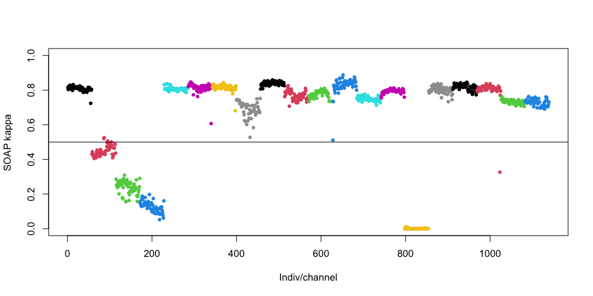

So, for the four "bad" individuals, we see that all channels have poor
kappa scores: the cluster of points are all below (or near) a low
kappa threshold of 0.5.  From this, we'd conclude it wasn't that C3
was just a very bad channel for some people - rather, the
problem likely lies with the staging (as we know to be the case here).

In contrast, this plot does point to a handful of channels that have
been flagged as bad - e.g. for `M08`, the red cluster of points third
to the last (rightmost) in the plot above.  Here, one of the final
channels seems to be an outlier for that individual, falling well
below the kappa threshold.

We can identify this channel:
```{ .R .codeR }
d[ d$ID == "M08" , c("CH","K") ]
```
```
      CH         K
969  Fp1 0.8002591
970  Fp2 0.7926766
971  AF3 0.7896391
972  AF4 0.8096110
973   F7 0.8162281
974   F5 0.7973992
975   F3 0.8133728
976   F1 0.8092905
977   F2 0.8110485
978   F4 0.8102376
979   F6 0.8099534
980   F8 0.7954398
981  FT7 0.8198113
982  FC5 0.8235413
983  FC3 0.8178465
984  FC1 0.8159907
985  FC2 0.8191978
986  FC4 0.8230782
987  FC6 0.8175959
988  FT8 0.7998662
989   T7 0.8237364
990   C5 0.8279041
991   C3 0.8369470
992   C1 0.8010708
993   C2 0.8217165
994   C4 0.8177090
995   C6 0.8115075
996   T8 0.8125639
997  TP7 0.8222410
998  CP5 0.8222884
999  CP3 0.8261689
1000 CP1 0.8371216
1001 CP2 0.8141448
1002 CP4 0.8166989
1003 CP6 0.8057053
1004 TP8 0.7921345
1005  P7 0.8207816
1006  P5 0.8199782
1007  P3 0.8212534
1008  P1 0.8001374
1009  P2 0.8050327
1010  P4 0.8108632
1011  P6 0.8129150
1012  P8 0.8081847
1013 PO3 0.8077789
1014 PO4 0.8021840
1015  O1 0.8041398
1016  O2 0.7922199
1017 AFZ 0.7957461
1018  FZ 0.8047130
1019 FCZ 0.8188830
1020  CZ 0.8229660
1021 CPZ 0.8102523
1022  PZ 0.8140062
1023 POz 0.3263965   <--- outlier
1024  OZ 0.7699115
1025 FPZ 0.7938324
```

If you saved the file `tmp/hjorth.1` from the earlier [signal
review](../p2/stats.md) step, we can review it again here:

```{ .R .codeR }
library(luna)
d <- read.table( "tmp/hjorth.1" , header=T, stringsAsFactors=F)
d$H1 <- log( d$H1 ) 
```

Just looking at the plots for `H1` and `H2`, we can see there is
indeed something off with `POz` (the midline channel second to the
bottom) for `M08`:

```{ .R .codeR }
dd <- d[ d$ID == "M08" , ]           
par(mfcol=c(3,1), mar=c(0.5,0.5,0.5,0.5))
ltopo.xy( dd$CH , dd$E , dd$H1 , z = dd$H1 , pch=20 , col = lturbo( 100 ) , cex=0.2 , xlab="Epoch", ylab="log(H1)" )
ltopo.xy( dd$CH , dd$E , dd$H2 , z = dd$H2 , pch=20 , col = lturbo( 100 ) , cex=0.2 , xlab="Epoch", ylab="H2" )
ltopo.xy( dd$CH , dd$E , dd$H3 , z = dd$H3 , pch=20 , col = lturbo( 100 ) , cex=0.2 , xlab="Epoch", ylab="H3" )
```

<!---

dd <- d[ d$ID == "M08" , ]

png( file= "vig/docs/imgs/soap-m08-poza.png" , width=1000, height=600 , res = 150 )
par(mfcol=c(1,1), mar=c(0.5,0.5,0.5,0.5))
ltopo.xy( dd$CH , dd$E , dd$H1 , z = dd$H1 , pch=20 , col = lturbo( 100 ) , cex=0.2 , xlab="Epoch", ylab="log(H1)" )
dev.off()

png( file= "vig/docs/imgs/soap-m08-pozb.png" , width=1000, height=600 , res = 150 )
par(mfcol=c(1,1), mar=c(0.5,0.5,0.5,0.5))
ltopo.xy( dd$CH , dd$E , dd$H2 , z = dd$H2 , pch=20 , col = lturbo( 100 ) , cex=0.2 , xlab="Epoch", ylab="H2" )
dev.off()

png( file= "vig/docs/imgs/soap-m08-pozc.png" , width=1000, height=600 , res = 150 )
par(mfcol=c(1,1), mar=c(0.5,0.5,0.5,0.5))
ltopo.xy( dd$CH , dd$E , dd$H3 , z = dd$H3 , pch=20 , col = lturbo( 100 ) , cex=0.2 , xlab="Epoch", ylab="H3" )
dev.off()

--->

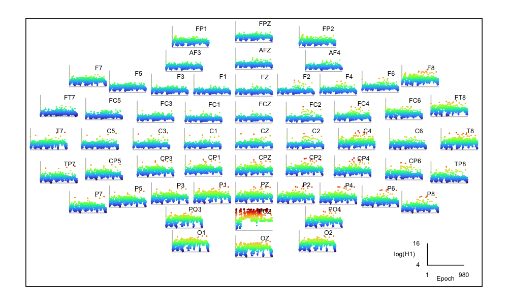
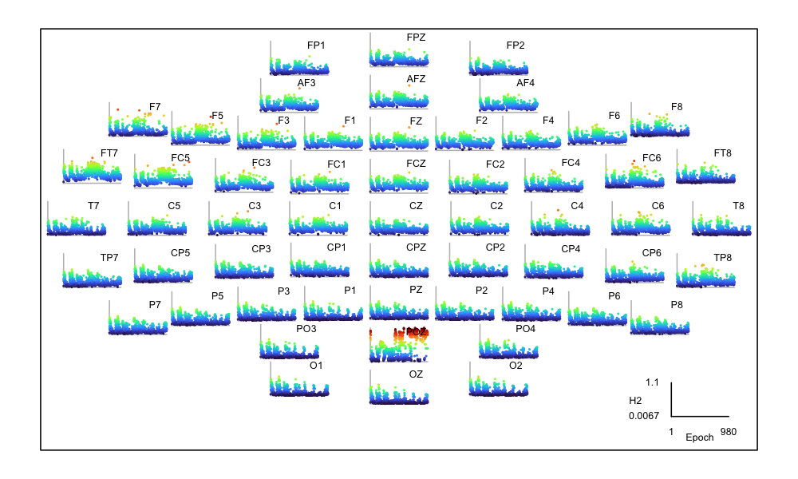
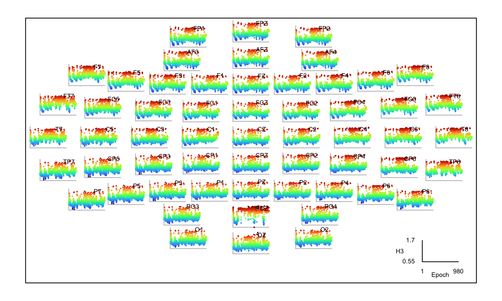


This type of issue will most likely to captured by standard
channel/epoch QC procedures (and likely corrected with
interpolation) so `SOAP` is not necessarily the optimal way to catch
such issues.  Nonetheless, the convergence is reassuring.


## Aligning misaligned staging

There is nothing we can do for the scrambled case, `M05`: as is
evident by simply looking at the hypnogram, it needs replacing (or
using [automated staging](pops.md), etc).  But can we do anything to
potentially salvage the manual staging for the other three recordings?

First we'll consider `F02`. If we have a low SOAP kappa but the
predictions look "shifted" - or, more likely, if we _know_ that the
timing information has been lost on the staging (e.g. it has
nonsensical time-stamps starting in the mid-morning, when the EDF
starts in the evening, etc), then we can turn to Luna's
[`PLACE`](https://zzz.bwh.harvard.edu/luna/ref/soap/#place) as
described [in this
vignette](https://zzz.bwh.harvard.edu/luna/vignettes/soap-pops/#aligning-orphaned-stage-data).

`PLACE` requires a simple .eannot style text file of the stage
labels: these stages will be aligned to the epochs in the EDF. We can use
the `STAGE` command (which is just a minimal version of
`HYPNO epoch`) to output these stage labels:

```{ .sh .codeL }
luna harm1.lst id=F02 -s STAGE min > stg.txt
```

We can now run `PLACE`, passing `stg.txt` to the required `stages`
option and telling it to write any new (realigned) solution to
`new.eannot`:

```{ .sh .codeL }
luna harm1.lst id=F02 -o out.db -s PLACE sig=C3 stages=stg.txt out=new.eannot
```

As described in the
[vignette](https://zzz.bwh.harvard.edu/luna/vignettes/soap-pops/#aligning-orphaned-stage-data),
`PLACE` shifts the annotations, one epoch at a time, to find the
optimal alignment (highest kappa value).  In the console log, it
outputs:

```
  read 861 epochs from stg.txt
  based on EDF, there are 861 30-s epochs
  requiring 0.1 proportion of EDF, and 0.5 of supplied stages overlap

  ...

  optimal epoch offset = -22 epochs (kappa = 0.774458)
  which spans 839 epochs (of 861 in the EDF, and of 861 in the input stages)
```

We can extract the fit for all possible epochs:

```{ .sh .codeL }
destrat out.db +PLACE -r OFFSET > o.1
```


In R:
<!---
png(file="vig/docs/imgs/place.png", res=150,width=1000,height=500)
dev.off()
--->

```{ .R .codeR }
d <- read.table("o.1",header=T,stringsAsFactor=F)
plot( d$OFFSET , d$K , type="n" , xlab="Offset (epochs)" , ylab="Kappa" , xlim=c(-500,500) )
abline(v=c(0,-22), col=c("gray","red") )
lines( d$OFFSET , d$K , type="l" ,  col="darkgreen" ,lwd=2)
```
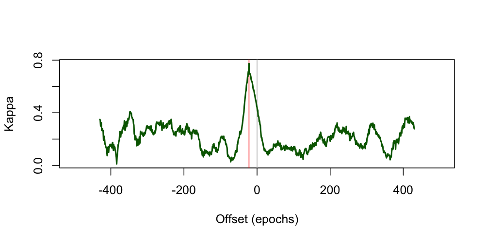

All other things being equal, when the output of `PLACE` looks like
this (i.e. a sharp peak at one high-kappa value), you can be confident
this is a likely correct solution (especially if you had reason to
believe the stage timings were misplaced, as can sometimes happen when working
with archival data, etc).   Zooming into the actual values plotted around the
peak at an offset of -22 epochs, we can see how dramatically it drops off - i.e.
`PLACE` can resolve the alignment to a single epoch (although this depends on the length
and nature of the recording):

```{ .sh .codeL }
destrat out.db +PLACE -r OFFSET/-25,-24,-22,-21,-20 -v K K3 -p 2
```
```
ID   OFFSET       K      K3
F02     -25    0.68    0.65
F02     -24    0.71    0.70
F02     -22    0.77    0.78
F02     -21    0.71    0.73
F02     -20    0.70    0.69
```

The file `new.eannot` contains new annotations; note, the last 22 rows
are set to `?` as the stages been been shifted "backwards" in time
by 22 epochs.  So, we've "solved" the issue with `F02`.

## Matching swapped annotations

What about the two remaining individuals, `F03` and `F04`?  If we
suspect that files have been swapped, we can in principle use `SOAP`
to figure this out.

!!!note "Use of SOAP"
    This is definitely an _edge case_ usage of `SOAP`, that might 
    not be practical in large samples.  At a certain
    point, it would probably be cleaner to use [automated
    staging](pops.md) to restage files, or even redo the manual staging.
    We nonetheless include this as an illustration of how `SOAP`
    works.  There may also be cases where it is
    not easy to perform automated stages (e.g. unusual EEG montages,
    or even the lack of any EEG signals).  _In principle_ `SOAP` is
    agnostic to channel type and could work with other signals that
    covary with sleep stages, e.g. the `EOG`, `EMG` or
    `ECG` even.  It is beyond the scope of this walkthrough to
    address these use cases, however.

Here we iterate through each of the 20 recordings but tell Luna to: a)
ignore that individual's real annotations (with `skip-sl-annots=T`
meaning to skip annotation files defined in the sample list) and b) to
instead read annotations from `F03` and apply them to each EDF.

As our `.annot` files are encoded in elapsed seconds, not clock times,
it means that any file swaps might not have been self-evident; it also 
let's us swap them in in this simple way (although in this particular case, all
recordings were forced to have the same 10pm start, and so this point is moot).

We can run for all EDFs, asking which of them seems to match the
staging in the file `F03.annot` the best, if not `F03` itself?

```{ .sh .codeL }
luna harm1.lst skip-sl-annots=T annot-file=work/harm1/F03.annot \
  -o out1.db -s SOAP sig=C3
```

Extracting and plotting the results (plotting code not shown):
```{ .sh .codeL }
destrat out1.db +SOAP -r CH -v K3 K
```

<!---
destrat out1.db +SOAP -r CH -v K3 K > o.1
R
png( file="vig/docs/imgs/soap-match1.png", res=150, width=1000, height=500) 
d <- read.table("o.1",header=T,stringsAsFactors=F)
pal = rep( "gray" , 20 )
pal[3:4] <- c("red4","red1" )
plot( d$K , pch=20 , col = pal , xlab = "Individual" , ylab = "SOAP kappa" , ylim=c(0,1) , main = "F03.annot matches F04.edf best" ) 
abline(h=0.5,lty=2)
dev.off()
--->

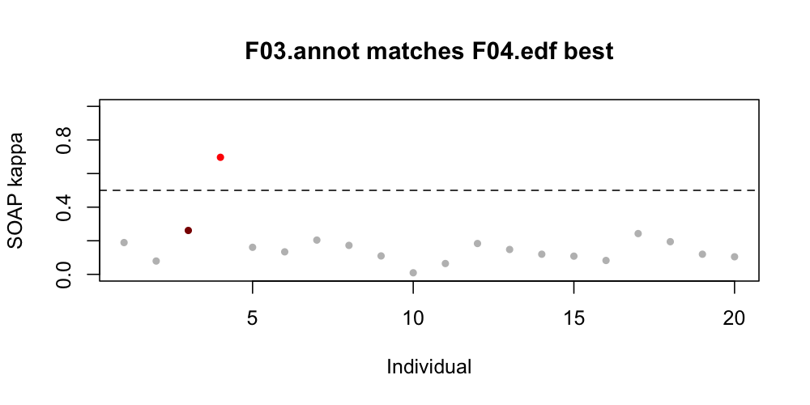

Although the plot colors `F03` in dark red the only high
kappa in fact belongs to `F04` (bright red), suggesting that
the annotations in `F03.annot` better match the signals in `F04.edf`.

Is the converse true?  Given that `F04` also had low original kappas,
perhaps the staging in `F03.annot` better matches the signals in
`F04.edf`?  Again, we'll run this lining up `F04.annot` against _all_
N=20 EDFs:

```{ .sh .codeL }
luna harm1.lst skip-sl-annots=T annot-file=work/harm1/F04.annot \
  -o out2.db -s SOAP sig=C3
```

<!---
destrat out2.db +SOAP -r CH -v K3 K > o.1
R
png( file="vig/docs/imgs/soap-match2.png", res=150, width=1000, height=500)
d <- read.table("o.1",header=T,stringsAsFactors=F)
pal = rep( "gray" , 20 )
pal[4:3] <- c("red4","red1" )
plot( d$K , pch=20 , col = pal , xlab = "Individual" , ylab = "SOAP kappa" , ylim=c(0,1) , main = "F04.annot matches F03.edf best" )
abline(h=0.5,lty=2)
dev.off()
--->

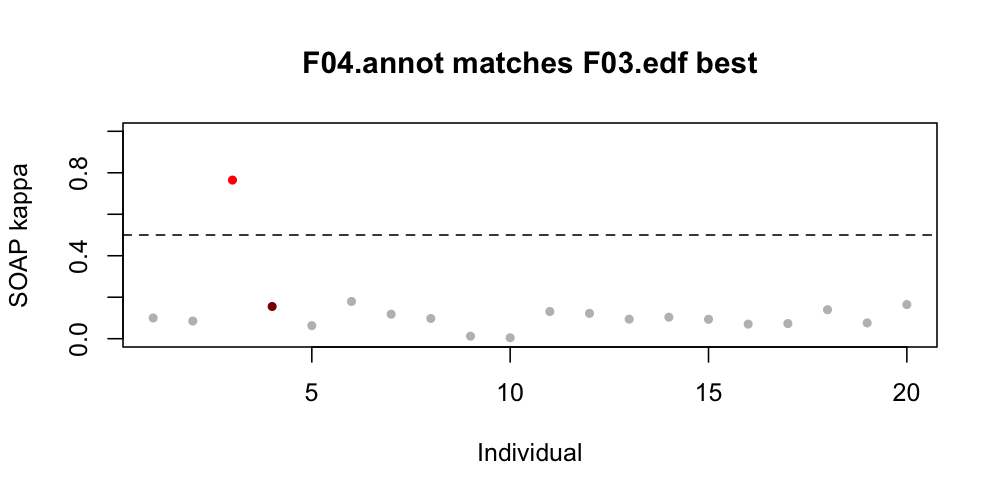

As in the first instance, although the nominal "owner" of these
annotations (`F04`) is dark red, the only EDF with a high kappa score
is `F03` (bright red).  So, in this particular case, it appears we've
detected a straight swap between two individuals.

This _may_ be a slightly contrived example, but our experiences working
with many datasets suggests that these and similar types of errors certainly
can and do occur.


## Summary

In this step, we used `SOAP` to check staging data: 

 - we assessed the general quality of staging for most individuals (which
   was good)

 - we identified a handful of individuals with unusually low `SOAP`
   metrics

 - we used `SOAP` and its friend `PLACE` to resolve some of these edge
   cases (involving swapped or shifted staging)

 - we identified a handful of channels likely containing strong
   artifacts, leading to low `SOAP` values _just for those channels_

In this walkthrough we have manual staging
available which -- having fixed some clear errors -- seems of
generally good quality.   Still, for illustration of Luna's functions,
in the next section we'll next look at running [automated staging](pops.md).

!!!info "Soap versus automated staging: detecting versus correcting problems"
     As noted above, `SOAP` can be a quick, _self-contained_
     method to apply as a QC step.  It likely has more applications to
     _assess_ overall quality and flag potential problems, rather than
     using it for follow up detective work as we did here.  If there
     are problems with existing staging, it will likely be simpler to
     just redo the staging, ideally via [automated methods](pops.md).

     Of course, if manual staging exists, one could also use automated
     staging to provide a QC check of the manual staging too.
     Typically in the context of automated staging, existing manual
     staging is _assumed_ to be the gold standard.  As we've seen
     here, however, that is not necessarily the case.  Indeed, as
     automated stagers get better, for good quality signals low kappas
     from _automated staging_ will more likely reflect problems with
     the manual staging, rather than poor performance of the automated
     stager.

     Still, using automated staging to evaluate 
     existing staging may not be straightforward,
     as it brings an additional layer of assumptions, e.g. about the
     transferability of the model, as well as signal qualities.  As such,
     `SOAP` can still provide a useful, simpler approach to 
     _staging evaluation_.
