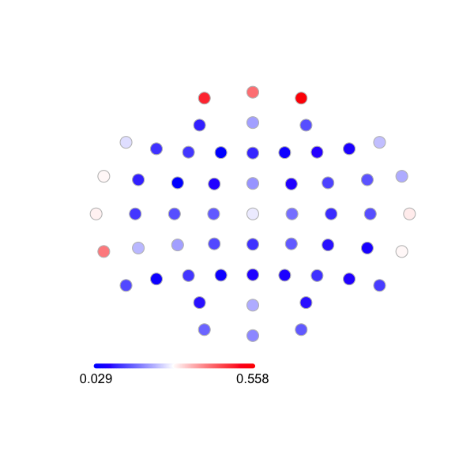
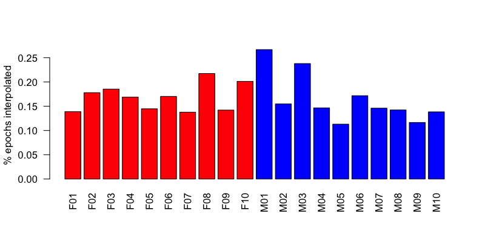
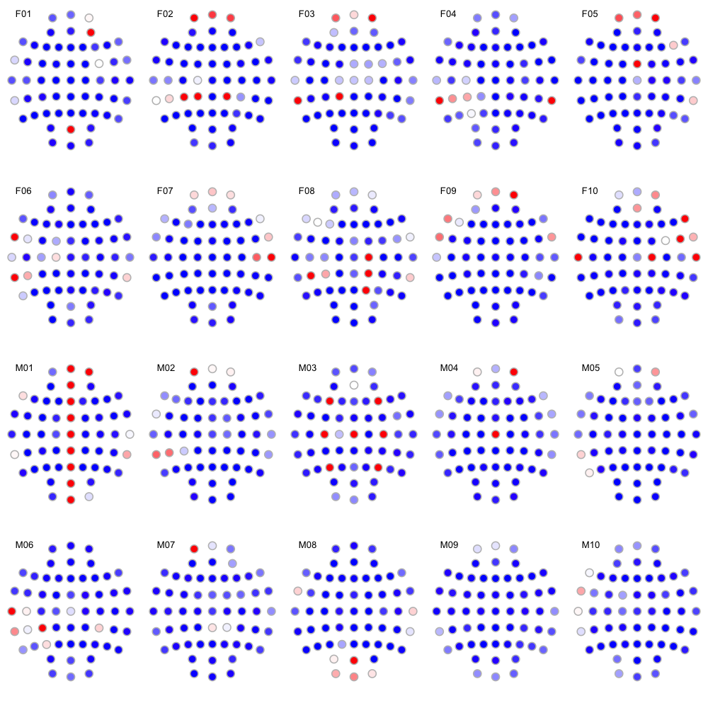

# 4.2. EEG interpolation

We'll populate the `work/clean` folder with (hopefully!)
analysis-ready EDFs, after this final interpolation step. See [this
vignette](https://zzz.bwh.harvard.edu/luna/vignettes/chep/) for an
overview of the logic of QC with
`CHEP-MASK`/`CHEP`/`MASK`/`INTERPOLATE` commands.

Luna implements a spherical-spline interpolation method.
Typically, interpolation works, epoch-by-epoch, to interpolate
epoch/channel combinations that have been flagged as likely artifact
by automated procedures.

!!!hint "QC for limited montage EEG studies"
    Naturally, if we were
    instead working with limited montage EEG studies (e.g. from PSG),
    then interpolation would not be an issue.  As such, we'd skip this
    step and simply move to epoch-level QC prior to specific analyses.
    Inasmuch as it is desirable to have a _squared-off_ dataset, with
    all channels having the same set of epochs, hd-EEG datasets
    necessitate approaches such as QC to achieve this goal; this is
    less of a concern of limited montage studies.

## Forcing specific channels

When we know, _a priori_ or based on other
analyses, that a channel is bad, we can instruct the interpolation
method to interpolate it no matter what.  To aid this step, given the
observations made in prior QC steps, we've created a file
`auxiliary/badchs.txt` which is a `vars` (individual-variable) format file
that defines a variable `${badchs}` for each individual,
i.e. reflecting the above three observations.

```{ .sh .codeL }
cat work/data/auxiliary/badchs.txt
```
```
ID	badch
F01	.
F02	.
F03	.
F04	.
F05	.
F06	.
F07	.
F08	.
F09	.
F10	.
M01	AFZ,FZ,FCZ,CZ,CPZ,PZ,POz,OZ,FPZ
M02	.
M03	CZ,C3,C4,F3,F4,P3,P4
M04	CZ
M05	.
M06	.
M07	.
M08	.
M09	.
M10	.
```

In the above file, we've added `.` values for individuals with no
channels to drop in the above, as the variable needs to be defined for
all individuals.  In the script before,

```
CHEP bad-channels=${badch}
```

will evaluate to

```
CHEP bad-channels=.
```
which basically means _no channels are bad_ (as no channels have the label `.`).


## Running interpolation


This step performs of series of scans looking for outliers -- either
by epoch or by channel -- and then performs interpolation
epoch-by-epoch. In some cases entire channels are dropped for all
epochs. The core command below is `INTERPOLATE`. By default, it uses
internal (64-channel) sensor map. If you have more or
differently-positioned sensors, you can directly attach channel
locations via the
[`CLOCS`](https://zzz.bwh.harvard.edu/luna/ref/spatial/#clocs) command
first.

This step will take several minutes to complete: so as not to overwrite
it, we'll call the output `int-out.db`.  It will write a new set of
EDFs to `work/clean`.  It will also output epoch-level Hjorth
statistics pre- and post-interpolation.


```{ .sh .codeL }
luna harm2.lst vars=luna-grins/auxiliary/badchs.txt \
 -o int-out.db \
 -s ' SIGNALS drop=A1,A2
      TAG INTERPOLATE/0
      SIGSTATS epoch
      TAG  .
      CHEP-MASK ch-th=3
      CHEP bad-channels=${badch} channels=0.3
      CHEP-MASK ch-th=2
      CHEP bad-channels=${badch} dump
      INTERPOLATE
      TAG INTERPOLATE/1
      SIGSTATS epoch
      WRITE edf-dir=work/clean '
```

We can review the generated output from `INTERPOLATE`: 

```{ .sh .codeL }
destrat int-out.db +INTERPOLATE 
```
```
ID  NCHEP_INTERPOLATED NE_INTERPOLATED  NE_MASKED  NE_NONE
F01               6673             843          0        0   
F02               8733             861          0        0   
F03               9189             870          0        0   
F04               8443             877          0        0   
F05               7388             896          0        0   
F06               7927             817          0        0   
F07               7412             944          0        0   
F08              10434             842          0        0   
F09               6307             779          0        0   
F10              10564             921          0        0   
M01              13316             876          0        0   
M02               7805             885          0        0   
M03              12721             938          0        0   
M04               7947             951          0        0   
M05               6014             933          0        0   
M06               8935             913          0        0   
M07               8303             998          0        0   
M08               7963             982          0        0   
M09               6487             976          0        1   
M10               7026             891          0        0   
```

To obtain a more granular picture of what was interpolated for whom,
we can pull the channel-level outputs:

```{ .sh .codeL }
destrat int-out.db +INTERPOLATE -r CH  > o.chs
```

Loading these data into R:

```{ .R .codeR }
d <- read.table( "o.chs" , header=T, stringsAsFactors=F)
library(luna)
```

First, summarizing by channel: here we plot the average percent of
epochs flagged and then interpolated:

<!---
png(file="vig/docs/imgs/interp1.png", res=100, width=600,height=600)
dev.off()
--->

```{ .R .codeR }
dc <- tapply( d$PCT_INTERPOLATED , d$CH , mean )
ltopo.rb( names(dc) , dc  , zeroed=F , show.leg=T, sz=2) 
```



Frontopolar and temporal channels are particularly prone to artifact
and thus interpolation.  We can tabulate the same information depicted
above:

```{ .R .codeR }
cbind(sort(dc, decreasing=T) )
```
```
       Fp2        Fp1        FPZ        TP7         T8         T7        FT7 
0.55837264 0.49355039 0.41932952 0.41198287 0.31164829 0.30672167 0.29958038 
       TP8         CZ         F7         F8        CP5        FT8        POz 
0.29647388 0.27731058 0.26892996 0.24022931 0.23314956 0.22601227 0.22344106 
       CP3        AFZ        FCZ         OZ         C2         O1        CP2 
0.21682390 0.21214005 0.20529878 0.19280673 0.17391582 0.15878867 0.15209290 
        O2         C1        FC6        AF4         C3         C6        CP1 
0.15131115 0.15109263 0.14621647 0.14032227 0.13980163 0.13854846 0.13751657 
        P7        FC4         P8         F3         C5         P3         F5 
0.13551774 0.13196309 0.12465140 0.12073521 0.11834359 0.11696603 0.11556481 
       CPZ         P4         C4         FZ        AF3        FC5        PO3 
0.11490587 0.11362248 0.10890102 0.10216490 0.10038775 0.09910836 0.08815335 
       CP4        PO4         F4         PZ        FC2        FC1         P6 
0.08700970 0.08514355 0.07997645 0.07926446 0.07661015 0.07604957 0.07504070 
        P2         F6        CP6         P5         F2         P1        FC3 
0.07287504 0.07081249 0.06394192 0.05137664 0.05108995 0.04973998 0.03417183 
        F1 
0.02903031 
```


Next, summarizing by individual:

<!---
png(file="vig/docs/imgs/interp2.png", res=100, width=800,height=400)
dev.off()
--->

```{ .R .codeR }
di <- tapply( d$PCT_INTERPOLATED , d$I , mean )
barplot( di , names.arg = names(di) ,
         col = rep(c("red","blue"),each=10) ,
	 las=2, ylab="% epochs interpolated")

```




Combining these viewsw, we can also generate topo-plots of interpolation rates per individual:

<!---
png(file="vig/docs/imgs/interp3.png", res=150, width=1000,height=1000)
dev.off()
--->

```{ .R .codeR }
par(mfrow=c(4,5) , mar=c(0,0,0,0) )

for (id  in ids ) {

 di <- d[ d$ID == id , ] 

 ltopo.rb( di$CH , di$PCT_INTERPOLATED ,
           zeroed = F , mt = id , zlim = c(0,1) , sz=1.5)
}

```



Here we see the expected consequences of the
[manipulations](../data.md#signal-manipulations) for `M01` (all
midline channels are flat) and `M03` (six central and frontal channels
duplicated, as thus listed in `badchs.txt`).

Finally, a number of channels have been comletely interpolated
(including the ones specified in `badchs.txt`): 

```{ .R .codeR }
d[ d$PCT_INTERPOLATED == 1 , ] 
```
```
      ID  CH NE_INTERPOLATED PCT_INTERPOLATED
4    F01 AF4             843                1
55   F01 POz             843                1
58   F02 Fp1             861                1
88   F02 CP3             861                1
89   F02 CP1             861                1
90   F02 CP2             861                1
116  F03 Fp2             870                1
143  F03 TP7             870                1
146  F03 CP1             870                1
200  F04 TP7             877                1
207  F04 TP8             877                1
230  F05 Fp2             896                1
279  F05 FCZ             896                1
298  F06 FT7             817                1
314  F06 TP7             817                1
370  F07  T8             944                1
424  F08  C2             842                1
429  F08 CP5             842                1
432  F08 CP2             842                1
440  F08  P2             842                1
458  F09 Fp2             779                1
525  F10  F8             921                1
532  F10 FC6             921                1
534  F10  T7             921                1
538  F10  C2             921                1
541  F10  T8             921                1
572  M01 Fp2             876                1
619  M01 AFZ             876                1
620  M01  FZ             876                1
621  M01 FCZ             876                1
622  M01  CZ             876                1
623  M01 CPZ             876                1
624  M01  PZ             876                1
625  M01 POz             876                1
626  M01  OZ             876                1
627  M01 FPZ             876                1
628  M02 Fp1             885                1
691  M03  F3             938                1
694  M03  F4             938                1
707  M03  C3             938                1
710  M03  C4             938                1
723  M03  P3             938                1
726  M03  P4             938                1
736  M03  CZ             938                1
743  M04 Fp2             951                1
793  M04  CZ             951                1
876  M06  T7             913                1
886  M06 CP3             913                1
913  M07 Fp1             998                1
1024 M08 POz             982                1
```


## Building the new project

The new set of interpolated EDF is in the folder `work/clean/`.  We'll
now add the annotations to this folder also. (Again, it is not a
prerequisute that all files belong in the same folder, nor it is
necessarily best practice: it is simply the procedure adopted in this
walkthrough.)

```{ .sh .codeL }
cp work/harm2/*.annot work/clean/
```

Finally, we'll build a new _clean_ sample list `c.lst`, which will be
the basis for most of the [analysis steps](../p5/index.md) of this
walkthrough.

```{ .sh .codeL }
luna --build work/clean > c.lst
```

We'll next generate [Hjorth plots](hjorth.md) on the data, pre- and post-interpolation.