# 5.8. Association models

Luna supports two commands (`GPA` and `CPT`) that implement efficient
linear model testing, with empirical permutation-based schemes to
handle multiple testing. These commands do not access original EDF or
annotation files at all.  Rather, the _inputs_ for these commands are
the _outputs_ from prior Luna commands (or, indeed, from _any_ other
software that output values for the observations, as well as other
covariate data already collected).

In general, `GPA` is the more general and flexible option, and should
probably be the default if using Luna to perform association
testing (especially if wishing to control for multiple testing across many
different domains of variable).

In contrast, `CPT` may under some conditions be more powerful, and is more
appropriate when testing only a single metric (e.g. spindle density)
and wishing to account for the multiplicity (and interdependence) of
channels in a hd-EEG context, for example.

## GPA overview

Key points to note with respect to the _general permutation-based
association_ command (`GPA`):

 - fits least squares linear models, allowing for covariates and using
   the Freedman-Lane approach to handling nuisance variables when
   permuting data

 - checks for missing data, both row- and column-wise, and optionally
   performs kNN-based imputation of missing data (otherwise, it
   imposes casewise deletion)

 - reads and merges multiple files from Luna output (or other
   sources), supporting _long-format_ files and tracking any _strata_
   (e.g. channel, frequency, stage, etc)

 - works in a two-stage manner, first generating a compact binary data
   matrix (with `--gpa-prep`), then performing association tests of
   some or all of the variables in one or more second steps (with `--gpa`)
   
 - supports options to summarize, report and subset the data matrix

 - generates _adjusted_ empirical significance values (`PADJ`)

 - can test multiple dependent _and_ multiple independent variables simultaneously

 - is completely generic, in that it does not assume any particular
   structure to the variables: in fact, you could use `GPA` to analyze
   _any_ type of data in terms of linear models for quantitative dependent variables


## CPT overview

Key points to note with respect to the _cluster-based permutation
test_ command (`CPT`):

 - assumes input are structured (i.e. repeated) by channel, channel
   pair, frequency and/or time interval (e.g. spectral power values
   defined for multiple channels over a range of frequencies)
 
 - implements a _cluster-based_ approach to testing, that can increase
   power in some contexts, by pooling results for similar metrics,
   e.g. nearby channels

 - clusters are defined via simple greedy algorithms along several
   domains including:

     - spatial distance between two individual channels

     - distance between two frequencies

     - distance between two pairs of channels (for cross-channel metrics, e.g. connectivity)

 - designed for a _single independent_ (predictor) variable
 
 - allows for covariates, using the same Freedman-Lane approach to
   handling nuisance variables as `GPA`

 - also generates _adjusted_ empirical significance values for
   individual variables (similar to `GPA`)
  

## Single domain

As an initial, simpler example, we'll run `GPA` (and then `CPT`) on a single set of
results: spectral power from the Welch analysis (`PSD`).  These
metrics (which we previously saved in the file
`res/spectral.welch.n2.allchs`) comprise 4,503 values per individual
(79 frequency bins by 57 channels), although there is naturally a very
high degree of redundancy (i.e. with nearby channels and nearby
frequencies reflecting essentially similar activity).

One can imagine straightforward ways to reduce the number of tests
(which is much greater than the _N_ = 20 individuals we have here), to
reduce the multiple testing burden but also to potentially to increase
power, at least under some circumstances, e.g.:

 - reduce frequency bins to _bands_ (or merge nearby bins, e.g. to
   give a 1 Hz rather than 0.25 Hz resolution)

 - average power metrics for related channels (e.g. grouping into
   frontal versus central versus others, etc)

 - apply a dimension-reduction step prior to analysis, for example
   applying principal components analysis via [`PSC`](psc.md) as
   previously described

 - restrict testing to a prioritized subset, e.g. based on prior
   hypotheses

However, here we instead consider a more _brute-force_ approach, in
which we don't impose (potentially arbitrary and restrictive) reductions
to the data, testing each of the 4,503 metrics separately but
accounting for the multiple testing in a way that respects the
(massive) inter-dependencies between metrics. This yields adjusted
empirical p-values that control the family-wise type I error
rate at the desired rate (e.g. 5% if using 
adjusted _P_ < 0.05).  This is achieved by comparing each _t_-statistic
based on the observed data against the
_maximum_ statistic (over all tests) under each replicate.  The
final adjusted empirical p-value is, for a single test, the number of
times a we observed a maximum statistic (over all tests) that was
greater or equal to the observed statistic.

The `CPT` approach attempts to take this further, trying to 
increase power as well as control false positive rates, by grouping
tests in a data-driven manner, guided by the observed
pattern of associations.  (We'll apply `CPT` as well as `GPA` here.)

Finally, a further advantage of permutation-based approaches to
significance testing is that it will broadly retain expected levels of
performance under the null hypothesis, even in the presence of
non-normal distributions, outliers and small sample sizes where
asymptotic approaches may fail.

---

Using `GPA` is a a two-step procedure:

 - [first](#-gpa-prep), create a compact binary file describing all the data, with `--gpa-prep`

 - [second](#-gpa), perform association analyses (or request other summaries) with `--gpa`


### `--gpa-prep`

Along with the spectral data in `res/spectral.welch.n2.allchs`,
demographic data are in `work/data/aux/master.txt`.

There are two ways to specify these _inputs_ (datasets) for `GPA`:
either on the command-line as a option (`inputs`), or via a separate
JSON file (`spec`).  For small applications, the former is easier; for
larger applications (and to be able to more flexibly
transform the data), the JSON option is preferred.  We'll use
the JSON approach in the primary application of GPA below; in this first application,
we'll use the `inputs` command-line option.

We'll define two shell variables, purely to make the subsequent command more readable, first
defining the dependent variable (`dvs`) and independent variable
(`ivs`) files:

```{ .sh .codeL }
dvs="res/spectral.welch.n2.allchs|psd|CH|F"
ivs="work/data/aux/master.txt|demo"
```

Note that after the filename, we specify a _group_ label
(here `psd` or `demo` -- this can be any user-defined string) followed by any
stratifying factors present, all `|`-delimited. The _group_
labels are simple tags that can be used subsequently to select or
exclude groups of variables for analysis. The specification of factors tells `GPA` how to handle columns in a
file: for the spectral datafile, these factors are `CH` and `F`, which
map to the file header:

```{ .sh .codeL }
head res/spectral.welch.n2.allchs
```
```
ID   CH    F      stg   PSD
F01  Fp1   0.5    N2    24.0111
F01  Fp1   0.75   N2    21.1436
F01  Fp1   1      N2    19.8732
F01  Fp1   1.25   N2    18.4895
F01  Fp1   1.5    N2    17.0952
F01  Fp1   1.75   N2    15.9320
F01  Fp1   2      N2    14.6315
F01  Fp1   2.25   N2    13.7661
F01  Fp1   2.5    N2    13.3606
...
```

Of note, `GPA` always requires a first column of `ID` which
corresponds to the individual ID (i.e. what will be a single row of
the final observation-by-metric dataset).

Further, specifying `F` and `CH` as factors here tells `GPA` to track
them and make separate variables (columns in the final) matrix by each
combination of those factors, as we'll see below. For the demographics
files, no stratifying factors are specified, as there are only 20 rows
(one per individual).

We'll make a working folder for all `GPA` analysis:
```{ .sh .codeL }
mkdir gpa
```

We'll now pass this information to `--gpa-prep` via the `inputs`
argument (note: `inputs` can take any number of files, and they do not
need to map to "dependent" and "independent" variables in this manner,
this is just how this particular example is organized):

Note the use of double quotes after `echo` means that the variables
`${dvs}` and `${ivs}` will be appropriately expanded:

```{ .sh .codeL }
echo " inputs=${dvs},${ivs}
       vars=PSD,age,male
       dat=gpa/b.n2.spec " | luna --gpa-prep > gpa/manifest.n2.spec
```

Note that we also pass two other arguments above:

 - `vars` tells Luna which variables to extract; if omitted, then all
   variables in the file would be extracted (except that `ID` and any
   specified _factors_ would still be handled differently); in this
   case, it means we ignore `stg` in the first file (which is a
   constant string -- all `N2` -- in this case and so would be
   ignored/dropped even if loaded)

 - `dat` gives the name of the binary file to save the dataset in

The following output is sent to the console log on running the above command:

```
  preparing inputs...
  ++ res/spectral.welch.n2.allchs: read 20 indivs, 1 base vars --> 4503 expanded vars
  ++ work/data/aux/master.txt: read 20 indivs, 2 base vars --> 2 expanded vars

  checking for too much missing data ('retain-cols' to skip; 'verbose' to list dropped vars)
  nothing to check (n-rep and n-prop set to 0)

  writing binary data (20 obs, 4505 variables) to gpa/b.n2.spec
  ...done
```

For the spectral data, we see that Luna found 1 _base variable_
(i.e. `PSD`) which was expanded to 4,503 unique variables (given the
`CH` and `F` stratifiers) for each person.

After a few checks for fully redundant/empty columns, it saves the
data (a 20 by 4,505 matrix) in `gpa/b.n2.spec`.  _This is a binary file:_
don't try to open it or use it for anything other than
subsequent `--gpa` commands.

We also capture the output (sent to the standard output stream) via
the `>` redirection operator, to a file `gpa/manifest.n2.spec`.  This
_manifest_ file has useful information on each column in the data
matrix:

```{ .sh .codeL }
head gpa/manifest.n2.spec 
```
```
NV   VAR                 NI    GRP      BASE     CH     F
0    ID                  20    .        ID       .      .
1    age                 20    demo     age      .      .
2    male                20    demo     male     .      .
3    PSD_CH_Fp1_F_0.5    20    psd      PSD      Fp1    0.5
4    PSD_CH_Fp1_F_0.75   20    psd      PSD      Fp1    0.75
5    PSD_CH_Fp1_F_1      20    psd      PSD      Fp1    1
6    PSD_CH_Fp1_F_1.25   20    psd      PSD      Fp1    1.25
7    PSD_CH_Fp1_F_1.5    20    psd      PSD      Fp1    1.5
8    PSD_CH_Fp1_F_1.75   20    psd      PSD      Fp1    1.75
...
```

Specifically,

 - `NV` is the column number (one can use this to reference individual
   variables in the data matrix)

 - `VAR` is the _expanded_ variable name, i.e. based on the _base_
   variable name (`PSD`) followed by _factor/level_ pairs, e.g
   `CH_Fp1` and `F_0.5`, all strung together with underscores

 - `NI` is the number of _non-missing_ individuals for that variable

 - `GRP` is the group name we assigned earlier

 - `BASE` is the _base_ variable associated with the `VAR`

 - `F` and `CH` explicitly list the factor levels associated with that
 `VAR`: in this case, these columns are `F` and `CH`, if different
 factors were listed, these final columns would be different; when a
 factor is not applicable, we enter a `.` (period)

The `BASE`, `CH` and `F` columns are of course implicit in the `VAR`
name, but this formatting of the manifest can make it easier to
programmatically work with large datasets (i.e. this manifest can be
merged with the outputs after association testing, by linking on
`VAR`, and can then be used to help select, or make visualizations,
etc, with test statistics organized by channel or frequency, etc.


### `--gpa`

In the second step, having generated the binary data matrix
`gpa/b.n2.spec` (and saved an optional _manifest_) we can now use
`--gpa` to query these data.

First, we'll review some convenience features: we can request the
manifest if needed (sent to standard out):

```{ .sh .codeL }
luna --gpa --options dat=gpa/b.n2.spec manifest
```

Note, here we're using the form of command where we write options
after `--options`: this is equivalent to the form used earlier, where
we pipe the options in via standard input, i.e.:

```{ .sh .codeL }
echo "dat=gpa/b.n2.spec manifest" | luna --gpa 
```

We can get a description of the dataset with `desc`:

```{ .sh .codeL }
luna --gpa --options dat=gpa/b.n2.spec desc
```
```
  ------------------------------------------------------------
  Summary for (the selected subset of) gpa/b.n2.spec

  # individuals (rows)  = 20
  # variables (columns) = 4505

  ------------------------------------------------------------
  3 base variable(s):

    PSD --> 4503 expanded variable(s)
    age --> 1 expanded variable(s)
    male --> 1 expanded variable(s)

  ------------------------------------------------------------
  2 variable groups:

    demo:
         2 base variable(s) ( age male )
         2 expanded variable(s)
         no stratifying factors

    psd:
         1 base variable(s) ( PSD )
         4503 expanded variable(s)
         2 unique factors:
           CH -> 57 level(s):
             CH = AF3 --> 79 expanded variable(s)
             CH = AF4 --> 79 expanded variable(s)
             CH = AFZ --> 79 expanded variable(s)
             CH = C1 --> 79 expanded variable(s)
             CH = C2 --> 79 expanded variable(s)
             CH = C3 --> 79 expanded variable(s)
             ...
           F -> 79 level(s):
             F = 0.5 --> 57 expanded variable(s)
             F = 0.75 --> 57 expanded variable(s)
             F = 1 --> 57 expanded variable(s)
             F = 1.25 --> 57 expanded variable(s)
             F = 1.5 --> 57 expanded variable(s)
             F = 1.75 --> 57 expanded variable(s)
             ...

  ------------------------------------------------------------
```

We can `dump` the entire file as tab-delimited text, 
e.g. here to a text file `data.txt`

```{ .sh .codeL }
luna --gpa --options dat=gpa/b.n2.spec dump > data.txt 
```

We can also request basic statistics (means, standard deviations and
number of non-missing observations) with `stats` (these are saved to
the standard database output mechanism, not written to the console, so
we need to specify a database here):

```{ .sh .codeL }
luna --gpa -o out.db --options dat=gpa/b.n2.spec stats
```
```{ .sh .codeL }
destrat out.db +GPA -r VAR | head
```
```
VAR                  MEAN   NOBS        SD
age                 36.35     20    5.5181
male                  0.5     20    0.5129
PSD_CH_Fp1_F_0.5   26.193     20    2.0224
PSD_CH_Fp1_F_0.75  22.779     20    1.7986
PSD_CH_Fp1_F_1     20.792     20    1.9699
PSD_CH_Fp1_F_1.25  19.190     20    2.1133
PSD_CH_Fp1_F_1.5   17.570     20    2.0701
PSD_CH_Fp1_F_1.75  16.133     20    1.9557
PSD_CH_Fp1_F_2     14.814     20    1.8189
...
```

---

With all these options, as well as with association analysis, 
we can select specific variables and/or individuals in several
ways: e.g. by _group_ with `grps`:

```{ .sh .codeL }
luna --gpa --options dat=gpa/b.n2.spec grps=demo manifest
```
```
NV    VAR    NI    GRP     BASE
0     ID     20    .       ID
1     age    20    demo    age
2     male   20    demo    male
```

Or getting PSD means only for the channel FZ :

```{ .sh .codeL }
luna --gpa --options dat=gpa/b.n2.spec faclvls=CH/FZ stats
```

Or dumping the data for a particular variable (and predictors):

```{ .sh .codeL }
luna --gpa --options dat=gpa/b.n2.spec X=male Z=age lvars=PSD_CH_CZ_F_13.5 dump
```
```
ID    age  male  PSD_CH_CZ_F_13.5
F01    41     0     0.9873
F02    32     0    -0.8027
F03    37     0     0.8507
F04    32     0    -2.0234
F05    30     0    -0.2828
F06    32     0     0.4124
F07    33     0     1.2073
F08    40     0     0.3140
F09    44     0     1.0924
F10    34     0    -0.9689
M01    31     1     0.0248
M02    44     1    -0.7124
M03    33     1     1.2799
M04    41     1    -0.6525
M05    30     1     1.5537
M06    27     1    -0.7782
M07    45     1    -0.7169
M08    40     1     0.9535
M09    40     1    -1.0899
M10    41     1    -0.6484
```

---

We'll now turn to actual association analysis, with sex (coded 0/1 for
female/male) as a predictor (`X` variable) and age as a covariate (`Z`
variable).  Both `X` and `Z` can take a multiple variables as a
comma-delimited list; all `Z` variables will be fit jointly, but `X`
variables are only entered individually.  All variables that have been
otherwise included will automatically be assigned as the dependent
(`Y`) variables. 

Here we request 10,000 permutations of the data:
```{ .sh .codeL }
luna --gpa -o out/gpa-n2-spec.db \
     --options dat=gpa/b.n2.spec X=male Z=age nreps=10000
```
```
  reading binary data from gpa/b.n2.spec
  reading 4505 of 4505 vars on 20 indivs
  read 20 individuals and 4505 variables from gpa/b.n2.spec
  selected 1 X vars & 1 Z vars, implying 4503 Y vars
  checking for too much missing data ('retain-cols' to skip ... 
  requiring at least n-req=5 non-missing obs
  no vars dropped based on missing-value requirements
  running QC (add 'qc=F' to skip) without winsorization 
  retained all observations following case-wise deletion screen
  standardized and winsorized all Y variables
  4503 total tests specified
  analysis of 20 of 20 individuals
  adjusting for multiple tests only within each X variable 
  performing association tests w/ 10000 permutations... (may take a while)

  .......... .......... .......... .......... ..........  50 perms
  .......... .......... .......... .......... ..........  100 perms
  .......... .......... .......... .......... ..........  150 perms
  ...

 1665 (prop = 0.369753) significant at nominal p < 0.05
  573 (prop = 0.127249) significant at FDR p < 0.05
   69 (prop = 0.0153231) significant after empirical family-wise type I error control p < 0.05
  ...done
```

Going through the console log:

 - `GPA` correctly infers 4,053 Y variables, as 2 variables have been
   specified as either X or Z variables (predictors/covariates)

 - there are no missing data in this example, but `GPA` performs some
   checks in any case

 - the QC step a) normalizes all Y variables, and b) optionally
   winsorizes them (with `winsor=0.02` for example)

 - it performs 10,000 replicates, each replicate fitting 4,503 linear
   models; the console notes that _this may take a while_ although in
   this example, with a small _N_ = 20 dataset, it only takes 2.2
   seconds to load, process and report all output (i.e. fitting over 20
   million models per second, thanks to the matrix formulation of the
   algorithm and the efficient Eigen matrix library Luna uses).  This
   means that even for much larger problems, `GPA` will be able to
   perform reasonably efficiently (and for the adjusted p-values at
   least, 10,000 replicates is more than enough), although it scales
   supralinearly with increasing sample size.

 - we see that 1,665 tests (of 4,503, or 37%) were significant at a
   nominal _P_ < 0.05, which is obviously much greater than the
   expected 5% (although acknowledging the correlations between tests
   make this number harder to interpret)

 - however, 69 tests remain significant _after adjustment_ to control the family-wise type I error rate

 - controlling the false discovery rate at 0.05, we have 573 significant results (over 12% of all tests) 

Remember that when you run this, you may find slightly more or fewer
significnt results based on empirical p-values, reflecting the random
aspect to permutation testing (as well as the fact that some steps
involved randomly selecting a subset of epochs, e.g. PSI).

We can review the significant tests in the output database:

```{ .sh .codeL }
destrat out/gpa-n2-spec.db 
```
```
  commands      : factors     : levels        : variables 
----------------:-------------:---------------:---------------------------
  [GPA]         : X Y         : 4503 level(s) : B BASE EMP EMPADJ GROUP N 
                :             :               : P P_FDR STRAT T
----------------:-------------:---------------:---------------------------
```

The `EMPADJ` is the seventh column in the output, so we can pull the 69
significant results as follows: (showing here just the first four
lines with the header from the full output, and dropping some columns for clarity):

```{ .sh .codeL }
destrat out/gpa-n2-spec.db +GPA -r X Y | awk ' $7 < 0.05 ' 
```
```
Y                        B     EMP EMPADJ      P  P_FDR          STRAT       T
PSD_CH_C5_F_14.5   -1.4620  0.0009 0.0490 0.0002 0.0163   CH=C5;F=14.5 -4.6181
PSD_CH_CP5_F_14.25 -1.4370  0.0004 0.0414 0.0002 0.0161 CH=CP5;F=14.25 -4.7406
PSD_CH_CP5_F_14.5  -1.5014  0.0002 0.0260 0.0001 0.0133  CH=CP5;F=14.5 -5.1005
PSD_CH_CP5_F_14.75 -1.5123  0.0002 0.0270 0.0001 0.0136 CH=CP5;F=14.75 -5.0762
PSD_CH_CP5_F_15    -1.4961  0.0003 0.0351 0.0001 0.0159    CH=CP5;F=15 -4.8607
...
```

These top hits are clearly from highly related variables and
consequently have very similar results.  Their high correlation means
that they present less of a multiple testing burden, as the _effective
number_ of tests is much smaller than 4,503.

Note that the empirical p-values are based on randomization:
therefore, different runs of the analysis will give slightly different
results, especially when interpreting things in a binary "above" or
"below" some threshold (e.g `EMPADJ` < 0.05).  Running a higher number
of replicates will lead to more stable estimates, if something is
really "on the border" of significance and you want a "definitive"
answer.

Also note that the P-values are calculated as `(R+1)/(N+1)` where `N`
is the number of replicates, and `R` is the number of times the
null-permuted statistic equaled or exceeded (two-sided) the
observed. The `+1` acknowledges that the observed data are also a
possible random permutation, which "equals" itself; we add this to
avoid empirical p-values that are too small (i.e. 0) if not enough
permutations are performed; i.e. if `nreps=10` then the smallest
possible empirical p-value would be 1/11 = 0.091, not 0/10 = 0.

---

Let's load the full set of results into R for visualization:

```{ .R .codeR }
library(luna)
k <- ldb( "out/gpa-n2-spec.db" )
lx(k)
```
```
GPA : X_Y 
```
```{ .R .codeR }
d <- k$GPA$X_Y
```

We'll check we have the 70 (or whatever number your permutation run gave) significant results (after correction):
```{ .R .codeR }
table( d$EMPADJ < 0.05 ) 
```
```
FALSE  TRUE 
 4434    69 
```

We'll also read in the _manifest_ and merge it, to aid with making
plots: (noting that `VAR` in the manifest is to be linked with `X` in
the GPA output, and that we allow the `.` character to be the missing
code (along with `NA`) to ensure that `F` is not cast as a string
variable by R):

```
m <- read.table("gpa/manifest.n2.spec",
                header=T, stringsAsFactors=F, na.strings="." )

d <- merge( d , m , by.x="Y" , by.y = "VAR" )
```

We'll use `ltopo.xy()` to plot both the channel- and frequency-specific
results, with the coefficient (`B` = beta) as the primary Y variable;
we'll also flag which results where significant after adjustment,
using the Z (color) axis:


```
ltopo.xy( d$CH, x=d$F, y=d$B, z = d$EMPADJ < 0.05,
          pch=20 , col = c(rep("gray",50),rep("red",50)) ,
          cex = 0.4 , yline = 0 , ylab = "Beta" ,
          mt = "Sex differences in N2 spectral power (+ve: M>F, -ve:M<F)" )
```

(_Note the kludge here: the Z color scale is assumed to be continuous,
with a 100-value palette required; for this binary case, we'll just
make a 100-color palette with 50 of each color, to map to the binary
`d$EMPADJ < 0.05`._)


<!---
png( file="~/dropbox/projects/luna-apps/2024/vig/docs/imgs/gpa-sexdiff1.png", res=125, width=800, height=500)
par(mar=c(0,0,0,0))
ltopo.xy( d$CH, x=d$F, y=d$B, z = d$EMPADJ < 0.05,
          pch=20 , col = c(rep("gray",50),rep("red",50)) ,
          cex = 0.4 , yline = 0 , ylab = "Beta" ,
          mt = "Sex differences in N2 spectral power (+ve: M>F, -ve:M<F)" )
dev.off()

png( file="~/dropbox/projects/luna-apps/2024/vig/docs/imgs/gpa-sexdiff1-fdr.png", res=125, width=800, height=500)
par(mar=c(0,0,0,0))
ltopo.xy( d$CH, x=d$F, y=d$B, z = d$P_FDR < 0.05,
          pch=20 , col = c(rep("gray",50),rep("red",50)) ,
          cex = 0.4 , yline = 0 , ylab = "Beta" ,
          mt = "Sex differences in N2 spectral power (+ve: M>F, -ve:M<F)" )
dev.off()

--->

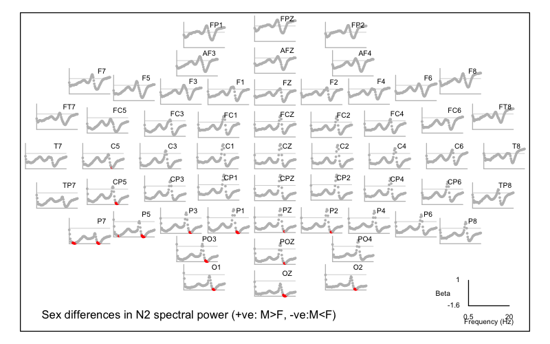

That is, we see two primary areas of significant difference in the
frequency domain, with males having lower power during N2 around 3 Hz
and also around 15 Hz. We can count the number of significant channels
per band (note, removing some rows with zeros to reduce output):

```{ .R .codeR }
cbind( tapply( d$EMPADJ , d$F , function(x) { length( x[ x< 0.05 ] ) } )  ) 
```
```
0.5      0
0.75     0
1        0
1.25     0
1.5      0
1.75     0
2        0
2.25     1
2.5      1
2.75     1
3        2
3.25     2
3.5      1
3.75     1
4        0
4.25     0
4.5      0
4.75     0
...
13       0
13.25    0
13.5     0
13.75    0
14       2
14.25    6
14.5    10
14.75   12
15      12
15.25   11
15.5     6
15.75    1
16       0
16.25    0
16.5     0
16.75    0
...
```

Likewise, we can query which channels were significant:

```{ .R .codeR }
r <- tapply( d$EMPADJ , d$CH , function(x) { length( x[ x< 0.05 ] ) } )  
r[ r > 0 ]
```
```
 C5 CP5  O1  O2  OZ  P1  P2  P3  P5  P7 PO3 POz  PZ 
  1   5   5   5   7   6   3   4   9  13   6   3   2 
```

Repeating but highlighting tests with `P_FDR` significant at 5% instead of `EMPADJ`, we see the following:

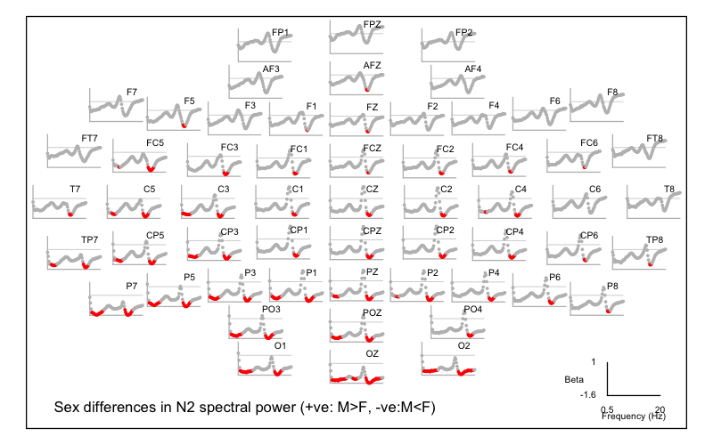

---

For what it's worth, if we repeat the same analysis for REM sleep,
we'd find that the sigma sex difference appears to be specific to N2
sleep, whereas the parietal delta difference is not (steps not shown):

<!---
# REM analysis 

f1="res/spectral.welch.rem.allchs|psd|CH|F"
f2="work/data/aux/master.txt|demo"

echo " dat=gpa/b.rem.spec
       inputs=${f1},${f2}
       vars=PSD,age,male " | luna --gpa-prep > gpa/manifest.rem.spec
luna --gpa -o out/gpa-rem-spec.db --options dat=gpa/b.rem.spec X=male Z=age nreps=10000

R
k <- ldb( "out/gpa-rem-spec.db" ) 
m <- read.table( "gpa/manifest.rem.spec" , header=T, stringsAsFactors=F , na.strings = "." )

d <- k$GPA$X_Y
d <- merge( d , m , by.x="Y" , by.y = "VAR" )


png( file="vig/docs/imgs/gpa-sexdiff2.png", res=125, width=800, height=500)
par(mar=c(0,0,0,0))
ltopo.xy( d$CH, x=d$F, y=d$B, z = d$EMPADJ < 0.05,
          pch=20 , col = c(rep("gray",50),rep("red",50)) ,
          cex = 0.4 , yline = 0 , ylab = "Beta" ,
          mt = "Sex differences in REM spectral power (+ve: M>F, -ve:M<F)" )
dev.off()

--->

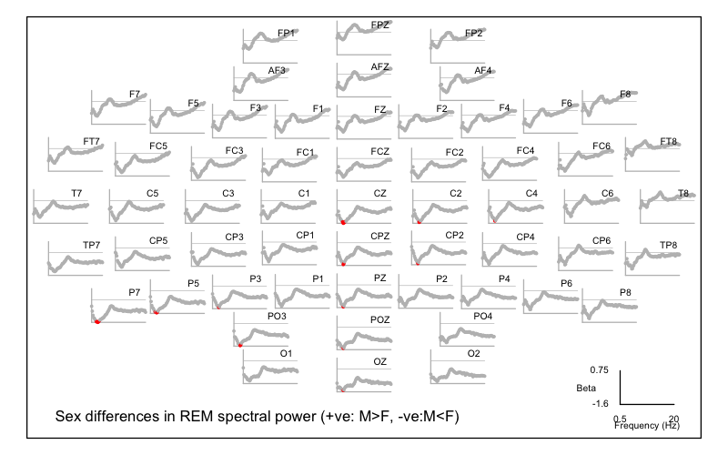


<h5>Extracting raw data</h5>

Following a significant result, we can extract and view the raw data.
For example, one of the top hits was `PSD_CH_P5_F_14.5`. We can
extract the raw data along with `age` and `male` (naturally we could
also obtain these from the original input files, but sometimes it is
more convenient to do it this way):

```
luna --gpa --options dat=gpa/b.n2.spec dump X=male Z=age lvars=PSD_CH_P5_F_14.5
```
```
ID   age  male  PSD_CH_P5_F_14.5
F01  41   0     1.93855
F02  32   0     0.37221
F03  37   0     1.43436
F04  32   0    -0.18478
F05  30   0     0.34970
F06  32   0     0.61751
F07  33   0     0.35468
F08  40   0     1.01328
F09  44   0     1.02012
F10  34   0     0.59440
M01  31   1    -1.88691
M02  44   1    -1.34835
M03  33   1    -0.31823
M04  41   1    -0.92167
M05  30   1    -0.10552
M06  27   1    -1.24021
M07  45   1    -0.27414
M08  40   1     0.47212
M09  40   1    -0.99162
M10  41   1    -0.89551
```

Note: specifying `male` and `age` via `X` and `Z` means they are not
normalized/winsorized (as all _dependent_ variables are).  That is,
if we instead write:

```
luna --gpa --options dat=gpa/b.n2.spec dump lvars=male,age,PSD_CH_P5_F_14.5
```

it will dump the same variables, but with age and sex also normalized
(which isn't intuitive for a binary 0/1 variable):

```
ID    age        male        PSD_CH_P5_F_14.5
F01   0.842673  -0.974679    1.93855         
F02  -0.788307  -0.974679    0.37221         
F03   0.117793  -0.974679    1.43436         
F04  -0.788307  -0.974679   -0.18478         
F05  -1.15075   -0.974679    0.34970         
F06  -0.788307  -0.974679    0.61751         
F07  -0.607087  -0.974679    0.35468         
F08   0.661453  -0.974679    1.01328         
F09   1.38633   -0.974679    1.02012          
F10  -0.425867  -0.974679    0.59440         
M01  -0.969528   0.974679   -1.88691         
M02   1.38633    0.974679   -1.34835         
M03  -0.607087   0.974679   -0.31823         
M04   0.842673   0.974679   -0.92167         
M05  -1.15075    0.974679   -0.10552         
M06  -1.69441    0.974679   -1.24021         
M07   1.56755    0.974679   -0.27414         
M08   0.661453   0.974679    0.47212         
M09   0.661453   0.974679   -0.99162         
M10   0.842673   0.974679   -0.89551      
```

Alternatively, setting `qc=F` will skip normalization for _all_ variables:
```{ .sh .codeL }
luna --gpa --options dat=gpa/b.n2.spec dump lvars=male,age,PSD_CH_P5_F_14.5 qc=F
```
```
ID   age  male  PSD_CH_P5_F_14.5
F01  41   0     8.1431
F02  32   0     2.15151
F03  37   0     6.21447
F04  32   0     0.0208357
F05  30   0     2.0654
F06  32   0     3.08984
F07  33   0     2.08445
F08  40   0     4.6037
F09  44   0     4.62988
F10  34   0     3.00142
M01  31   1    -6.49023
M02  44   1    -4.43007
M03  33   1    -0.489638
M04  41   1    -2.79794
M05  30   1     0.324016
M06  27   1    -4.01642
M07  45   1    -0.320977
M08  40   1     2.53367
M09  40   1    -3.06552
M10  41   1    -2.69789
```

Here are these data plotted, with the black horizontal line showing
the sample mean: this is clearly not driven by an outlier (which we
wouldn't expect given the use of permutation despite the small sample); 9 of 10
females are above the mean and 9 of 10 males are below the mean:

<!---
luna --gpa --options dat=gpa/b.n2.spec dump lvars=male,age,PSD_CH_P5_F_14.5  qc=F > o.1
R
d <- read.table( "o.1" , header=T, stringsAsFactors=F ) 
png(file="vig/docs/imgs/n2spechit.png",res=100,width=500,height=300)
plot( d$PSD_CH_P5_F_14.5 , col = c( rep( "red", 10) , rep( "blue",10 ) ) , pch=20 , xlab = "Individual" , ylab = "log(power)" , main = "N2 power (P5, 14.5 Hz)" ) 
abline( h = mean( d$PSD_CH_P5_F_14.5 ) ) 
dev.off()
--->

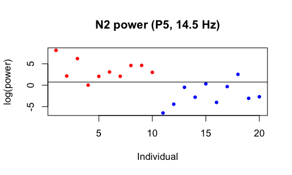


We can also request means and standard deviations with `stats` but
request these are a) only for significant results and b) stratified by
sex:

To get sex-specific means, one could use the `subset` options, which
expects `male` to be a 0/1 variable (so `subset=male` or
`subset=+male` means all males; `subset=-male` is all females).

Alternatively, we can specify a list of IDs via `inc-ids` or
`exc-ids`.  (These commands can be applied prior to running the
association analyses too, not just for the `stats` option.) As it is
not convenient to type a long list of IDs on the command line, if we
have them stored in a text file we can use Luna's `@{include}` syntax
to read them (one entry/ID per row) and make a comma-delimited list
implicitly.  In this case, they are in the files `male.ids` and
`females.ids` in the `aux/` folder.

We can get a list of the 69 expanded significant variables as follows: (i.e. column 3 is the `VAR` name, column 7 is `EMPADJ`):
```{ .sh .codeL }
destrat out/gpa-n2-spec.db +GPA -r X Y  | awk ' $7<0.05 { print $3 } ' > hits.txt
```
To check:

```{ .sh .codeL }
head hits.txt 
```
```
PSD_CH_C5_F_14.5
PSD_CH_CP5_F_14.25
PSD_CH_CP5_F_14.5
PSD_CH_CP5_F_14.75
PSD_CH_CP5_F_15
PSD_CH_CP5_F_15.25
PSD_CH_P7_F_2.25
PSD_CH_P7_F_2.5
PSD_CH_P7_F_2.75
PSD_CH_P7_F_3
...
```

```{ .sh .codeL }
wc -l hits.txt 
```
```
 69 hits.txt
```

We can then pass this to the `lvars` option using the same `@{include}` syntax, first for females:

```
luna --gpa -o females.db \
     --options dat=gpa/b.n2.spec stats \
               lvars=@{hits.txt} inc-ids=@{work/data/aux/female.ids}
```
And then for males:
```
luna --gpa -o males.db \
     --options dat=gpa/b.n2.spec stats \
               lvars=@{hits.txt} inc-ids=@{work/data/aux/male.ids}
```

These can be extracted for plotting etc, via `destrat males.db +GPA -r
VAR` etc: e.g. here are the first few rows from each (some columns
removed, etc )

```
                      ----- from males.db ---     ---- from females.db ---
VAR                   MEAN    NOBS  SD            MEAN    NOBS  SD   
PSD_CH_C3_F_14.75    -0.958   10    2.257         3.443   10    1.924
PSD_CH_CP5_F_14.5    -2.054   10    2.314         2.433   10    2.332
PSD_CH_CP5_F_14.75   -3.008   10    2.164         1.368   10    2.189
PSD_CH_CP5_F_15      -3.801   10    2.082         0.252   10    1.979
...
```


### `--cpt`

Next, we'll take the same original (N2) spectral data and apply the
`CPT` command instead of `GPA`.  Unlike `GPA`, this is a one-step
procedure, whereby we perform tests directly on the text input file(s):


```{ .sh .codeL }
luna --cpt -o out/cpt-n2-spec.db \
     --options dv-file=res/spectral.welch.n2.allchs dv=PSD \
               iv-file=work/data/aux/master.txt iv=male covar=age \
               th-freq=0.5 th-spatial=0.5 th-cluster=3 \
               nreps=10000
```

Stepping through the options:

 - we point to `res/spectral.welch.n2.allchs` as the `dv-file`
   (dependent variables) and specify a _single_ class of variable
   (`dv=PSD`, i.e. a column in that file)

 - unlike `GPA` (which is generic), `CPT` will explicitly look for
   stratifying factors it recognizes in the file (i.e. `CH` and `F`
   here) and apply them, so we don't manually specify them

 - we next specify the demographic data in `iv-file` and define a
   single IV (`iv=male`) and optionally one or more covariates (`covar=age`);
   these correspond to `X` and `Z` in `GPA` -- yes, in an ideal world the syntax
   would be more similar between these two commands, this is something that we'll
   address in subsequent releases... (perhaps...)

 - we then set thresholds that will be used for defining _adjacency_, here
   either between channels or between frequency bins; here PSD values
   will be adjacent if they are adjacent both with respect to spatial
   and frequency thresholds; `th-freq` is in Hz and `th-spatial` is in distances from
   the unit-sphere map of channel locations

 - we then specify a _t_-statistic threshold (`th-cluster=3`) which
   controls how clusters are grown: _adjacent_ metrics with test
   statistics greater than this threshold will be merged in a single
   cluster, in a greedy, bottom-up manner
 
 - clusters as well as individual metrics are evaluated for
   association, with the cluster-level statistic being the sum of
   individual metric statistics; the significance of these sum-statistics
   is evaluated by permutation (i.e. under each null replicate, clusters are
   generated based on the same greedy principle) 

 - lower `th-cluster` values imply larger clusters (of less strongly
   associated metrics); the sum-statistics will be larger, but they
   will also be larger under the null replicates (i.e. by chance
   alone); the optimal `th-cluster` will be data dependent (and some
   extensions of this basic approach not implemented in Luna allow for the threshold to vary
   whilst not capitalizing on chance); in practice setting a value or
   either 2 or 3 is probably sufficient - look at how many clusters
   are detected in the first round and their sizes

Running this also takes about 8 seconds to do 10,000 replicates and
clustering; it gives the following output to the console:

```
  read 20 observations from work/data/aux/master.txt (of total 20 data rows)
  reading metrics from res/spectral.welch.n2.allchs
  converting input files to a single matrix
  found 20 rows (individuals) and 4503 columns (features)
  identified 0 of 20 individuals with at least some missing data
  finished making regular data matrix on 20 individuals
  final datasets contains 4503 DVs on 20 individuals, 1 primary IV(s), and 1 covariate(s)
  set 68 channel locations to default values
  defining adjacent variables...
  of 3192 spatial distances, mean (median) = 1.24291 (1.26729); min/max = 0.30395 / 1.99956
  spatial dist. percentiles (1,5,10,20%) = 0.312308 0.391745 0.535039 0.784754
  on average, each variable has 25.348 adjacencies
  0 variable(s) have no adjacencies
  running permutations, assuming a two-sided test...
  found 3 clusters, maximum statistic is 1463.54
  .......... .......... .......... .......... ..........  50 perms
  .......... .......... .......... .......... ..........  100 perms
  .......... .......... .......... .......... ..........  150 perms

  ...

  .......... .......... .......... .......... ..........  9900 perms
  .......... .......... .......... .......... ..........  9950 perms
  .......... .......... .......... .......... ..........  10000 perms
  2 clusters significant at corrected empirical P<0.05
  all done.
```

The key lines above are:

 - one starting `final datasets contains...` that indicates we have
   4,503 DVs on 20 individuals, 1 primary IV(s), and 1 covariate(s) --
   it is always important to check that all the expected data have
   been correctly imported

 - the distribution of spatial distances (here 57 * 56 = 3,192
   reflecting possible merges in both directions between two channels,
   although all distances are of course symmetric)
                                               
 - that each variable has on average around 25 adjacencies (i.e. which
  is about 0.5% of all metrics); if this number is too small, then the
  method will not be able to grow clusters especially if a large
  proportion have no adjacencies (this is reported on the line below);
  if the number is too large, then clusters may not have 
  physiological significance.  (At the extreme, if all metrics are
  adjacent to all others, there will be a single cluster which
  represents a form of omnibus test of all aggregated effects, which
  may under some circumstances be of interest but it is not the main
  focus here.)

We can extract the outputs for the significant clusters: 

```{ .sh .codeL }
destrat out/cpt-n2-spec.db +CPT -r K
```
```
ID   K   N    P       SEED
.    1   376  0.0152  P5~14.5~0~PSD
.    2   275  0.0272  P7~3~0~PSD
```

This shows the two significant (post adjustment for multiple testing)
clusters, with the _seed_ for each cluster (the most significant term)
and the number of members of that cluster (`N`).  That is, we see the same two
regions that were identified (in broad terms) by the prior `GPA` analysis.

We can load the full table of outputs into R:

```{ .r .codeR }
library(luna)
k <- ldb( "out/cpt-n2-spec.db" )
d <- k$CPT$VAR
head(d)
```
```
  ID             VAR          B  CH CLST     F        PC         PU       STAT T
1  .   AF3~0.5~0~PSD -1.1904908 AF3    0  0.50 0.9999000 0.24117588 -1.2044104 0
2  .  AF3~0.75~0~PSD -1.2565732 AF3    0  0.75 0.9963004 0.14168583 -1.5364543 0
3  .  AF3~1.25~0~PSD -1.7565233 AF3    0  1.25 0.8940106 0.05169483 -2.1269364 0
4  .   AF3~1.5~0~PSD -1.5901487 AF3    0  1.50 0.9386061 0.06609339 -1.9896006 0
5  .  AF3~1.75~0~PSD -1.3916724 AF3    0  1.75 0.9693031 0.08659134 -1.8476327 0
6  . AF3~10.25~0~PSD -0.3788045 AF3    0 10.25 1.0000000 0.71682832 -0.3718688 0
...
```

Looking at this main table: 

 - the `VAR` names are _expanded_, similar to `GPA` but using a
   slightly different form: channel, time, frequency and variable
   separated by the `~` character; the equivalent `CH`, `F` and `T`
   (time, which is not used here) strata are also listed as columns
   (note: `T` is _not_ the _t_-statistic from the tests)

 - the coefficient and _t_-statistic are listed as `B` and `STAT`

 - the uncorrected and corrected P-value are listed as `PU` and `PC`
   (corresponding to `P` and `PADJ` for `GPA`)

 - the `PC` statistics here should be similar to the `PADJ` values
    from `GPA`: indeed, here if we ask how many are less than 0.05,
    the answer is 66 which is close to 70 before (note the point above
    about small fluctuations being expected due to the randomization
    procedure - if we ran both methods again, we may get some small
    variations up or down due to chance; using a higher `nreps` will
    stabilize outputs)

 - perhaps the key variable here is `CLST` which is `0` if that metric
 was not assigned to any cluster, otherwise `1`, `2`, etc to indicate
 that it belongs to the first, second, etc cluster


<!---
png( file = "vig/docs/imgs/cpt-n2spec.png" , res=125 , width=800, height=500 ) 
pal = c( rep( "lightgray" , 33 ) , rep( "blue" , 33 ) , rep ( "green" , 34 ) )

par(mar=c(0,0,0,0))
ltopo.xy( d$CH , x=d$F, y=d$STAT, z=d$CLST ,
          pch=20 , col = pal ,
          cex = 0.4 , yline = 0 , ylab = "t-statistic" ,
          mt = "CPT sex differences in N2 spectral power (+ve: M>F, -ve:M<F)" )
dev.off()
--->

We can plot which points belong to significant clusters:
```{ .r .codeR }
pal = c( rep("lightgray",33), rep("blue",33), rep("green",34) )

ltopo.xy( d$CH , x=d$F, y=d$STAT , z = d$CLST ,
          pch=20 , col = pal ,
          cex = 0.4 , yline = 0 , ylab = "signed log(P)" ,
          mt = "CPT sex differences in N2 spectral power (+ve: M>F, -ve:M<F)" )
```
(_Note the kludge in getting the Z color axes to work for prespecified colors again._)

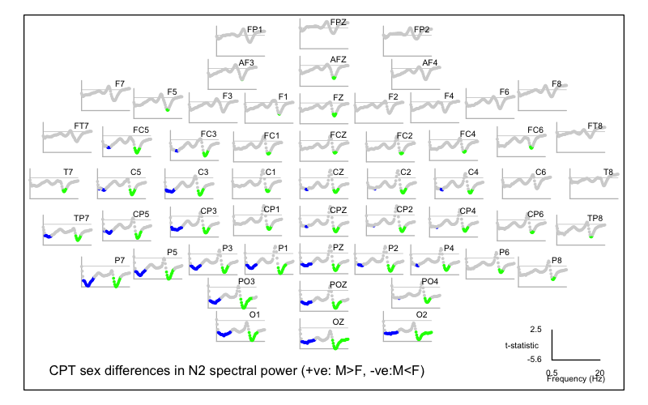

As expected, this shows a qualitatively similar pattern to the `GPA`
results.  Of note, the clusters naturally span a larger number of
points: they will all have in common an unadjusted _t_-statistic with
an absolute value of 3 or more (i.e. given `th-cluster=3`), but they will not
all be significant after correction.   We can see they are all pointwise
significant with the least significant still having a nominal _P_ < 0.01:

```{ .r .codeR }
range( d$PU[ d$CLST != 0 ]  ) 
```
```
0.00009999 0.00979902
```
However, some of the implicated variables have corrected values up to _P(adj)_ = 0.46:
```
range( d$PC[ d$CLST != 0 ]  ) 
```
```
0.01089891 0.45585441
```

This isn't a problem _per se_ (i.e. there would be no point in running
a cluster-based analysis if we always required all constituent members to
also be individually significant after correction).  However, depending
on the cluster definitions it does mean that one cannot necessarily
make strong claims about any one result, based on _only_ the fact that
it belongs to a significant cluster.

In any case, here we appear to have highly concordant results.  For
completeness, we'll also run the REM spectra through `CPT` (steps not
shown).  This yields one significant cluster with 250 members and a
seed at CZ for 2.75 Hz activity:

```
ID   K   N    P      SEED
.    1   250  0.0318 CZ~2.75~0~PSD
```

The full plot for REM is:

<!---

luna --cpt -o out/cpt-rem-spec.db --options nreps=10000 \
 dv-file=res/spectral.welch.rem.allchs dv=PSD \
 iv-file=work/data/aux/master.txt iv=male covar=age \
 th-freq=0.5 th-spatial=0.5 th-cluster=3

destrat out/cpt-rem-spec.db +CPT -r K

k <- ldb( "out/cpt-rem-spec.db" )
d <- k$CPT$VAR
png( file = "vig/docs/imgs/cpt-remspec.png" , res=125 , width=800, height=500 )
pal = c( rep( "lightgray" , 33 ) , rep( "blue" , 33 ) , rep ( "green" , 34 ) )
par(mar=c(0,0,0,0))
ltopo.xy( d$CH , x=d$F, y=d$STAT , z = d$CLST ,
          pch=20 , col = pal ,
          cex = 0.4 , yline = 0 , ylab = "t-statistic" ,
          mt = "CPT sex differences in REM spectral power (+ve: M>F, -ve:M<F)" )
dev.off()


--->

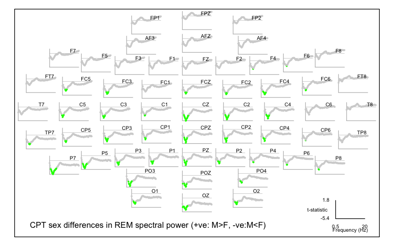

## Multiple domains

Having introduced `GPA` as our primary association (linear model)
tool, we're now in a position (drum roll...)  to finally perform the
broad assessment of sex differences across the various domains
considered in this walkthrough so far.

If you followed the earlier steps, your `res/` folder should contain
outputs from various classes of analysis:

  - __hypnogram__-based metrics (`hypno.base`, `hypno.stage` and
    `hypno.cycle`)

  - __spectral__ metrics (as previously analyzed) for N2 and REM, for
    the original spectra as well as band-power summaries
    (`spectral.welch.n2.allchs`, `spectral.welch.rem.allchs`,
    `spectral.welch.band.n2.allchs` and
    `spectral.welch.band.rem.allchs`)

  - metrics quantifying ultradian N2 band-power __dynamics__ 
    (`dynam.cycles`, `dynam.band.1` and `dynam.band.2`)

  - net and pairwise __connectivity__ (PSI) metrics for N2 and REM (`psi1.n2`, `psi1.rem`, `psi2.n2` and `psi2.rem`)

  - __spindle/SO__ metrics (`spso.spindles`, `spso.slowosc` and `spso.coupl`)

  - __predicted age difference__ (`pad.base`)


These obviously vary tremendously in their scale: whereas `pad.base`
contains a single metric, `psi2.n2` contains 14,364.  We'll include
focused analyses of individual domains below, but our initial
analysis will be an agnostic screen across all metrics.

### `--gpa-prep`

In this more involved scenario, rather than use the `inputs` option
for `--gpa-prep` it can be preferable to create a [JSON
format](https://en.wikipedia.org/wiki/JSON) file that specifies the
files, variables, factors and other features.

If passing a JSON file to `--gpa-prep` via `spec=specs.json`, it expects
the following structure:

 - a single object (`{ }`) with a named object `inputs`, and
   optionally a second named object `spec`

 - `inputs` should be an array (`[ ]`) of objects, each describing one
   file

 - each file is an object with fields including `file`, `group`,
   `vars`, `facs` and others

 - `specs` contains general settings and can be ignored for now

An example is simplest: for the case above where the `inputs` were passed via the command line as: 

 - `res/spectral.welch.n2.allchs|psd|CH|F`

 - `work/data/aux/master.txt|demo`

The equivalent `specs.json` file would be: 

```
{
  "inputs": [
    {
      "file": "work/data/aux/master.txt",
      "group": "demo",
      "vars": [ "male", "age" ]
    },

    {
      "file": "spectral.welch.n2.allchs",
      "group": "psc",
      "vars": "U",
      "facs": [ "CH","F" ]
    }
  ]
}
```

The JSON format is simple but has to be exact: Luna will report any
errors in the syntax, or you can use an online JSON validator tool to
confirm the syntax.  The good news is that you can use a basic template
and adjust it, as it likely won't need to change much when reused in different
analyses.

For our application, the full `specs.json` file is in
`work/data/aux/specs.json` and you can also view it in full
[here](specs.json). (Depending on your browser, it will likely open
this link as a special JSON file, but you should be able to view its
raw data also.)

---

<h5>Creating the binary file</h5>

With the datasets described in `specs.json`, we can now make the binary file and associated manifest:

```{ .sh .codeL }
luna --gpa-prep --options dat=gpa/b.dat \
                          spec=work/data/aux/specs.json > gpa/manifest
```

This should give the following output (scan this carefully when
running, as it will note if certain files could not be found, etc).

```
  parsing orig/aux/specs.json
  reading file specifications ('inputs') for 19 files:
   work/data/aux/master.txt ( group = demo ): 
    expecting 0 factors, extracting 2 var(s)
   res/hypno.base ( group = hypno ): 
    expecting 0 factors, extracting 11 var(s)
   res/hypno.stage ( group = hypno ): 
    expecting 1 factors, extracting 7 var(s)
   res/hypno.cycle ( group = hypno ): 
    expecting 1 factors, extracting 3 var(s)
   res/spectral.welch.n2.allchs ( group = spec ): 
    expecting 3 factors, extracting 1 var(s)
   res/spectral.welch.rem.allchs ( group = spec ): 
    expecting 3 factors, extracting 1 var(s)
   res/spectral.welch.band.n2.allchs ( group = spec ): 
    expecting 3 factors, extracting 1 var(s)
   res/spectral.welch.band.rem.allchs ( group = spec ): 
    expecting 3 factors, extracting 1 var(s)
   res/psi1.n2 ( group = psi ): 
    expecting 2 factors and 1 fixed factors, extracting 1 var(s)
   res/psi1.rem ( group = psi ): 
    expecting 2 factors and 1 fixed factors, extracting 1 var(s)
   res/psi2.n2 ( group = psi ): 
    expecting 3 factors and 1 fixed factors, extracting 1 var(s)
   res/psi2.rem ( group = psi ): 
    expecting 3 factors and 1 fixed factors, extracting 1 var(s)
   res/dynam.cycles ( group = dynam ): 
    expecting 3 factors, extracting 1 var(s)
   res/dynam.band.1 ( group = dynam ): 
    expecting 4 factors, extracting 2 var(s)
   res/dynam.band.2 ( group = dynam ): 
    expecting 5 factors, extracting 1 var(s)
   res/spso.spindles ( group = spso ): 
    expecting 2 factors, extracting 6 var(s)
   res/spso.slowosc ( group = spso ): 
    expecting 1 factors, extracting 8 var(s)
   res/spso.coupl ( group = spso ): 
    expecting 2 factors, extracting 4 var(s)
   res/pad.base ( group = pad ): 
    expecting 0 factors, extracting 1 var(s)

  preparing inputs...
  ++ res/dynam.band.1: read 20 indivs, 2 base vars --> 140 expanded vars
  ++ res/dynam.band.2: read 20 indivs, 1 base vars --> 500 expanded vars
  ++ res/dynam.cycles: read 20 indivs, 1 base vars --> 128 expanded vars
  ++ res/hypno.base: read 20 indivs, 11 base vars --> 11 expanded vars
  ++ res/hypno.cycle: read 20 indivs, 3 base vars --> 12 expanded vars
  ++ res/hypno.stage: read 20 indivs, 7 base vars --> 35 expanded vars
  ++ res/pad.base: read 20 indivs, 1 base vars --> 1 expanded vars
  ++ res/psi1.n2: read 20 indivs, 1 base vars --> 513 expanded vars
  ++ res/psi1.rem: read 20 indivs, 1 base vars --> 513 expanded vars
  ++ res/psi2.n2: read 20 indivs, 1 base vars --> 14364 expanded vars
  ++ res/psi2.rem: read 20 indivs, 1 base vars --> 14364 expanded vars
  ++ res/spectral.welch.band.n2.allchs: read 20 indivs, 1 base vars --> 570 expanded vars
  ++ res/spectral.welch.band.rem.allchs: read 20 indivs, 1 base vars --> 570 expanded vars
  ++ res/spectral.welch.n2.allchs: read 20 indivs, 1 base vars --> 4503 expanded vars
  ++ res/spectral.welch.rem.allchs: read 20 indivs, 1 base vars --> 4503 expanded vars
  ++ res/spso.coupl: read 20 indivs, 4 base vars --> 456 expanded vars
  ++ res/spso.slowosc: read 20 indivs, 8 base vars --> 456 expanded vars
  ++ res/spso.spindles: read 20 indivs, 6 base vars --> 684 expanded vars
  ++ work/data/aux/master.txt: read 20 indivs, 2 base vars --> 2 expanded vars

  checking for too much missing data ('retain-cols' to skip; 'verbose' to list dropped vars)
  requiring at least n-req=5 non-missing obs (as a proportion, at least n-prop=0.05 non-missing obs)
  no vars dropped based on missing-value requirements

  writing binary data (20 obs, 42325 variables) to gpa/b.dat
  ...done
```

We see that overall we have 42,325 variables across the sample, saved
in a binary file `gpa/b.dat` along with a manifest in `gpa/manifest`.

---

<h5>Data descriptions</h5>

To obtain a summary of the data:

```{ .sh .codeL }
luna --gpa --options dat=gpa/b.dat desc
```

```
  ------------------------------------------------------------
  Summary for (the selected subset of) gpa/b.dat

  # individuals (rows)  = 16
  # variables (columns) = 42323

  ------------------------------------------------------------
  47 base variable(s):

    AMP --> 114 expanded variable(s)
    BOUT_05 --> 5 expanded variable(s)
    BOUT_10 --> 4 expanded variable(s)
    BOUT_MD --> 5 expanded variable(s)
    BOUT_MX --> 5 expanded variable(s)
    BOUT_N --> 5 expanded variable(s)
    CDENS --> 114 expanded variable(s)
    CHIRP --> 114 expanded variable(s)
    COUPL_MAG_Z --> 114 expanded variable(s)
    COUPL_OVERLAP_Z --> 114 expanded variable(s)
    DENS --> 114 expanded variable(s)
    DIFF --> 1 expanded variable(s)
    DUR --> 114 expanded variable(s)
    FRQ --> 114 expanded variable(s)
    MINS --> 5 expanded variable(s)
    NOSC --> 114 expanded variable(s)
    NREMC_MINS --> 4 expanded variable(s)
    NREMC_NREM_MINS --> 4 expanded variable(s)
    NREMC_REM_MINS --> 4 expanded variable(s)
    PCT --> 4 expanded variable(s)
    PSD --> 10274 expanded variable(s)
    PSI --> 29754 expanded variable(s)
    REM_LAT --> 1 expanded variable(s)
    REM_LAT2 --> 1 expanded variable(s)
    SE --> 1 expanded variable(s)
    SME --> 1 expanded variable(s)
    SOL --> 1 expanded variable(s)
    SO_AMP_NEG --> 57 expanded variable(s)
    SO_AMP_P2P --> 57 expanded variable(s)
    SO_AMP_POS --> 57 expanded variable(s)
    SO_DUR --> 57 expanded variable(s)
    SO_DUR_NEG --> 57 expanded variable(s)
    SO_DUR_POS --> 57 expanded variable(s)
    SO_RATE --> 57 expanded variable(s)
    SO_SLOPE --> 57 expanded variable(s)
    SPT --> 1 expanded variable(s)
    SS --> 500 expanded variable(s)
    TIB --> 1 expanded variable(s)
    TST --> 1 expanded variable(s)
    TST_PER --> 1 expanded variable(s)
    TWT --> 1 expanded variable(s)
    U --> 70 expanded variable(s)
    U2 --> 70 expanded variable(s)
    UDENS --> 114 expanded variable(s)
    WASO --> 1 expanded variable(s)
    age --> 1 expanded variable(s)
    male --> 1 expanded variable(s)

  ------------------------------------------------------------
  7 variable groups:

    demo:
         2 base variable(s) ( age male )
         2 expanded variable(s)
         no stratifying factors

    dynam:
         4 base variable(s) ( PSD SS U U2 )
         768 expanded variable(s)
         6 unique factors:
           B -> 10 level(s):
             B = ALPHA --> 80 expanded variable(s)
             B = BETA --> 80 expanded variable(s)
             B = DELTA --> 80 expanded variable(s)
             B = FAST_SIGMA --> 80 expanded variable(s)
             B = GAMMA --> 64 expanded variable(s)
             B = SIGMA --> 80 expanded variable(s)
             ...
           CH -> 5 level(s):
             CH = CPZ --> 640 expanded variable(s)
             CH = CZ --> 32 expanded variable(s)
             CH = FZ --> 32 expanded variable(s)
             CH = OZ --> 32 expanded variable(s)
             CH = PZ --> 32 expanded variable(s)
           P -> 4 level(s):
             P = C1 --> 32 expanded variable(s)
             P = C2 --> 32 expanded variable(s)
             P = C3 --> 32 expanded variable(s)
             P = C4 --> 32 expanded variable(s)
           Q -> 10 level(s):
             Q = 1 --> 50 expanded variable(s)
             Q = 10 --> 50 expanded variable(s)
             Q = 2 --> 50 expanded variable(s)
             Q = 3 --> 50 expanded variable(s)
             Q = 4 --> 50 expanded variable(s)
             Q = 5 --> 50 expanded variable(s)
             ...
           QD -> 7 level(s):
             QD = BETWEEN --> 20 expanded variable(s)
             QD = TOT --> 120 expanded variable(s)
             QD = WITHIN --> 20 expanded variable(s)
             QD = W_C1 --> 120 expanded variable(s)
             QD = W_C2 --> 120 expanded variable(s)
             QD = W_C3 --> 120 expanded variable(s)
             ...
           VAR -> 1 level(s):
             VAR = PSD --> 640 expanded variable(s)

    hypno:
         21 base variable(s) ( BOUT_05 BOUT_10 BOUT_MD BOUT_MX BOUT_N MINS ... )
         56 expanded variable(s)
         2 unique factors:
           C -> 4 level(s):
             C = 1 --> 3 expanded variable(s)
             C = 2 --> 3 expanded variable(s)
             C = 3 --> 3 expanded variable(s)
             C = 4 --> 3 expanded variable(s)
           SS -> 5 level(s):
             SS = N1 --> 6 expanded variable(s)
             SS = N2 --> 7 expanded variable(s)
             SS = N3 --> 7 expanded variable(s)
             SS = R --> 7 expanded variable(s)
             SS = W --> 6 expanded variable(s)

    pad:
         1 base variable(s) ( DIFF )
         1 expanded variable(s)
         no stratifying factors

    psi:
         1 base variable(s) ( PSI )
         29754 expanded variable(s)
         5 unique factors:
           CH -> 57 level(s):
             CH = AF3 --> 18 expanded variable(s)
             CH = AF4 --> 18 expanded variable(s)
             CH = AFZ --> 18 expanded variable(s)
             CH = C1 --> 18 expanded variable(s)
             CH = C2 --> 18 expanded variable(s)
             CH = C3 --> 18 expanded variable(s)
             ...
           CH1 -> 56 level(s):
             CH1 = AF3 --> 1008 expanded variable(s)
             CH1 = AF4 --> 990 expanded variable(s)
             CH1 = AFZ --> 972 expanded variable(s)
             CH1 = C1 --> 954 expanded variable(s)
             CH1 = C2 --> 936 expanded variable(s)
             CH1 = C3 --> 918 expanded variable(s)
             ...
           CH2 -> 56 level(s):
             CH2 = AF4 --> 18 expanded variable(s)
             CH2 = AFZ --> 36 expanded variable(s)
             CH2 = C1 --> 54 expanded variable(s)
             CH2 = C2 --> 72 expanded variable(s)
             CH2 = C3 --> 90 expanded variable(s)
             CH2 = C4 --> 108 expanded variable(s)
             ...
           F -> 9 level(s):
             F = 11 --> 3306 expanded variable(s)
             F = 13 --> 3306 expanded variable(s)
             F = 15 --> 3306 expanded variable(s)
             F = 17 --> 3306 expanded variable(s)
             F = 19 --> 3306 expanded variable(s)
             F = 3 --> 3306 expanded variable(s)
             ...
           stg -> 2 level(s):
             stg = N2 --> 14877 expanded variable(s)
             stg = REM --> 14877 expanded variable(s)

    spec:
         1 base variable(s) ( PSD )
         10146 expanded variable(s)
         4 unique factors:
           B -> 10 level(s):
             B = ALPHA --> 114 expanded variable(s)
             B = BETA --> 114 expanded variable(s)
             B = DELTA --> 114 expanded variable(s)
             B = FAST_SIGMA --> 114 expanded variable(s)
             B = GAMMA --> 114 expanded variable(s)
             B = SIGMA --> 114 expanded variable(s)
             ...
           CH -> 57 level(s):
             CH = AF3 --> 178 expanded variable(s)
             CH = AF4 --> 178 expanded variable(s)
             CH = AFZ --> 178 expanded variable(s)
             CH = C1 --> 178 expanded variable(s)
             CH = C2 --> 178 expanded variable(s)
             CH = C3 --> 178 expanded variable(s)
             ...
           F -> 79 level(s):
             F = 0.5 --> 114 expanded variable(s)
             F = 0.75 --> 114 expanded variable(s)
             F = 1 --> 114 expanded variable(s)
             F = 1.25 --> 114 expanded variable(s)
             F = 1.5 --> 114 expanded variable(s)
             F = 1.75 --> 114 expanded variable(s)
             ...
           stg -> 2 level(s):
             stg = N2 --> 5073 expanded variable(s)
             stg = R --> 5073 expanded variable(s)

    spso:
         18 base variable(s) ( AMP CDENS CHIRP COUPL_MAG_Z COUPL_OVERLAP_Z DENS ... )
         1596 expanded variable(s)
         2 unique factors:
           CH -> 57 level(s):
             CH = AF3 --> 28 expanded variable(s)
             CH = AF4 --> 28 expanded variable(s)
             CH = AFZ --> 28 expanded variable(s)
             CH = C1 --> 28 expanded variable(s)
             CH = C2 --> 28 expanded variable(s)
             CH = C3 --> 28 expanded variable(s)
             ...
           F -> 2 level(s):
             F = 11 --> 570 expanded variable(s)
             F = 15 --> 570 expanded variable(s)

  ------------------------------------------------------------

```

---

<h5>kNN missing data imputation</h5>

When running `--gpa`'s `desc` option above, you may have noticed some
information in the console log before the main summary, regarding
missing data and invariance of metrics:

```
  requiring at least n-req=5 non-missing obs (as a proportion, at least n-prop=0.05 non-missing obs)
  no vars dropped based on missing-value requirements
  running QC (add 'qc=F' to skip) without winsorization (to set, e.g. 'winsor=0.05')
  case-wise deletion subsetted X from 20 to 16 indivs (add 'verbose' to list)
  dropping BOUT_10_SS_N1 due to invariance
  dropping PCT_SS_W due to invariance
  reduced data from 42325 to 42323 vars ('retain-rows' to skip) 
```

That is, it has dropped 4 individuals.  Re-running adding `verbose` lets us know who was dropped:

```
  dropping indiv. F05 due to missing values (case-wise deletion)
  dropping indiv. F08 due to missing values (case-wise deletion)
  dropping indiv. F09 due to missing values (case-wise deletion)
  dropping indiv. M06 due to missing values (case-wise deletion)
```

Looking at the manifest, the third column (`NI`) gives the number of non-missing individuals; we can select the
variables with fewer than 20 full observations, e.g. in R or using a simple `awk` command:

```{ .sh .codeL }
awk ' $3 != 20 { print $2 , $3 , $4 } ' OFS="\t" gpa/manifest
```
```
VAR                     NI    GRP
PSD_B_SLOW_CH_FZ_P_C3   19    dynam
PSD_B_DELTA_CH_FZ_P_C3  19    dynam
PSD_B_THETA_CH_FZ_P_C3  19    dynam
PSD_B_ALPHA_CH_FZ_P_C3  19    dynam
PSD_B_SIGMA_CH_FZ_P_C3  19    dynam
    ...
    ...
    ...
NREMC_MINS_C_3          19    hypno
NREMC_MINS_C_4          16    hypno
NREMC_NREM_MINS_C_3     19    hypno
NREMC_NREM_MINS_C_4     16    hypno
NREMC_REM_MINS_C_3      19    hypno
NREMC_REM_MINS_C_4      16    hypno
```

There are 331 variables in total with fewer than 20 non-missing
observations (and subset of those shown above).  From inspection, it
is clear they all relate to variables involving the third and fourth
NREM cycles and so they are missing for those individuals who do not
have that many NREM cycles defined.

For our small sample we obviously don't want to drop 4 of 20 people
(20% of the sample) for this trivial reason.  One option is to drop
these variables (e.g. restricting the earlier analyses to only the
first two cycles), or to analyse the cycle-specific separately in an
N=16 analysis (but with all other variables analyzed in a separate
N=20 analysis).

As `GPA` always requires a fully non-missing dataset when fitting linear models,
a further option is to impute the missing values.   The `GPA` module supports a
simple approach to this, based on kNN imputation of missing values.  Re-running with `knn=3` to
use the three nearest neighbors to do this:  

```{ .sh .codeL }
luna --gpa --options dat=gpa/b.dat knn=3 desc
```
```
  reading binary data from gpa/b.dat
  reading 42325 of 42325 vars on 20 indivs
  read 20 individuals and 42325 variables from gpa/b.dat
  selected 0 X vars & 0 Z vars, implying 42325 Y vars
  finished kNN imputation: imputed 795 missing values
  all missing values imputed
  checking for too much missing data ('retain-cols' to skip; 'verbose' to list dropped vars)
  requiring at least n-req=5 non-missing obs (as a proportion, at least n-prop=0.05 non-missing obs)
  no vars dropped based on missing-value requirements
  running QC (add 'qc=F' to skip) without winsorization (to set, e.g. 'winsor=0.05')
  retained all observations following case-wise deletion screen
  dropping BOUT_10_SS_N1 due to invariance
  dropping PCT_SS_W due to invariance
  reduced data from 42325 to 42323 vars ('retain-rows' to skip) 
```

We now see that 795 values have been imputed, and also that _all
observations have been retained_ based on missing data.

Note that `knn` only uses _dependent variables_, i.e. __not any
predictors or covariates__ that are specified via `X` and `Z`, as we'll
do below in the association analyses.

In practice, if using kNN imputation one might want to look at the
imputed values (i.e. which can be done with `dump` as well as `knn`).
Naturally, depending on the nature of the missing data (i.e. is it
missing at random, etc), the performance of this approach may vary. If
all significant results are coming from metrics with a high proportion
of imputed data, for example, one might want to explore the data some
more.  But for the purposes of this didactic walkthrough, we'll
_assume_ that the imputation was sufficient.

---

Having fixed the missing data issue, we still see that 
two variables (columns) were dropped due to _invariance_

```
  dropping BOUT_10_SS_N1 due to invariance
  dropping PCT_SS_W due to invariance
```

This means these two variables had no variation in this sample -
i.e. nobody had an contiguous N1 bout longer than 10 minutes (which is
not surprising); also the `PCT` stage durations are only defined for
_sleep_ (not wake) stages, as it is expressed as a proportion of total
sleep time.  Thus the final dataset is reduced from 42,325 to 42,323
variables.


### `--gpa`

Finally...  we can now fit the association models over all variables.  As before,

 - the predictor is `male`

 - we'll covary for `age`

 - we'll request 10,000 permutations

 - we'll include the `knn=3` imputation step to ensure an _N_ = 20 analysis


```{ .sh .codeL }
luna --gpa -o out/gpa-full.db \
           --options dat=gpa/b.dat knn=3 X=male Z=age nreps=10000
```
With `male` and `age` specified as predictors/covariates, GPA knows to exclude them from
the list of dependent variables, i.e. from the console log:
```
  read 20 individuals and 42325 variables from gpa/b.dat
  selected 1 X vars & 1 Z vars, implying 42323 Y vars
```

Running on a standard laptop, this analysis took a little longer but
only about 25 seconds.  This suggests that even with larger
sample sizes, permutation-based approaches with many variables should
still be feasible.

---

_Did we find anything?_

From the console log, we see 6290 (15%) of metrics are significant at
the nominal _P_ < 0.05 rate, which is clearly more than expected; we
also see 8 variables that are significant after adjustment for
multiple testing, and 233 that are FDR-significant at 0.05:

```
  6290 (prop = 0.148626) significant at nominal p < 0.05
  233 (prop = 0.00550554) significant at FDR p < 0.05
  8 (prop = 0.000189031) significant after empirical family-wise type I error control p < 0.05
```

What are these eight?
```{ .sh .codeL }
destrat out/gpa-full.db +GPA -r X Y -p 3 | awk ' NR == 1 || $7 < 0.05 ' 
```
```
Y                                  B   BASE      EMP  EMPADJ        P   P_FDR                        STRAT      T
PSI_stg_N2_CH1_AF3_CH2_FPZ_F_13 -1.664  PSI  9.9e-05  0.0359  2.6e-06  0.0142  CH1=AF3;CH2=FPZ;F=13;stg=N2  -6.87
PSI_stg_N2_CH1_F3_CH2_Fp2_F_13  -1.693  PSI  9.9e-05  0.0343  2.5e-06  0.0142   CH1=F3;CH2=Fp2;F=13;stg=N2  -6.90
PSI_stg_N2_CH1_F5_CH2_FPZ_F_13  -1.745  PSI  9.9e-05  0.0055  3.1e-07  0.0069   CH1=F5;CH2=FPZ;F=13;stg=N2  -8.08
PSI_stg_N2_CH1_F5_CH2_Fp2_F_13  -1.725  PSI  9.9e-05  0.0155  1.0e-06  0.0142   CH1=F5;CH2=Fp2;F=13;stg=N2  -7.41
PSI_stg_N2_CH1_F7_CH2_FPZ_F_13  -1.754  PSI  9.9e-05  0.0056  3.2e-07  0.0069   CH1=F7;CH2=FPZ;F=13;stg=N2  -8.06
PSI_stg_N2_CH1_FC5_CH2_Fp2_F_13 -1.693  PSI  9.9e-05  0.0344  2.5e-06  0.0142  CH1=FC5;CH2=Fp2;F=13;stg=N2  -6.90
PSI_stg_N2_CH1_FPZ_CH2_FT7_F_13  1.699  PSI  9.9e-05  0.0253  1.9e-06  0.0142  CH1=FPZ;CH2=FT7;F=13;stg=N2   7.04
PSI_stg_N2_CH1_CP1_CH2_F8_F_17   1.678  PSI  9.9e-05  0.0361  2.7e-06  0.0142   CH1=CP1;CH2=F8;F=17;stg=N2   6.87
```

That is, the one class of association that survives correction for
multiple testing (in this N=20 sample) is for N2 connectivity from the
PSI, specifically implicating differences in sigma-band (i.e. F=13 Hz
implies a window of 11 - 15 Hz given our prior parameterization)
activity at frontopolar electrodes.  We've [previously tested and
characterized sex differences in PSI](conn.md#sex-differences),
finding this effect (that appears to be generalized over multiple
frontal channels), reflecting greater sensor-level nonzero-lag
directed connectivity in females.  What we've added here is a more
robust statistical assessment of this effect, both in terms of
distributional issues that may arise in the small sample, but more
importantly in terms of multiple testing (here for over 40,000
variables tested).


__We probably don't want to bet the farm on this result just yet,
however...__  Whether this reflects true (neural) physiological
differences or not (e.g. versus the differential impact of muscle
contamination, head size, or other factors, etc) is beyond the scope
of this walkthrough.  Naturally, this result could also still be a
false positive (i.e. there is a 5% probability).  In fact, the very
low sample size implies likely low power, which not only the
probability of missing genuine associations but also the probability
that significant associations represent false-positive findings
(e.g. [PMID 24739678](https://pubmed.ncbi.nlm.nih.gov/24739678/)).

Although the broad patterns will tend to hold, the random selection of
epochs for PSI can also influence whether or not results are _just
above_ or _just below_ the very stringent thresholds applied here.  _That
is, we've found that in re-running the PSI step (which gives the bulk
of the metrics) will pick a different set of epochs each time -
sometimes we find more than 7 "experiment-wide significant hits", but
sometimes we find fewer, or none._

Of course, we're hitting these issues because we've unleashed a fairly
massive barrage of tests on an under-powered sample: the methods in
`GPA` can't rescue a fundamentally flawed study design, after all.
Whilst there may be _some signal_ here (as the earlier Q-Q plot
suggested...), the likelihood at these specific results holding up to
replication might not be high, as one might intuitively guess.  In any case,
we'll explore the correspondence between this and the independent N=106
dataset in a subsequent (future) section.


---

What about the FDR-corrected results?  Here we pull a summary of the _base_ variable names (column 5)
that have an FDR-adjusted p-value less than 0.05 (column 11): 

```{ .sh .codeL }
destrat out/gpa-full.db +GPA -r X Y  | awk ' NR == 1 || $11 < 0.05 { print $5 } '  | sort | uniq -c
```
```
   4 AMP
   1 BASE
   3 CDENS
   1 CHIRP
   1 COUPL_MAG_Z
   3 DENS
  28 FRQ
  87 PSD
  99 PSI
   1 SO_AMP_NEG
   1 SO_AMP_P2P
   4 SO_SLOPE
   1 UDENS
```

---

<h5>Secondary analyses</h5>

We will not explore the results in great detail here, particularly as
we've previously covered some of this in previous sections, and there
is not experiment-wide support for these other metrics in this sample.
Nonetheless, we'll touch on a couple of domains here:

First, we'll extract the full table of results:

```{ .sh .codeL }
destrat out/gpa-full.db +GPA -r X Y > results.txt
```

In R, we'll merge the manifest information in too:
```{ .r .codeR }
d <- read.table("results.txt", header=T, stringsAsFactors=F)
m <- read.table("gpa/manifest", header=T, stringsAsFactors=F, na.strings = ".")
```

Note that the manifest contains extra columns for the additional factors (e.g. `CH1`, `CH2`, etc);
also note that as `VAR` was a factor but also an existing column in the manifest, R has sensibly disambiguated
things by renaming it `VAR.1`:

```{ .r .codeR }
str(m)
```
```
'data.frame': 42326 obs. of  17 variables:
 $ NV   : int  0 1 2 3 4 5 6 7 8 9 ...
 $ VAR  : chr  "ID" "age" "male" "PSD_B_SLOW_CH_FZ_P_C1" ...
 $ NI   : int  20 20 20 20 20 20 20 20 20 20 ...
 $ GRP  : chr  NA "demo" "demo" "dynam" ...
 $ BASE : chr  "ID" "age" "male" "PSD" ...
 $ B    : chr  NA NA NA "SLOW" ...
 $ C    : int  NA NA NA NA NA NA NA NA NA NA ...
 $ CH   : chr  NA NA NA "FZ" ...
 $ CH1  : chr  NA NA NA NA ...
 $ CH2  : chr  NA NA NA NA ...
 $ F    : num  NA NA NA NA NA NA NA NA NA NA ...
 $ P    : chr  NA NA NA "C1" ...
 $ Q    : int  NA NA NA NA NA NA NA NA NA NA ...
 $ QD   : chr  NA NA NA NA ...
 $ SS   : chr  NA NA NA NA ...
 $ VAR.1: chr  NA NA NA NA ...
 $ stg  : chr  NA NA NA NA ...
```

We'll merge the two files, but first make some changes to clean things
up (it would be fine to not make these changes, it just means the
variable names in the merged dataset would be more awkward, i.e. with
`.x` and `.y` suffixes added):

 - `BASE` features in both files, so we'll drop it from the manifest

 - inconveniently, we chose the factor label `P` for _period_ in the
 ultradian analyses, which will clash with `P` meaning p-value in `d`;
 we'll therefore rename it to `PER` in `m` before merging

 - likewise, `B` means _beta_ in `d` but is also used to mean _band_
   in the manifest, so we'll also rename that
 
```{ .r .codeR }
m$BASE <- NULL
names(m)[ which( names(m) == "P" ) ] <- "PER"
names(m)[ which( names(m) == "B" ) ] <- "BAND" 
d <- merge( d , m , by.x = "Y" , by.y = "VAR" )
```

We now have a single data frame that can be used to explore the results further:

```{ .r .codeR }
head(d)
```
```
                Y ID    X          B BASE        EMP    EMPADJ GROUP  N
1 AMP_CH_AF3_F_11  . male -0.1243122  AMP 0.77032297 1.0000000  spso 20
2 AMP_CH_AF3_F_15  . male -0.9902673  AMP 0.01739826 0.9992001  spso 20
3 AMP_CH_AF4_F_11  . male -0.2741774  AMP 0.53094691 1.0000000  spso 20
4 AMP_CH_AF4_F_15  . male -1.0354408  AMP 0.01509849 0.9991001  spso 20
5 AMP_CH_AFZ_F_11  . male -0.2829109  AMP 0.51394861 1.0000000  spso 20
6 AMP_CH_AFZ_F_15  . male -1.1048864  AMP 0.00789921 0.9968003  spso 20
            P     P_FDR       STRAT          T    NV NI  GRP BAND  C  CH  CH1
1 0.772153355 0.9379536 CH=AF3;F=11 -0.2942182 40734 20 spso <NA> NA AF3 <NA>
2 0.016191734 0.2169887 CH=AF3;F=15 -2.6688917 40735 20 spso <NA> NA AF3 <NA>
3 0.532566870 0.8475408 CH=AF4;F=11 -0.6370678 40736 20 spso <NA> NA AF4 <NA>
4 0.013653692 0.2014633 CH=AF4;F=15 -2.7504996 40737 20 spso <NA> NA AF4 <NA>
5 0.513590826 0.8397811 CH=AFZ;F=11 -0.6672143 40826 20 spso <NA> NA AFZ <NA>
6 0.007053735 0.1538769 CH=AFZ;F=15 -3.0621383 40827 20 spso <NA> NA AFZ <NA>
   CH2  F  PER  Q   QD   SS VAR.1  stg
1 <NA> 11 <NA> NA <NA> <NA>  <NA> <NA>
2 <NA> 15 <NA> NA <NA> <NA>  <NA> <NA>
3 <NA> 11 <NA> NA <NA> <NA>  <NA> <NA>
4 <NA> 15 <NA> NA <NA> <NA>  <NA> <NA>
5 <NA> 11 <NA> NA <NA> <NA>  <NA> <NA>
6 <NA> 15 <NA> NA <NA> <NA>  <NA> <NA>
```

We'll start by asking how many nominally significant hits each domain had (as a proportion and an absolute amount,
given the large differences in size of domains): 

```{ .r .codeR }
cbind( tapply( d$P < 0.05 , d$GRP , mean  ) ,
       tapply( d$P < 0.05 , d$GRP , sum  )  ) 
```
```
dynam 0.12630208   97
hypno 0.10714286    6
pad   1.00000000    1
psi   0.09833972 2926
spec  0.26296077 2668
spso  0.33020050  527
```

Repeating with the empirical p-values, we have effectively identical results:
```{ .r .codeR }
cbind( tapply( d$EMP < 0.05 , d$GRP , mean  ) ,
       tapply( d$EMP < 0.05 , d$GRP , sum  )  )
```
```
dynam 0.12760417   98
hypno 0.10714286    6
pad   1.00000000    1
psi   0.09954964 2962
spec  0.26512911 2690
spso  0.33395990  533
```

Looking at the FDR-corrected p-values (with this correcting across _all_ tests):
```{ .r .codeR }
cbind( tapply( d$P_FDR < 0.05 , d$GRP , mean  ) ,
       tapply( d$P_FDR < 0.05 , d$GRP , sum  )  )
```
```
dynam 0.000000000    0
hypno 0.000000000    0
pad   0.000000000    0
psi   0.003327284   99
spec  0.008574808   87
spso  0.029448622   47
```


We'll make a reduced data frame of "hits" (well, nominal _P_ < 0.05
metrics) and drop a few extraneous columns for clarity of reporting:

```
h <- d[ d$P < 0.05 , ]
h$STRAT <- h$ID <- h$X <- h$T <- h$NV <- h$NI <- NULL
```

<h5>Macro-architecture</h5>

```{ .r .codeR }
h[ h$GRP == "hypno" , c("Y","B","P","P_FDR","EMPADJ" ) ]
```
```
           Y          B            P      P_FDR    EMPADJ
 BOUT_N_SS_W  1.1676260 0.0066418769 0.15007521 0.9966003
  MINS_SS_N2  0.9446139 0.0378035804 0.30324666 0.9999000
   MINS_SS_R -0.9929067 0.0240601019 0.25259335 0.9997000
    PCT_SS_R -1.2515896 0.0027297578 0.10667228 0.9870013
         SPT  1.3248853 0.0008962152 0.07325602 0.9388061
         TIB  1.2353554 0.0041284106 0.12417801 0.9929007
```

If we were to run `GPA` restricted to this domain

```{ .sh .codeL }
luna --gpa -o out/gpa-hypno.db --options dat=gpa/b.dat knn=3 grps=hypno X=male Z=age nreps=10000
```
```
  56 total tests specified
  analysis of 20 of 20 individuals
  adjusting for multiple tests only within each X variable ('adj-all-X' to adjust across all X)
  performing association tests w/ 10000 permutations... (may take a while)
  6 (prop = 0.107143) significant at nominal p < 0.05
  0 (prop = 0) significant at FDR p < 0.05
  1 (prop = 0.0178571) significant after empirical family-wise type I error control p < 0.05
```

Extracting the six nominally significant metrics (not all columns shown below):
```{ .sh .codeL }
destrat out/gpa-hypno.db +GPA -r X Y | awk ' $7 < 0.05 ' 
```
```
Y                  B     BASE      EMP  EMPADJ        P    P_FDR
BOUT_N_SS_W    1.167  BOUT_N    0.0072  0.1836   0.0066   0.0929      
MINS_SS_N2     0.944    MINS    0.0374  0.6582   0.0378   0.3528
MINS_SS_R     -0.992    MINS    0.0258  0.5028   0.0240   0.2694
PCT_SS_R      -1.251     PCT    0.0021  0.0803   0.0027   0.0764
SPT            1.324     SPT    0.0010  0.0293   0.0008   0.0501
TIB            1.235     TIB    0.0046  0.1203   0.0041   0.0770
```

We see these are the same six as the first run: the `EMP` values are
(effectively) identical: any differences coming only from the
randomization in permutation. In contrast, the `EMPADJ` are much
smaller now, although technically only one (SPT) survives test
correction.  In this particular example, none pass the FDR-corrected
threshold.

!!!info "Interpreting results"
    _Is SPT significant or not, then?_
    Naturally, decisions on _how_ to apply tools such as `GPA`
    (i.e. determining what is the appropriate level of control for all
    analyses in one paper, or one project) must ultimately be driven
    by the investigator's judgement, research interests and
    transparency of reporting more generally.  It is
    completely acceptable to control only at the level of individual
    domains of tests (or at other levels) instead of pooling _all_
    metrics in a single analysis (for a given predictor), as long as
    those decisions are clearly articulated when reporting results.

    Beyond that, significance testing is clearly not the only
    framework for reporting results, and blind adherence to
    essentially arbitrary (i.e. 0.05) thresholds (adjusted or
    otherwise) should not be one's only guiding principle.
    Consideration of effect size estimates along with confidence
    bounds is important.  However, especially in the context of
    high-dimensional data, adopting a rigorous significance-testing
    approach is still a useful heuristic, and one that will help to
    _"keep you honest"_ in how to interpret things.  Overall, when there is a
    well-defined null as in this case, _"but
    would I have expected this outcome by chance?"_ will likely always
    remain an important question to ask routinely.


<h5>Spectral results</h5>

We've examined the spectral results above in detail, and so we won't
repeat them here.  The most obvious conclusion from the combined
analysis is that the spectral results don't survive this higher level
of testing (in this small sample).   The smallest `PADJ` for the `spec`
domain was 0.25 in this analysis.

To look at the pattern of nominally significant results (purely to
show different approaches to the full plots we performed above), we'll
first extract only the _P_ < 0.05 results for this one domain in `s`:

```{ .r .codeR }
s <- h[ h$GRP == "spec" ,  ]
```

As a function of frequency, we see some shared and some distinct
patterns of sex differences between N2 and REM sleep:

```{ .r .codeR }
barplot( table( s$stg , s$F ) , beside=T , legend = T ,
         xlab = "Frequency" , ylab = "Channels w/ P<0.05" ,
         col = lstgcols( c( "N2", "R" ) ) )
```

<!---
png( file="vig/docs/imgs/res-spec-f.png", res=125, width=1000, height=400) 
barplot( table( s$stg , s$F ) , beside=T , legend = T ,
         xlab = "Frequency" , ylab = "Channels w/ P<0.05" ,
         col = lstgcols( c( "N2", "R" ) ) )
dev.off()
-->

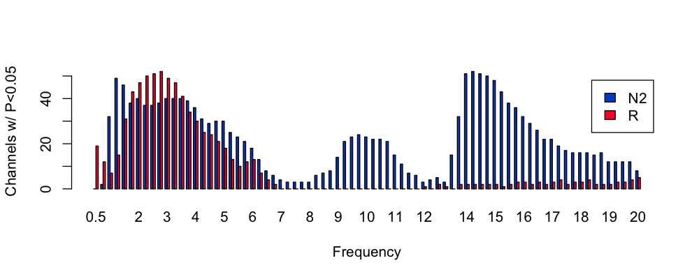


To generate a similar plot as a function of channel, we'll first load the
helper file previously used to help ordering channels by the antero-posterior
axis:

```{ .r .codeR }
clocs <- read.table( "work/data/aux/clocs"  ,header=T , stringsAsFactors=F ) 
s$CH <- toupper( s$CH ) 
s <- merge( s , clocs[ , c("CH","N" ) ] , by="CH" ) 
chs <- unique( s$CH[ order( s$N.y ) ] )
```


```{ .r .codeR }
barplot( table( s$stg , s$N.y ) , beside=T , legend = T ,
         xlab = "Frequency" , ylab = "Channels w/ P<0.05" ,
         col = lstgcols( c( "N2", "R" ) ) ,  names.arg = chs ,
         las=2 , cex.names = 0.5 , args.legend = list(x = "topleft") ) 
```

<!---
png( file="vig/docs/imgs/res-spec-ch.png", res=125, width=1000, height=400)
barplot( table( s$stg , s$N ) , beside=T , legend = T ,
         xlab = "Frequency" , ylab = "Channels w/ P<0.05" ,
         col = lstgcols( c( "N2", "R" ) ) ,  names.arg = chs ,
         las=2 , cex.names = 0.5 , args.legend = list(x = "topleft") )
dev.off()
-->

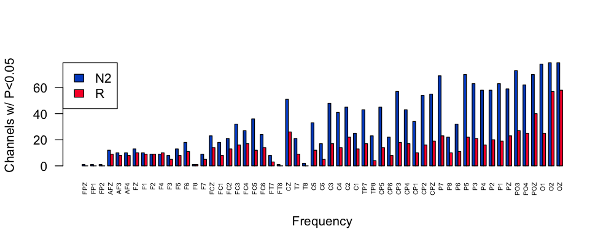


---

Repeating these plots but only for metrics with _P_ < 0.001 instead of _P_ < 0.05:

```{ .r .codeR }
s <- h[ h$GRP == "spec" & h$P < 0.001 ,  ]
```

By frequency:
<!---
png( file="vig/docs/imgs/res-spec-f2.png", res=125, width=1000, height=400) 
barplot( table( s$stg , s$F ) , beside=T , legend = T ,
         xlab = "Frequency" , ylab = "Channels w/ P<0.05" ,
         col = lstgcols( c( "N2", "R" ) ) , las=2 , cex.names = 0.5 )
dev.off()
-->

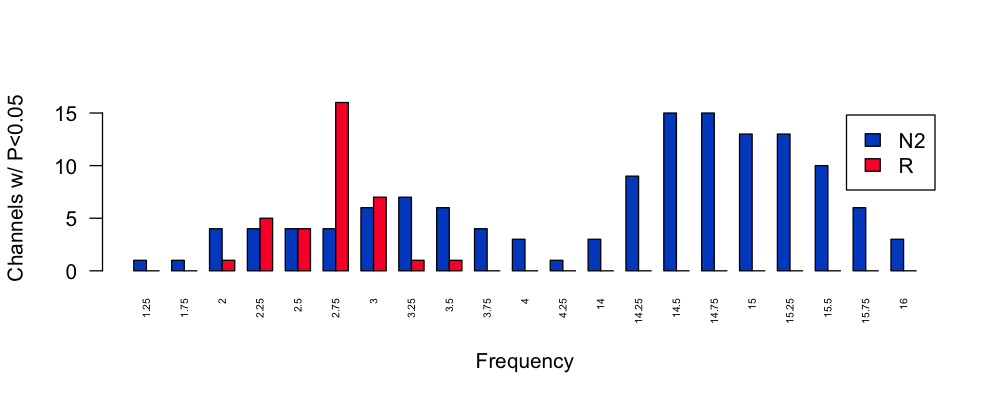


<!---
s$CH <- toupper( s$CH ) 
s <- merge( s , clocs[ , c("CH","N" ) ] , by="CH" )
chs <- unique( s$CH[ order( s$N ) ] ) 
png( file="vig/docs/imgs/res-spec-ch2.png", res=125, width=1000, height=400)
barplot( table( s$stg , s$N ) , beside=T , legend = T ,
         xlab = "Frequency" , ylab = "Channels w/ P<0.05" ,
         col = lstgcols( c( "N2", "R" ) ) ,  names.arg = chs ,
         las=2 , cex.names = 0.5 , args.legend = list(x = "topleft") )
dev.off()
-->

By channel:
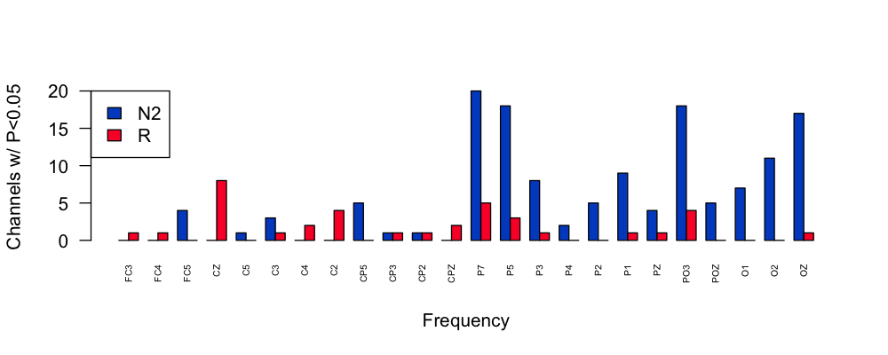


<h5>Spindle/SO results</h5>

```{ .r .codeR }
s <- d[ d$GRP == "spso"  ,  ]
vars <- unique( s$BASE )

s$LP <- -log10( s$P ) 

vars <- c("DENS","AMP","DUR","NOSC","FRQ","CHIRP")

par(mfcol=c(2,6), mar=c(0,0,1,0) )
for (v in vars ) 
 for (f in c(11,15) )
  ltopo.rb( s$CH , s$T , f = s$BASE == v & s$F == f ,
            th = 1.33 , sz=2,
            th.z = s$LP , mt = v ) 
```

<!---
png(file="~/dropbox/projects/luna-apps/2024/vig/docs/imgs/res-spin1.png",width=800,height=300,res=100)
par(mfcol=c(2,6), mar=c(0,0,1,0) )
for (v in vars )
 for (f in c(11,15) )
  ltopo.rb( s$CH , s$T , f = s$BASE == v & s$F == f ,
            th = 1.33 , sz=2,
            th.z = s$LP , mt = v  )
dev.off()
--->


Results for spindle metrics, with slow spindles on the top row, fast spindles on the bottom row:

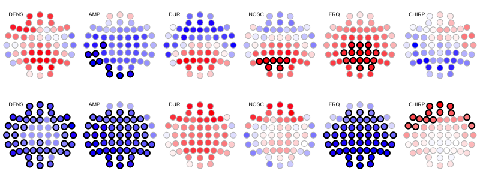


<!---
png(file="~/dropbox/projects/luna-apps/2024/vig/docs/imgs/res-spin2.png",width=600,height=300,res=100)
vars <- c( "SO_RATE", "SO_AMP_NEG", "SO_AMP_P2P", "SO_AMP_POS", "SO_DUR", "SO_DUR_NEG", "SO_DUR_POS", "SO_SLOPE" )
par(mfrow=c(2,4), mar=c(0,0,1,0) )
for (v in vars )
  ltopo.rb( s$CH , s$T , f = s$BASE == v  ,
            th = 1.33 , sz=2,
            th.z = s$LP , mt = v  )
dev.off()
--->

Here are the results for SO (not stratified by spindle frequency, 8 different metrics across the two rows):

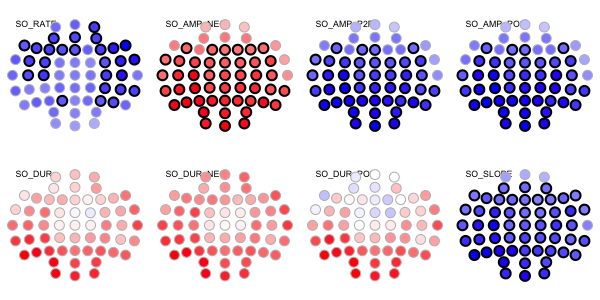

The results for spindle/SO coupling metrics (again, top row slow spindles, bottom row fast spindles):

<!---
png(file="~/dropbox/projects/luna-apps/2024/vig/docs/imgs/res-spin3.png",width=600,height=300,res=100)
vars = c( "CDENS","UDENS","COUPL_OVERLAP_Z","COUPL_MAG_Z" ) 
par(mfcol=c(2,4), mar=c(0,0,1,0) )
for (v in vars )
 for (f in c(11,15) )
  ltopo.rb( s$CH , s$T , f = s$BASE == v & s$F == f ,
            th = 1.33 , sz=2,
            th.z = s$LP , mt = v  )
dev.off()
--->

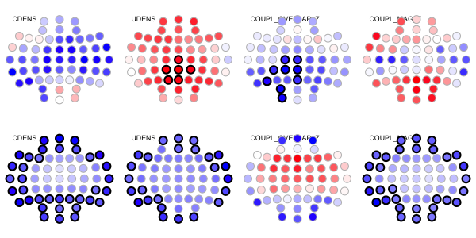


<h5>Predicted age difference</h5>

We've previously reviewed the sex differences in [_predicted age
difference_ metric](pad.md).  In brief, it shows a nominally
significant difference, with males being "older" than females (beta =
1.04 SD units).  The empirical _P_ = 0.02 but after adjustment (for
all tests) it is 0.99.

```
h[ h$GRP == "pad" , c("Y","B","P","P_FDR","EMPADJ" ) ]
```
```
   Y       B      P  P_FDR EMPADJ
DIFF 1.04997 0.0191 0.2327 0.9995
```

Extracting the group means for males and females from the binary file:

```{ .sh .codeL }
luna --gpa --options dat=gpa/b.dat stats \
                     lvars=DIFF inc-ids=@{work/data/aux/male.ids}
```
```
GPA    VAR/DIFF    .    MEAN    2.07196
GPA    VAR/DIFF    .    SD      7.95905
GPA    VAR/DIFF    .    NOBS         10
```

```{ .sh .codeL }
luna --gpa --options dat=gpa/b.dat stats \
                     lvars=DIFF inc-ids=@{work/data/aux/female.ids} 
```
```
GPA    VAR/DIFF    .    MEAN   -6.21103
GPA    VAR/DIFF    .    SD      6.12763
GPA    VAR/DIFF    .    NOBS         10
```

That is, whereas males are 2.1 years "older" than expected, on average
(albeit wide standard deviation), females are, on average, 6.2
years "younger".


## Age effects

Finally, instead of testing for sex differences conditional on age, we
will test for age differences, controlling for sex.  This is obviously
the same set of joint models being tested, but the recorded statistics
differ.

```{ .sh .codeL }
luna --gpa -o out/gpa-age.db \
     --options dat=gpa/b.dat X=age Z=male nreps=10000 knn=3
```

Perhaps unsurprisingly given the age range of this small sample
(i.e. mean of 36, interquartile range between 32 and 41), we don't see
any experiment-wide significant results (and no broad inflation of
nominally significant results, as we did for sex):

```
2239 (prop = 0.0529052) significant at nominal p < 0.05
0 (prop = 0) significant at FDR p < 0.05
0 (prop = 0) significant after empirical family-wise type I error control p < 0.05
```

Given many sleep metrics show marked but opposite effects during childhood versus late adulthood, this particular age group
represents a _plateau_ of the U-shaped trajectories in many instances; that combined with the restriction of range in age, and the
small sample, means that age is not a significant contributor to individual differences in this sample. 

## N2-REM connectivity

Finally, we'll use the same framework to repeat our prior tests of
(intra-individual) differences between N2 and REM sleep in
connectivity (PSI).  To do this, we'll need to structure our inputs
slightly differently: we'll now have two observations (rows) per
person: one for N2, one for REM, and we'll create a predictor variable
for sleep stage.  (`GPA` doesn't formally provide a repeated-measures
/ within-person here, so we'll ignore that nuance for now; in this
particular context, with matching implicit between groups, it should
not matter in any case.)

We need to reformat the inputs, such that we now are compared 20 versus 20 observations effectively:

We'll add an `n2_` prefix to the `ID` field:

```{ .sh .codeL }
awk ' NR == 1 { print $0 }  \
      NR != 1 { print "n2_"$0 } ' OFS="\t" res/psi2.n2 > res/psi2.n2rem      
```

We'll then concatenate the REM PSI values, with a different prefix (and can skip the header here):

```{ .sh .codeL }
awk ' NR != 1 { print "r_"$0 } ' OFS="\t" res/psi2.rem >> res/psi2.n2rem
```

The new file `res/psi2.n2rem` looks like (some fields dropped for clarity):
```{ .sh .codeL }
head res/psi2.n2rem
```
```
ID        CH1    CH2    F         PSI
n2_F01    AF3    AF4    3   -0.257172
n2_F01    AF3    AFZ    3   -1.397960
n2_F01    AF3     C1    3    3.612522
n2_F01    AF3     C2    3    2.939747
n2_F01    AF3     C3    3    2.863404
n2_F01    AF3     C4    3    3.248829
n2_F01    AF3     C5    3    0.237405
...
```

Then we'll make a new "phenotype" file in the same way, with an
indicator variable (`N2`) to track with metric is associated with N2
versus REM:

```{ .sh .codeL }
awk '  NR == 1 { print $0,"N2" }  \
       NR != 1 { print "n2_"$0,"1" } ' OFS="\t" work/data/aux/master.txt > res/demo-nr-rem.txt
```

```{ .sh .codeL }
awk ' NR != 1 { print "r_"$0,"0" } ' OFS="\t" work/data/aux/master.txt >> res/demo-nr-rem.txt
```

This file now has 40 "observations":

```
cat res/demo-nr-rem.txt 
```
```
ID        male    age   N2
n2_F01    0       41    1
n2_F02    0       32    1
n2_F03    0       37    1
n2_F04    0       32    1
    ...
r_F01     0       41    0
r_F02     0       32    0
r_F03     0       37    0
r_F04     0       32    0
    ...
r_M06     1       27    0
r_M07     1       45    0
r_M08     1       40    0
r_M09     1       40    0
r_M10     1       41    0
```

---

We'll use the quick `inputs` method here for `GPA` to make the binary file `gpa/b.psi` (note the `+=` operator for the
second `inputs` argument appends this as a command-delimited list):

```{ .sh .codeL }
echo " inputs=res/psi2.n2rem|psi|CH1|CH2|F
       inputs+=res/demo-nr-rem.txt|demo
       vars=PSI,age,male,N2
       dat=gpa/b.psi " | luna --gpa-prep > gpa/manifest.psi
```

```
  preparing inputs...
  ++ res/demo-nr-rem.txt: read 40 indivs, 3 base vars --> 3 expanded vars
  ++ res/psi2.n2rem: read 40 indivs, 1 base vars --> 14364 expanded vars

  checking for too much missing data ('retain-cols' to skip; 'verbose' to list)
  nothing to check (n-rep and n-prop set to 0)

  writing binary data (40 obs, 14367 variables) to gpa/b.psi
  ...done
```

With this done, we can run the `GPA` model (including both `age` and
`male` as covariates, although this should not matter as the two
groups will be implicitly matched):

```{ .sh .codeL }
luna --gpa -o out/gpa-psi.db \
     --options dat=gpa/b.psi X=N2 Z=male,age nreps=10000
```

We now see a large proportion (10% of all metrics) are significant, correcting for the 14,367 tests performed:

```
14364 total tests specified
5735 (prop = 0.399262) significant at nominal p<0.05
4276 (prop = 0.297689) significant at FDR p<0.05
1454 (prop = 0.101225) significant after empirical family-wise type I error control p<0.05
```

We can take a quick look in  R:
```{ .r .codeR }
library(luna)
d <- ldb( "out/gpa-psi.db" )$GPA$X_Y
```

As before, we'll merge in the manifest information:
```
d <- merge( d , read.table( "gpa/manifest.psi", header=T, stringsAsFactors=F ) , by.x="Y" , by.y="VAR" ) 
```

We'll use the same `arconn.R` function:
```
source("http://zzz.bwh.harvard.edu/dist/luna/arconn.R" )
zlim = c(-12,12)

par(mfrow=c(1,9),mar=c(0,0,1,0))

for (f in seq(3,19,2)) {
 arconn(d$CH1, d$CH2, d$T, flt = d$F==f & d$EMPADJ < 0.05 , dst=1,
        directional=T, 
        cex=1,title=paste("N2 vs REM,",f-2,"-",f+2,"Hz",sep=""),
        lwd1=0.1, lwd2=1, zr=zlim)
}

```

<!---
png(file="~/dropbox/projects/luna-apps/2024/vig/docs/imgs/gpa-psi-rem-nrem.png", res=100, width=1000, height=350) 
zlim = c(-12,12)
par(mfrow=c(1,9),mar=c(0,0,1,0))
for (f in seq(3,19,2)) {
 arconn(d$CH1, d$CH2, d$T, flt = d$F==f & d$EMPADJ < 0.05 , dst=1,
         directional=T,   
        cex=1,title=paste("N2 vs R,",f-2,"-",f+2,"Hz",sep=""),
        lwd1=0.1, lwd2=1, zr=zlim)
}
dev.off()
--->

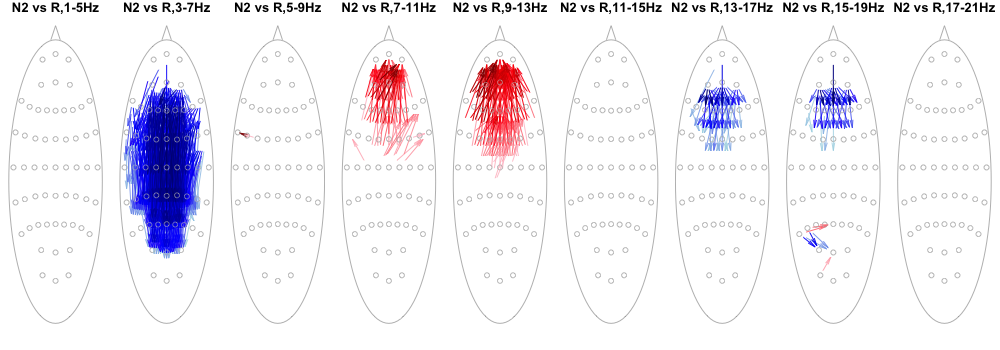

The plot shows only the links that are significant after adjustment in
this analysis; the edges are always oriented to show the (directed)
PSI that is numerically greater in N2 compared to REM (remember, as
before, that could mean _less_ overall connectivity -- see the [prior
page](conn.md#sex-differences) for notes on how to plot
group-differences in pairwise directed connectivity - for this
purpose, we just want to show the broad pattern of where the changes
are, and so we won't bother with those additional plots here).  The
color here shows whether the arrow is pointing up or down with respect
to topography.


Plotting instead all connections that are FDR-significant at 0.05:

<!---
png(file="~/dropbox/projects/luna-apps/2024/vig/docs/imgs/gpa-psi-rem-nrem-fdr.png", res=100, width=1000, height=350) 
zlim = c(-12,12)
par(mfrow=c(1,9),mar=c(0,0,1,0))
for (f in seq(3,19,2)) {
 arconn(d$CH1, d$CH2, d$T, flt = d$F==f & d$P_FDR < 0.05 , dst=1,
         directional=T,   
        cex=1,title=paste("N2 vs R,",f-2,"-",f+2,"Hz",sep=""),
        lwd1=0.1, lwd2=1, zr=zlim)
}
dev.off()
--->

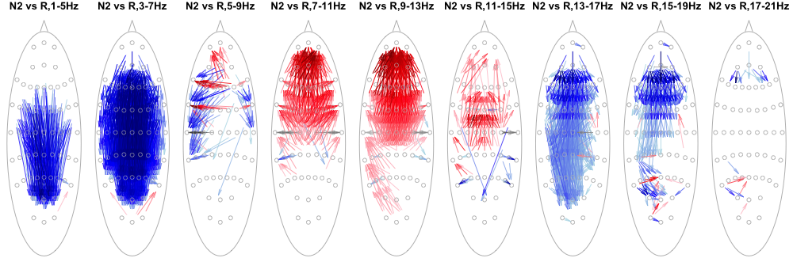


## Summary

We've seen two related methods for testing for association with linear
models.  Both methods are designed to take large numbers of metrics as
are typically output by Luna and offer a permutation-based to assess
multiple testing in these contexts (as well as FDR methods for `GPA`).
As always, many issues of study
design and analysis come into play when applying these (or any)
methods to real data.  While we seem to observe clear evidence for sex
differences in the N2 power spectra (in a focused analysis of that),
the broader analysis including tens of thousands of connectivity
metrics is not quite as clear: for this, _replication_ and/or
_extension in larger samples_ will be key (and we'll address this in
future steps).

We also saw that larger effects (i.e. within person N2 versus REM
differences in PSI, versus between-individual sex differences) _can_
in fact withstand the burden of multiple testing, reinforcing the
important point that it is not simply the sample size, the number of
tests and their correlational structure that matter, but the
anticipated _effect sizes_ too.

---

In the next section we'll consider [peri-event statistics](peri.md).
