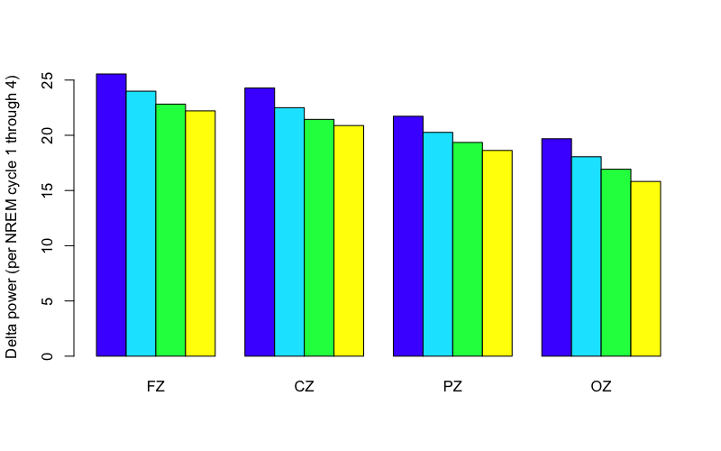
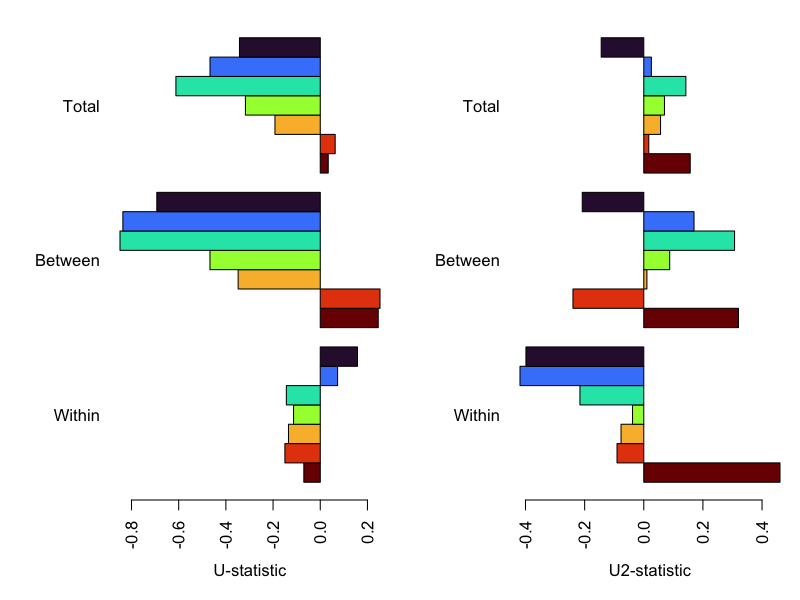
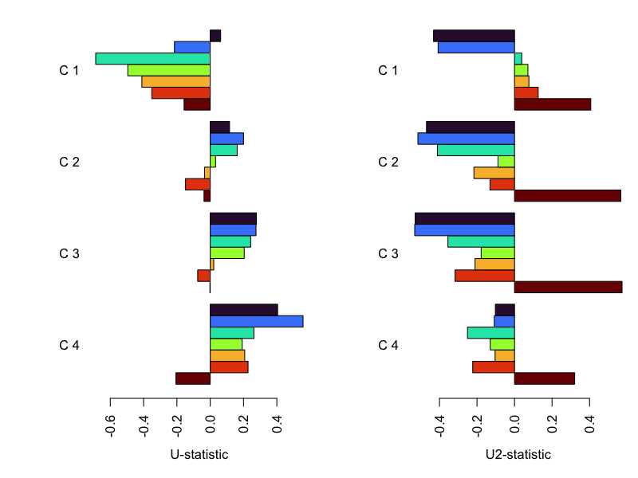
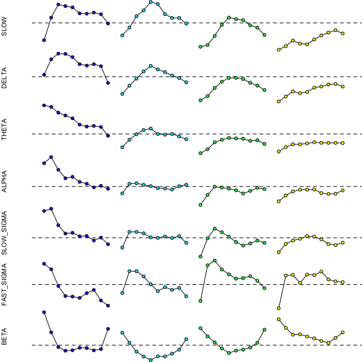

# 5.3. Quantifying ultradian dynamics

Luna has a number of approaches for quantifying ultradian dynamics -
beyond looking at the _average level_ of a metric.  Here we'll
consider two simple applications: analyses 1) [stratified by NREM
cycle](#cycle-level-dynamics) and 2) capturing
[epoch-level, intra-cycle dynamics](#epoch-level-dynamics).

## Cycle-level dynamics

As noted, the `HYPNO` command can [add annotatations](../p3/hypno.md#hypnogram-based-annotations),
for example, that track NREM cycle status.  By default, these
annotations (`h_cycle_n1`, `h_cycle_n2` etc) are assigned to epochs
belonging to the first, second, etc, NREM cycle.  For commands such as
`PSD` that [respect any current mask](https://zzz.bwh.harvard.edu/luna/ref/epochs/#command-epoch-types),
we can use the following to calculate NREM spectral
power stratified by NREM cycle (here just for four midline channels, Fz, Cz, Pz and Oz):
  
```{ .sh .codeL }
luna c.lst -o out/cycles.db \
  -s ' ${z=FZ,CZ,PZ,OZ}
       HYPNO annot

       MASK ifnot=N2,N3 & RE
       CHEP-MASK sig=${z} ep-th=3,3
       CHEP sig=${z} epochs & RE

       MASK ifnot=h_cycle_n1
       TAG P/C1
       PSD sig=${z} dB

       MASK ifnot=h_cycle_n2
       TAG P/C2
       PSD sig=${z} dB

       MASK ifnot=h_cycle_n3
       TAG P/C3
       PSD sig=${z} dB

       MASK ifnot=h_cycle_n4
       TAG P/C4
       PSD sig=${z} dB '
```

Note the use of Luna's
[`TAG`](https://zzz.bwh.harvard.edu/luna/ref/summaries/#tag) command
to keep track of the output, i.e. across different NREM cycles, by adding what
will appear as a new _factor_ in the output (`P`, for _period_, although we could have
chosen another label, e.g. `cycle`, etc).


!!!info "Freeze/thaw commands"
    If using a wider range of commands (that interact with masks differently),
    it can be safer to use the [`FREEZE`/`THAW`
    mechanism](https://zzz.bwh.harvard.edu/luna/ref/freezes/) instead
    of relying on how a given command handles masked epochs:
    e.g. writing this only for the first two NREM cycles, but this
    would achieve a similar thing as above:

    ```{ .sh .codeL }
    luna c.lst 1 -o out/cycles.db \
      -s ' ${z=FZ,CZ,PZ,OZ}
           HYPNO annot

           MASK ifnot=N2,N3 & RE
           CHEP-MASK sig=${z} ep-th=3,3
           CHEP sig=${z} epochs & RE

           FREEZE F1
           MASK ifnot=h_cycle_n1 & RE
           TAG P/C1
           PSD sig=${z} dB

           THAW F1
           MASK ifnot=h_cycle_n2 & RE
           TAG P/C2
           PSD sig=${z} dB

           ... etc ...
    ```
    Luna will give a warning to the console if a command that doesn't respect the current mask is used only masked data (in which case, you should use `FREEZE`/`THAW`).
    

We'll extract band power (for select bands) per NREM cycle (i.e. adding the `P` factor as added above by `TAG`):
```{ .sh .codeL }
destrat out/cycles.db +PSD \
    -r CH P \
    -r B/SLOW,DELTA,THETA,ALPHA,SIGMA,FAST_SIGMA,SLOW_SIGMA,BETA \
    -v PSD > res/dynam.cycles
```

In R, we'll read these cycle-specific power values:
```{ .R .codeR }
d <- read.table( "res/dynam.cycles" , header=T )
```
Each power value is now stratified by `P` (i.e. NREM cycle) as well as `CH` and `F`:
```{ .R .codeR }
head(d)
```
```
   ID          B CH  P      PSD
1 F01       SLOW FZ C1 25.14302
2 F01      DELTA FZ C1 25.77686
3 F01      THETA FZ C1 18.02996
4 F01      ALPHA FZ C1 16.88974
5 F01      SIGMA FZ C1 12.04257
6 F01 SLOW_SIGMA FZ C1 14.70089
```

We can summarize cycle-, channel- and band-specific power values as follows:

```{ .R .codeR }
res <- tapply( d$PSD , list( d$P, d$CH , d$B ) , mean )
```


To see whether, For example, N2 delta power is (on average) reduced over NREM cycles:

```{ .R .codeR }
res[,,"DELTA"]
```
```
         CZ       FZ       OZ       PZ
C1 24.42155 25.54793 19.71291 21.71640
C2 22.69480 23.98812 18.06028 20.23521
C3 21.67052 22.83185 16.90141 19.31206
C4 21.07029 22.21806 15.79932 18.59287
```

<!---
png(file="vig/docs/imgs/delta-cycles.png",res=100, width=800, height=500)
barplot( res[ , c("FZ","CZ","PZ","OZ") , "DELTA" ] , beside = T , col = topo.colors(4) , ylab = "Delta power (per NREM cycle 1 through 4)" ) 
dev.off()
-->

```{ .R .codeR }
barplot( res[ , c("FZ","CZ","PZ","OZ") , "DELTA" ] ,
         beside = T , col = topo.colors(4) ,
         ylab = "Delta power (per NREM cycle 1 through 4)" ) 
```



That is, we see that average per-cycle N2 delta power a) is higher in
frontal regions, and b) decreases with each NREM cycle, consistent
with expectations of delta power as an index of dissipating
homeostatic sleep pressure.

---

Test, and control for age/sex, we'll merge in the demographic data:

```{ .R .codeR }
d <- merge( d ,read.table( "work/data/aux/master.txt",header=T,stringsAsFactors=F), by="ID" )
```

We can then apply simple linear models, confirming that the reduction
across cycles (here at CZ) is in fact statistically significant):

```{ .R .codeR }
summary(lm( PSD ~ male + age + as.factor( P ) , data = d , subset = B == "DELTA" & CH == "CZ"  ) )
```
```
               Estimate Std. Error t value Pr(>|t|)    
(Intercept)    29.71078    1.60797  18.477  < 2e-16 ***
male           -1.83723    0.45452  -4.042 0.000136 ***
age            -0.12024    0.04369  -2.752 0.007557 ** 

as.factor(P)C2 -1.72675    0.60363  -2.861 0.005590 ** 
as.factor(P)C3 -2.74021    0.61211  -4.477 2.92e-05 ***
as.factor(P)C4 -3.20337    0.64086  -4.999 4.20e-06 ***
```


## Epoch-level dynamics

Luna's `dynam` argument can be applied to a number of commands, to
take epoch-level outputs and return a series of inter- and intra-cycle
summaries.  Here we'll apply to the `PSD` command, based on a single
channel (`CPZ`) for simplicity; we'll also restrict these analyses
to a maximum of 4 NREM cycles (as fewer people have more than 4 complete NREM cycles
in this sample):

```{ .sh .codeL }
luna c.lst -o out/dynam.db \
  -s ' HYPNO
       MASK ifnot=N2,N3 & RE
       CHEP-MASK sig=CPZ ep-th=3,3
       CHEP epochs & RE
       PSD sig=CPZ dynam dynam-max-cycle=4 dynam-norm-cycles=F '
```

When the `dynam` option is added to a command that supports it (e.g. `PSD`, `PSI`, `COH`, `SPINDLES`, etc),
the output will contain two additional strata, e.g. here defined by 1) `VAR`x`QD` and 2) `VAR`x`QD`x`Q` as well
as the original factors (i.e. `B`x`CH`).  Briefly,

 - `VAR` is in this case just `PSD` (i.e. spectral power)
 - `QD` is the interval considered: depending on the options, this can be across the whole night, within or between NREM cycles
 - `Q` is the quantile for a given interval, i.e. to show original (`OS`) and standardized (`SS`) scores over that period 

In this case, we have:

```{ .sh .codeL }
destrat out/dynam.db
```

```
  [PSD]         : CH                : 1 level(s)    : NE
                :                   :               : 
  [PSD]         : B CH              : 10 level(s)   : PSD RELPSD
                :                   :               : 
  [PSD]         : B CH VAR QD       : 60 level(s)   : A_P2P MEAN N OMEAN SD T_P2P U U2
                :                   :               :
  [PSD]         : B CH VAR QD Q     : 500 level(s)  : OS SS
```

If we'd added `spectrum` to the `PSD` command, we'd have equivalent
metrics for `CH`x`F` strata too. We'll extract the main outputs here
into text files:

```{ .sh .codeL }
destrat out/dynam.db +PSD -r CH VAR B QD   > res/dynam.band.1

destrat out/dynam.db +PSD -r CH VAR B Q QD > res/dynam.band.2
```

---

In R, we can review some of these metrics. The `dynam` module provides
simple summary statistics to quantify whether more "activity" (in this
context, higher EEG power) tends to occur relatively _earlier_ or
_later_ across a given period.  We'll read these in:


```{ .R .codeR }
d <- read.table("res/dynam.band.1",header=T,stringsAsFactors=F)
```
and define a list of bands of interest, ordered by frequency:
```{ .R .codeR }
bands <- c("SLOW", "DELTA","THETA","ALPHA","SLOW_SIGMA","FAST_SIGMA","BETA" ) 
```

After appropriate normalization and smoothing of epoch-level power
values, the `dynam` module reports `U` and `U2` metrics that reflect
the linear and quadratic coefficients for the metric (e.g. N2 delta
power) as a function of time, either across the whole night (`TOT`),
between NREM cycles (`BETWEEN`, based on the means per cycle), within
a specific NREM cycle (e.g. `W_C1` for the first cycle), or the
average within-cycle effect (`WITHIN`), here based on cycles 1 up to
4.

We can look at the mean U metric for each band under these conditions:
```{ .R .codeR }
r <- tapply( d$U , list( B = d$B , QD = d$QD  ) , mean ) 
r[ bands , ]
```
```
             QD
B            BETWEEN    TOT   W_C1   W_C2   W_C3   W_C4 WITHIN
  SLOW        -0.697 -0.344  0.071  0.120  0.269  0.420  0.161
  DELTA       -0.834 -0.467 -0.211  0.200  0.276  0.560  0.074
  THETA       -0.840 -0.611 -0.686  0.157  0.241  0.267 -0.145
  ALPHA       -0.466 -0.321 -0.503  0.025  0.204  0.195 -0.117
  SLOW_SIGMA  -0.353 -0.196 -0.415 -0.028  0.013  0.223 -0.134
  FAST_SIGMA   0.230  0.055 -0.348 -0.154 -0.099  0.235 -0.152
  BETA         0.245  0.031 -0.159 -0.037 -0.006 -0.201 -0.070
```

Negative values imply that relative more activity happens earlier
(i.e. it decreases with increasing time); positive values imply the opposite.
We can plot these values, first for the `TOT` and `BETWEEN` (that we typically expect to
be similar to each other) as well as the `WITHIN` (average within NREM cycle dynamics) condition. Below
we also plot the equivalent values for U2 (the quadratic term) on the right panel:


```{ .R .codeR }

par(mfcol=c(1,2),mar=c(5,6,1,1))

barplot( r[ rev(bands) , c( "WITHIN","BETWEEN","TOT" ) ]  ,
         xlab = "U-statistic" , 
         beside=T , horiz= T , las=2 , col = rev(lturbo(7)) ,
         names.arg = c("Within", "Between", "Total" ) )

r2 <- tapply( d$U2 , list( B = d$B , QD = d$QD  ) , mean )

barplot( r2[ rev(bands) , c( "WITHIN","BETWEEN","TOT" ) ]  ,
         xlab = "U2-statistic" ,
         beside=T , horiz= T , las=2 , col = rev(lturbo(7)) ,
         names.arg = c("Within", "Between", "Total" ) )

```


<!---
png(file="vig/docs/imgs/dynam-u2.png",width=800,height=600,res=100)

par(mfcol=c(1,2),mar=c(5,6,1,1))
r <- tapply( d$U , list( B = d$B , QD = d$QD  ) , mean )

barplot( r[ rev(bands) , c( "WITHIN","BETWEEN","TOT" ) ]  ,
         xlab = "U-statistic" , 
         beside=T , horiz= T , las=2 , col = rev(lturbo(7)) ,
         names.arg = c("Within", "Between", "Total" ) ) 

r <- tapply( d$U2 , list( B = d$B , QD = d$QD  ) , mean )

barplot( r[ rev(bands) , c( "WITHIN","BETWEEN","TOT" ) ]  ,
         xlab = "U2-statistic" ,
         beside=T , horiz= T , las=2 , col = rev(lturbo(7)) ,
         names.arg = c("Within", "Between", "Total" ) )
dev.off()
--->




The slower bands are in blues at the top, the faster bands (sigma,
beta) are in the reds.  This confirms that across the night as a whole
and between cycles, we see a decrease in slow/delta activity but a
slight increase in fast sigma/beta power.   Within NREM cycle, there are
not particularly marked linear trends.

However, intra-cycle dynamics are better captured by non-linear
(quadratic) changes across an individual NREM cycle.  If we instead
plot the U2 metric we see marked intra-cycle effects. The within-cycle
effects also vary between different cycles, on average, in a
band-specific manner.  Within each cycle:


<!---
png(file="vig/docs/imgs/dynam-wu2.png",width=800,height=600,res=100)

par(mfcol=c(1,2),mar=c(5,6,1,1))

r <- tapply( d$U , list( B = d$B , QD = d$QD  ) , mean )
par(mar=c(5,6,1,1))
barplot( r[ rev(bands) , c( "W_C4","W_C3","W_C2","W_C1" ) ] ,
         xlab = "U-statistic" ,
         beside=T , horiz= T , las=2 , col = rev(lturbo(7)) ,
         names.arg = paste( "C" , 4:1 ) )

r <- tapply( d$U2 , list( B = d$B , QD = d$QD  ) , mean )
barplot( r[ rev(bands) , c( "W_C4","W_C3","W_C2","W_C1" ) ] ,
         xlab = "U2-statistic" ,
         beside=T , horiz= T , las=2 , col = rev(lturbo(7)) ,
         names.arg = paste( "C" , 4:1 ) )

dev.off()
--->




---

These simple U and U2 metrics can be used as metrics to capture
individual differences in ultradian EEG power dynamics.  To understand
the primary nature of these types of dynamic chamges, it can often be useful
to more directly plot how power changes over time.  This information
is implicit in the `res/dynam.band.2` file, which has the (normalized)
power values for each individual, split by decile of each period
(either the whole night, `TOT`, or within a given NREM cycle,
e.g. `W_C1`).

We'll load these;
```{ .R .codeR }
d <- read.table("res/dynam.band.2",header=T,stringsAsFactors=F)
```
and calculate the table of means per band (`B`), period (`QD)` and intra-period decile (`Q`) for
the standardized scores (`SS`):
```{ .R .codeR }
r <- tapply( d$SS , list( d$Q , d$QD , d$B ) , mean )
```

To clarify the structure of the output: for each set of intervals, we have a matrix of band by decile:

```{ .R .codeR }
round(r , 2 ) 
```
```
, , ALPHA

    TOT W_C1 W_C2 W_C3 W_C4
1  1.49 1.55 0.84 0.58 0.65
2  1.11 1.69 1.06 0.80 0.79
3  1.01 1.40 1.07 0.99 0.88
4  0.95 1.20 1.04 0.97 0.93
5  0.99 1.24 1.01 0.95 0.93
6  0.97 1.12 0.97 0.90 0.94
7  0.91 1.07 0.95 0.83 0.85
8  0.86 0.98 0.93 0.89 0.83
9  0.91 1.03 1.00 0.94 0.83
10 0.81 0.96 1.04 0.94 0.90

, , BETA

    TOT W_C1 W_C2 W_C3 W_C4
1  1.31 1.86 1.32 1.43 1.65
2  0.83 1.34 1.06 1.23 1.44
3  0.92 0.95 0.83 1.07 1.26
4  1.03 0.87 0.70 0.91 1.27
5  0.97 0.88 0.61 0.79 1.23
6  0.87 0.94 0.71 0.85 1.18
7  0.98 0.93 0.71 0.88 1.11
8  0.96 0.87 0.78 0.93 1.06
9  1.03 0.91 0.88 1.05 1.19
10 1.11 1.43 1.15 1.40 1.33

... etc ...

```


After defining a little helper function `f1()`:

```{ .R .codeR }
f1 <- function(r,b) {
 # extract just W_C1 to W_C4 for this band
 rr <- r[ , -1 , b ]
 # get as vector after padding w/ blanks (NA) between cycles
 rr <- as.vector( rbind( rr , rep(NA,4)  )  ) 
 plot( rr , type="l" , xaxt='n' , ylab = b , axes = F , xlab="" )
 abline( h = 1 , lty=2)
 points( rr , bg = rep( topo.colors(4) , each=11 ) , pch=21 )
}
```

we can make plots for all bands:
```{ .R .codeR }
par(mfcol=c(7,1), mar=c(0,4,0,0 ) )
for (b in bands) f1( r , b ) 
```

<!---
png(file="vig/docs/imgs/dynam-bands.png",width=600,height=600,res=100)
par(mfcol=c(7,1), mar=c(0,4,0,0 ) )
for (b in bands) f1( r , b ) 
dev.off()
-->



That is, the dynamics apparent in this plot are effectively captured
by `U` and `U2`, between and within NREM cycles.  Slow/delta power
builds up within each NREM cycle, but dissipates over successive
cycles.  There is relatively more theta/alpha power right at sleep
onset. Beta power shows a qualitatively different U-shaped pattern
within each cycle.  As the metrics here are normalized by the mean and
minimum of the absolute power values, they are designed to capture
individual differences in the _change_ of power between and within
NREM cycles that is relatively independent of the _average_ value.
The use of deciles, although coming with some inherent assumptions and
limitations, allows different individuals to be compared on the same
metric.


## Summary

In this section we've seen some simple ways to:

 - obtain power values stratified by NREM cycle

 - quantify relative dynamics both within and between NREM cycles

 - visualize band-specific group-level ultradian dynamics in the sleep EEG

We'll include some of the key metrics from `dynam` in the association modelling step below.

---

In the next section we'll consider [connectivity analyses](conn.md).

