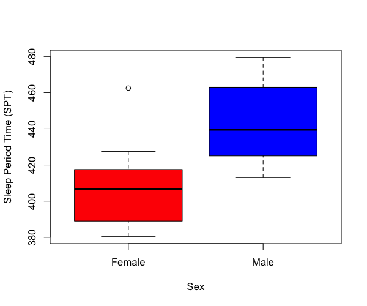
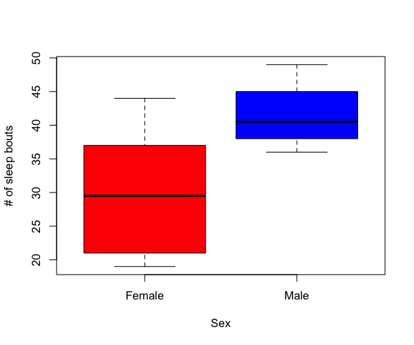
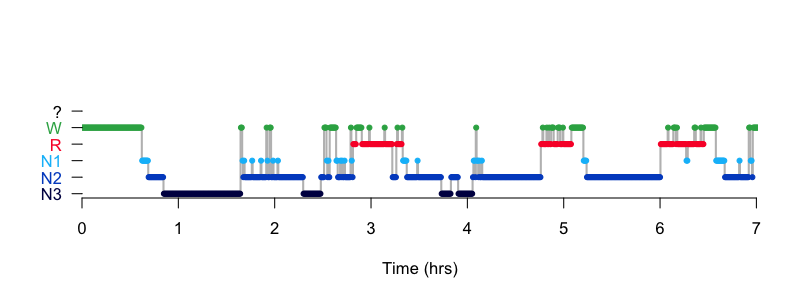

# 5.1. Macro-architecture

We've previously reviewed the
[`HYPNO`](https://zzz.bwh.harvard.edu/luna/ref/hypnograms/#hypno)
command in the context of [QC](../p3/hypno.md).  Here we'll output a
range of macro-architecture metrics, testing for sex differences.

Unlike the previous steps where we typically used a single temporary
output database (`out.db`) here we'll archive outputs more
systematically, as we'll compile some of these outputs for
[association analyses](assoc.md) in subsequent steps.  We'll make two
folders: `out/` for all Luna `.db` files generated, and `res/` for the
text files extracted from those output databases:

```{ .sg .codeL }
mkdir out res
```

## Running HYPNO

All metrics generated in this section are from the [`HYPNO`](https://zzz.bwh.harvard.edu/luna/ref/hypnograms/#hypno)
command.  We'll run with the `epoch` option to request epoch-level outputs:

```{ .sh .codeL }
luna c.lst -o out/hypno.db -s HYPNO epoch
```

For the subsequent [association analyses](assoc.md) we'll extract
three result files from `out/hypno.db`: first, the _base-line_
per-individual metrics:

```{ .sh .codeL }
destrat  out/hypno.db +HYPNO > res/hypno.base
```

Second, metrics stratified by sleep stage:

```{ .sh .codeL }
destrat  out/hypno.db +HYPNO -r SS/N1,N2,N3,R,W > res/hypno.stage
```

Third, metrics stratified by NREM cycle, considering only cycles 1
through 4 (as we'll see below, not many individuals in this sample had more than 4
cycles):

```{ .sh .codeL }
destrat  out/hypno.db +HYPNO -r C/1,2,3,4  > res/hypno.cycle
```

## Baseline metrics

In R, we'll review the outputs, loading the full database (although we
could equivalently have loaded the text file `res/hypno.base` here
instead):

```{ .R .codeR }
library(luna)
k <- ldb("out/hypno.db")
```

We extract the _baseline_ (`BL`) strata of results into a data-frame `d`:
```{ .R .codeR }
d <- k$HYPNO$BL
```

and then merge this table with the demographic data:

```{ .R .codeR }
p <- read.table("work/data/aux/master.txt", header=T, stringsAsFactors=F)
d <- merge( d , p , by="ID" ) 
```


The base-line variables are represented in the columns of `d`:
```{ .r .codeR }
names(d)
```
```
[1] "ID"                  "CONF"                "E0_START"           
 [4] "E1_LIGHTS_OFF"       "E2_SLEEP_ONSET"      "E3_SLEEP_MIDPOINT"  
 [7] "E4_FINAL_WAKE"       "E5_LIGHTS_ON"        "E6_STOP"            
[10] "EINS"                "FIXED_LIGHTS"        "FIXED_SLEEP"        
[13] "FIXED_WAKE"          "FWT"                 "HMS0_START"         
[16] "HMS1_LIGHTS_OFF"     "HMS2_SLEEP_ONSET"    "HMS3_SLEEP_MIDPOINT"
[19] "HMS4_FINAL_WAKE"     "HMS5_LIGHTS_ON"      "HMS6_STOP"          
[22] "LOST"                "LOT"                 "LZW"                
[25] "LZW3"                "NREMC"               "NREMC_MINS"         
[28] "OTHR"                "POST"                "PRE"                
[31] "REM_LAT"             "REM_LAT2"            "SE"                 
[34] "SFI"                 "SINS"                "SME"                
[37] "SOL"                 "SOL_PER"             "SPT"                
[40] "SPT_PER"             "T0_START"            "T1_LIGHTS_OFF"      
[43] "T2_SLEEP_ONSET"      "T3_SLEEP_MIDPOINT"   "T4_FINAL_WAKE"      
[46] "T5_LIGHTS_ON"        "T6_STOP"             "TGT"                
[49] "TIB"                 "TI_RNR"              "TI_S"               
[52] "TI_S3"               "TRT"                 "TST"                
[55] "TST_PER"             "TWT"                 "WASO"               
[58] "male"                "age"                
```

Plotting an initial representative metric, the sleep period time (SPT), the time between sleep onset and final wake), by males and females:

```{ .R .codeR }
boxplot( d$SPT ~ rep(c("Female","Male"),each=10) , col = c("red","blue" ), 
         xlab = "Sex" , ylab = "Sleep Period Time (SPT)" ) 
```
<!---
png(file="vig/docs/imgs/spt1.png",width=600,height=500,res=100)
boxplot( d$SPT ~ rep(c("Female","Male"),each=10) , xlab = "Sex" , ylab = "Sleep Period Time (SPT)" , col = c("red","blue" ))
dev.off()
--->



There appears to be evidence for a sex difference, which we can formally test, for example via a simple linear regression also controlling for age (and
removing any potential outliers (default +/- 3 SD units) from the dependent variable):

```{ .R .codeR }
summary(lm( outliers( SPT )  ~ age + male , data = d ) )
```
```
Coefficients:
            Estimate Std. Error t value Pr(>|t|)    
(Intercept) 479.9224    32.0737  14.963 3.22e-11 ***
age          -1.9894     0.8839  -2.251 0.037936 *  
male         38.1819     9.5082   4.016 0.000896 ***
---
Signif. codes:  0 ‘***’ 0.001 ‘**’ 0.01 ‘*’ 0.05 ‘.’ 0.1 ‘ ’ 1

Residual standard error: 20.99 on 17 degrees of freedom
Multiple R-squared:  0.5252,	Adjusted R-squared:  0.4693 
F-statistic: 9.402 on 2 and 17 DF,  p-value: 0.00178
```

We see that males have significantly longer SPTs in this small sample: 7.4 hrs versus 6.8 hrs (with 0 and 1 indicating female and male below):

```{ .R .codeR }
tapply( d$SPT , d$male , mean )  / 60 
```
```
0        1 
6.821667 7.401667 
```


<!---

f1a <- function( v, d , t = NULL ) {

 # get y
 y <- d[,v] 

 # test y is a variable numeric 
 if ( ! is.numeric(y) ) return(NA)
 if ( sum( is.finite( y ) ) < 5 ) return(NA)
 if ( sd( y , na.rm=T ) < 1e-4 ) return(NA)

 # optionally, outlier removal at +/- t SDs
 if ( ! is.null( t ) ) y <- outliers( y , t = t ) 

 # fit linear model, predictors = age + sex
 m1 <- summary( lm( y ~ age + male , data = d ) ) 

 # return beta, p-value and signed Z for a) age, b) sex(M)
 res <- c( as.vector(m1$coef[2,c(1,4)]) , sign(  m1$coef[2,1] ) * -log10( m1$coef[2,4] ) ) 
 res <- c( res , as.vector(m1$coef[3,c(1,4)]) , sign(  m1$coef[3,1] ) * -log10( m1$coef[3,4] ) ) 
# cat( v , res, "\n" )
 res
}

f1 <- function( vars, d , t = NULL ) {
 res <- sapply( vars , f1a, d = d , t = t )
 df <- as.data.frame(t( as.data.frame( res )  ))
 names( df ) <- c( "B_AGE", "P_AGE", "Z_AGE" , "B_M", "P_M", "Z_M" ) 
 df <- df[ complete.cases(df) , ] 
 df
}

vars <- c("TRT","TIB","SPT","TST","TST_PER","TWT", "WASO", "SE", "SME", "SOL", "REM_LAT", "REM_LAT2")

f1( vars , d ) 
--->

We can continue to test a range of key sleep metrics, applying the
same linear model with the results tabulated here:

| Variable | Metric | Beta | P-value |
|----|----|----|----|
|`TRT` | Total recording time (mins) | 35.26 | __0.004__ |
|`TIB` | Time-in-bed, here = TRT (mins) |  35.26 | __0.004__ |
|`SPT` | Sleep period time (mins) | 38.18 | __0.001__ |
|`TST` | Total sleep time (mins) | 23.61 | 0.19 |
|`TST_PER` | Persistent sleep time (mins) | -4.98 | 0.84 |
| |		
|`TWT`| Total wake time (mins) | 11.66	|0.62|
|`WASO`| Wake after sleep onset (mins) | 14.57	|0.48|
|`SE`| Sleep efficiency (%) | -1.35	|0.78|
|`SME`|	Sleep maintenance efficiency (%) | -2.48 |0.58 |
||		
|`SOL` | Sleep onset latency (mins) | -1.23 | 0.88 | 
|`REM_LAT` | REM latency, includes WASO (mins) | -16.32 | 0.38 | 
|`REM_LAT2` | REM latency, excludes WASO (mins) | -13.18 | 0.38 | 


That is, although males have significantly longer SPT and also longer
time in bed (TIB) and total recording time (TRT), there are actually
no (significant) group differences in total sleep time (TST) or wake
times (TWT or WASO), nor on sleep efficiency or onset latencies.

As we don't have explicit lights-off and lights-on annotations
present, the TRT and TIB metrics are identical here (i.e. lights off
is assumed to be the start of the recording, etc).


## Stage-specific metrics

Next, we'll look at stage-specific metrics, including stage duration.
Above, these metrics were saved in the file `res/hypno.stage`, but
we can also extract them from the attached database (`k`), and merge
with the demographic data as before:

```{ .R .codeR }
d <- k$HYPNO$SS
d <- merge( d , p , by="ID" )
```

The absolute stage duration is encoded by the `MINS` variable, which
is defined for each stage (N1, N2, N3, R as well as W and WASO) but
also for combined stages: (NR: all NREM, S: all sleep).  The
left/right columns give the means (in minutes) for females and males
respectively:

```{ .R .codeR }
tapply( d$MINS , list( d$SS, d$male  ) , mean ) 
```
```
          0      1
?      0.00   0.00
L      0.00   0.00
N1    30.00  41.15
N2   195.75 233.55
N3    60.10  51.40
N4     0.00   0.00
NR   285.85 326.10
R     68.50  49.20
S    354.35 375.30
W     78.15  91.90
WASO  54.95  68.80
```

These appear broadly as expected, e.g. the majority of time asleep is spent in N2 (over 3 hours), with a
average total sleep time around 6 hours (note, these were recorded in a hospital sleep lab, and so
for a variety of reasons,  sleep durations will likely be shorter then natural sleep time).

<!--
d$PCT <- d$PCT * 100
for (v in c("MINS","PCT") )
 for (ss in c("N1","N2","N3","NR","R","S","W","WASO") )
  cat( v , ss , round( as.numeric( f1( v , d[ d$SS == ss , ]  )[,4:5]) , 3 ) , "\n" )
--->

Fitting the same linear models as above, we see there appears to be some suggestion of sex differences in a number of stage-specific metrics:


| Variable | Metric | Beta | P-value |
|----|----|----|----|
|`MINS N1` | N1 duration (mins)  |  11.377 |0.145 |
|`MINS N2` | N2 duration (mins)  |  39.591 |__0.038__ |
|`MINS N3` | N3 duration (mins)  |  -8.832 |0.514 |
|`MINS NR` | NREM duration (mins)  |  42.136 |__0.015__ |
|`MINS R`  | REM duration (mins)  |  -18.529 |__0.024__ |
|`PCT N1`| Relative N1 duration (%)    |  2.384 |0.254| 	
|`PCT N2`|  Relative N2 duration (%)     |  7.412 |0.1 |	
|`PCT N3`| Relative N3 duration (%)      |  -3.738 |0.294 |
|`PCT NR`| Relative NREM duration (%)      |  6.059 |__0.003__ |	
|`PCT R` |  Relative REM duration (%)     |  -6.059 |__0.003__ |

That is, males in this sample appear to have more NREM but less REM
sleep, in both absolute and relative senses.  The effect is primarily
due to more N2 (almost 40 minutes more) and about 20 minutes less REM.
Of course, whether or not these differences generalize to the larger
GRINS sample, let alone to other samples from other comparable,
independent populations, is a separate question.


## Bout/transition metrics

As well as stage durations, the stage-stratified (`SS`) outputs also
contain some simple summaries of the number and length of contiguous
_bouts_ of each stage, as well as metrics that attempt to quantify the
rate and nature of inter-stage transitions.


<!--
for (v in c("BOUT_N" ))
 for (ss in c("N1","N2","N3","NR","R","S","W","WASO") )
  cat( v , ss , round( as.numeric( f1( v , d[ d$SS == ss , ]  )[,4:5]) , 3 ) , "\n" )

for (v in c("BOUT_10" ))
 for (ss in c("N1","N2","N3","NR","R","S","W","WASO") )
  cat( v , ss , round( as.numeric( f1( v , d[ d$SS == ss , ]  )[,4:5]) , 3 ) , "\n" )
--->

Some of these are listed below, with the same beta/p-value estimates from the linear
model testing for sex differences (beta: effect in males versus females):


| Variable | Metric | Beta | P-value |
|----|----|----|----|
|`SFI`	| Sleep Fragmentation Index (sleep to W count / `TST`) | 0.022 | 0.068 |
|`TI_S`	 | Transition Index (excludes W) N1-N2-N3-R (count / `TST`) | -0.0058| 0.82 |
|`TI_S3` | 3-class Transition Index (NR,R,W (count / `SPT`) | 0.023 |	0.13 |
|`TI_RNR` | REM-NREM transitions (count / `TST`) | 	-0.013 | __0.048__ |
| | | | 
|`BOUT_N N1`  | Number of N1 bouts | 12.087 | 0.13 | 
|`BOUT_N N2`  | Number of N2 bouts | 5.668 | 0.344 |
|`BOUT_N N3`  | Number of N3 bouts |-3.372 | 0.323 |
|`BOUT_N NR`  | Number of NR bouts |6.858 | 0.062 |
|`BOUT_N R`   | Number of REM bouts |-0.592 | 0.836 |
|`BOUT_N S`   | Number of sleep bouts | 10.609 |__0.006__ |
|`BOUT_N W`   | Number of wake bouts | 10.405 |__0.007__ |
|`BOUT_N WASO`| Number of WASO bouts | 10.609 |__0.006__| 


```{ .R .codeR }
boxplot( d$BOUT_N[ d$SS == "S" ]  ~ rep(c("Female","Male"),each=10) ,
         col = c("red","blue" ),
         xlab = "Sex" , ylab = "# of sleep bouts" )
```

<!---
png(file="vig/docs/imgs/sbout1.png",width=600,height=500,res=100)
boxplot( d$BOUT_N[ d$SS == "S" ]  ~ rep(c("Female","Male"),each=10) ,
         xlab = "Sex" , ylab = "# of sleep bouts" , col = c("red","blue" ))
dev.off()
--->



That is, males have a greater number of sleep bouts (i.e. periods of
contiguous sleep), or, correspondingly, more wake/WASO) bouts.  Given
that males and females have approximately equal TSTs, this implies a
more fragmented (more sleep-wake changes) in males.  This is reflected
in the slightly higher sleep fragmentation index (SFI), although that
is not significant in this (small) sample.  In general, this speaks to
the utility in querying multiple related metrics (when coupled with
[appropriate correction for multiple testing](assoc.md)) in the
context of biomarker discovery, when there is no strong _a priori_ and
specific reason for any one particular metric.

## NREM cycle metrics

Next, we'll pull out the cycle-specific metrics: primarily just
(REM/NREM) duration per cycle.

```{ .R .codeR }
d <- k$HYPNO$C
d <- merge( d , p , by="ID" )
```

After merging the demographic data, we can compute a table of means (in minutes) 

```{ .R .codeR }
tapply( d$NREMC_MINS , list( d$C, d$male  ) , mean )
```
```
0         1
1 125.15000 109.35000
2  93.60000 114.00000
3  87.45000  97.72222
4  67.42857  65.00000
5  44.33333  52.12500
6        NA  56.00000
```

It is important to remember that not all individuals will have all six cycles: 

```{ .R .codeR }
tapply( d$NREMC_MINS , list( d$C, d$male  ) , length )
```
```
   0  1
1 10 10
2 10 10
3 10  9
4  7  9
5  3  4
6 NA  1
```
i.e. we see that _N_ = 19 people have at least 3 NREM cycles defined, and everybody has at least two.  Analyses based on the 5th cycle would not be representative
of the whole sample, however.

From the baseline metrics (as extracted [above](#baseline-metrics)),
the variables `NREMC` and `NREMC_MINS` give the count and average
duration of NREM cycles per individual; applying the same linear model
as above, we can confirm there are no significant differences between
males and females for either metric:

| Variable | Metric | Beta | P-value |
|----|----|----|----|
|`NREMC`  | Number of NREM cycles | 0.3 |  0.50 |
|`NREMC_MINS`  | Average NREM cycle duration (mins) | 4.32 | 0.72 |

## Hypnogram visualization


Finally, as we extracted epoch-level data with the `epoch` option, we can view epoch-level metrics and plot hypnograms, etc.  For example:

```{ .R .codeR }
d <- k$HYPNO$E
lhypno( d$STAGE[ d$ID == "F01" ] )
```

<!--
png(file="vig/docs/imgs/hypno-f01.png",res=100,width=800,height=300)
lhypno( d$STAGE[ d$ID == "F01" ] )
dev.off()
--->



As we've [previously reviewed](../p3/hypno.md#hypnogram-visualization)
visualizing hypnograms earlier in this walkthrough, we'll not repeat
those steps here.


## Summary

Based on extracting a set of common hypnogram-derived metrics
describing sleep macro-architecture in males and females, we can
conclude that:

 - males spent more time in bed, despite not showing significant
   differences in TST, sleep onset latency, sleep efficiency or WASO
 
 - males had relatively more NREM sleep, females had relatively more
   REM

 - there were no obvious differences in NREM cycle structure


Even here, given the small sample it would be incautious to make
strong conclusions, due to the threat of both false positive (multiple
testing) and false negative (low power) errors.  We'll address both
issues later, by a) using methods to correct for multiple testing, and
b) querying the larger remaining GRINS control sample for the same
tests.

---

In the next section we'll consider [time/frequency (spectral)
analysis](tf.md).
