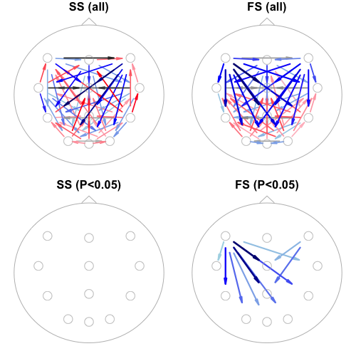
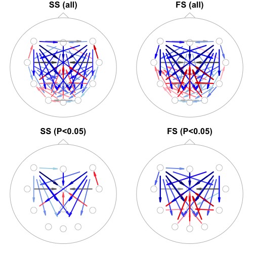

# 5.10. Interval-based analyses

In this final section, we consider analyses of event-level data
(i.e. _annotations_ rather than signals), using Luna's
[OVERLAP](https://zzz.bwh.harvard.edu/luna/ref/intervals/#overlap)
command.  Specifically, we focus on (fast and slow) spindles
detected by the
[SPINDLES](https://zzz.bwh.harvard.edu/luna/ref/spindles-so/#spindles)
command.


!!!hint "Applying `OVERLAP` in different contexts"
    Although we focus on spindle events here, the `OVERLAP` command is
    completely generic: the _events_ could be other features derived from
    the EEG, from cardiac activity or respiratory events, etc, or even
    fixed exposures such as experimental manipulations.  The `OVERLAP` command
    provides several options that allow fine-grained control over how events are
    handled in the randomization procedure, as appropriate for different contexts.

Using both single- and multiple-individual
approaches, we address two classes of question:

 - how are fast and slow spindles temporally related to each other?

 - how do (fast or slow) spindles propagate at the sensor-level?

To simplify the presentation of results (and speed up analysis a
little), we'll only use a subset of twelve channels:

```
                               F5----FZ----F6 
                               |     |     |  
                               C5----CZ----C6 
                               |     |     |  
                               P5----PZ----P6 
                               \     |     /  
                                O1---OZ---O2  
```


    

## Generating event data

We'll make a folder to store detected spindle events (as `.annot` files):

```{ .sh .codeL }
mkdir work/spindles
```

We'll then run `SPINDLES` for these 12 channels a) restricted to N2
sleep, b) after a round of epoch-level artifact rejection, c)
separately for slow (`fc=11`) and fast (`fc=15`) spindles, d) adding
annotations (labeled `SP11` and `SP15` respectively) based on the
detected events to the in-memory dataset, and e) saving those new
spindle-event annotations to `.annot` files in the new
`work/spindles/` folder:

```{ .sh .codeL }
luna c.lst -o out/overlap-spindles.db \
  -s ' ${s=F5,FZ,F6,C5,CZ,C6,P5,PZ,P6,O1,OZ,O2}
       MASK ifnot=N2 & RE
       CHEP-MASK sig=${s} ep-th=3,3
       CHEP sig=${s} epochs & RE
       SPINDLES sig=${s} fc=11 annot=SP11
       SPINDLES sig=${s} fc=15 annot=SP15
       WRITE-ANNOTS annot=SP11,SP15,N2 specials file=work/spindles/^.annot '
```


Note that we've added the `specials` option to `WRITE-ANNOTS` to get
`duration_sec` annotations in the exported files, which is necessary
for some of the multi-individual approaches below.  We also export
`N2` annotations as well as the generated spindle annotations in each
file, as this will be used as the _background_ (i.e. to constrain
shuffling only to periods that _could_ have had a spindle event).

Unlike most previous analyses presented in this walkthrough, here we
are not primarily interested in the `out/overlap-spindles.db` output.
Rather, our focus is on the event/annotation file(s) generated in
`work/spindles/`, e.g.:

```{ .sh .codeL }
head work/spindles/F01.annot
```
```
class        instance  channel start     stop      meta
start_hms    22.00.00  .       .         .         .
duration_hms 07.01.57  .       .         .         .
duration_sec 25317     .       .         .         .
epoch_sec    30        .       .         .         .
N2           N2        .       2490.000  2520.000  .
N2           N2        .       2520.000  2550.000  .
N2           N2        .       2550.000  2580.000  .
N2           N2        .       2580.000  2610.000  .
N2           N2        .       2610.000  2640.000  .
N2           N2        .       2640.000  2670.000  .
SP15         15        OZ      2640.266  2640.969  amp=22.8214;dur=0.703125;frq=14.2222;isa=0.891995;rp_mid=0.786517
SP15         15        O1      2640.281  2640.969  amp=21.5774;dur=0.6875;frq=13.8182;isa=0.897088;rp_mid=0.781609
SP15         15        P5      2640.289  2640.969  amp=31.3933;dur=0.679688;frq=13.2414;isa=0.878222;rp_mid=0.77907
SP15         15        FZ      2643.742  2644.508  amp=56.1651;dur=0.765625;frq=13.7143;isa=3.02084;rp_mid=0.43299
SP15         15        CZ      2643.742  2644.641  amp=70.4011;dur=0.898438;frq=14.4696;isa=2.85374;rp_mid=0.368421
...
```

The first few items are generated by the `specials` option as noted
above (as a `duration_sec` annotation containing the duration of the
total recording in seconds as the instance ID is needed in some steps
below).  We also see N2 annotations, which are then interleaved with
detected spindles (of 9792 events for this individual listed in
`F01.annot`).

Spindles start about 45 minutes after the EDF start (i.e. 2640
seconds).  Considering the full file, there are two unique _class_
labels (`SP15` and `SP11`) for fast and slow spindles respectively;
the _instance_ ID field (second column lists the target frequency,
similarly either 11 or 15 here, but we can ignore this field for these
analyses, i.e. it could be blank, `.`).  The `channel` each spindle
was detected on is listed in the third column, followed by the `start`
and `stop` times in seconds.  Finally, when generating annotations
(from the `annot` flag), the `SPINDLES` command adds a few metrics to
describe the event, using the .annot format for meta-information
(namely `;`-delimited key=value pairs), such as amplitude (`amp`),
duration (`dur`) and frequency (`frq`).

Importantly for these analyses, it also outputs `rp_mid` (you may have
to scroll the above box horizontally to see it) which is a number
between 0.0 and 1.0 that gives the _relative position_ at which
spindle activity was greatest, i.e. the spindle "peak", which will
typically be around the middle of the event (given characteristic
waxing and waning spindle morphology) but not necessarily exactly at
the temporal midpoint (i.e. halfway between `start` and `stop`).  The
`OVERLAP` command can be instructed to use the `rp_mid` information to
align "when" spindles occur, i.e. to perform analyses based on spindle
"peaks" rather than whole intervals based on start/stop times.


## Single-subject analysis

We'll first restrict analysis to a single individual, `F01`, passing the
newly-generated spindle events in `work/spindles/F01.annot` by adding the
`annot-file` special variable and selecting `id=F01`:

```{ .sh .codeL }
luna c.lst id=F01 -o out/overlap-F01-1.db \
     annot-file=work/spindles/F01.annot \
     -s ' OVERLAP seed=SP11,SP15 nreps=100 bg=N2 seed-seed=T '
```

What does this `OVERLAP` command do? It essentially tests for above-chance levels
of overlap, proximity and temporal ordering of events, based on an
empirical approach that randomly shuffles annotations, creating many null
(surrogate) datasets.  See [the main
documentation](https://zzz.bwh.harvard.edu/luna/ref/intervals/#overlap)
for a fuller description. The other options do the following:

  - `seed` means we specify spindle events (as annotations have labels
    `SP11` and `SP15`) as the _seeds_, namely the class of events that
    are shuffled and quantified

  - `nreps=100` means we request 100 random annotation datasets to be
    generated
 
  - `bg=N2` means we _constrain_ the shuffling and counting of events
   only to intervals spanned by an `N2` annotation. We know that
   spindles could only have been detected during N2 sleep (as we
   masked all non-N2 periods) and therefore when creating randomly
   shuffled data, we cannot place a spindle outside of that
   region.  That is, `bg` means _background_ and it is the denominator
   against which all events occur.  (Note: in this instance, `N2` annotations
   would have been available via the attached stage annotation file specified in `c.lst`
   even if we hadn't exported them explicitly into the new `.annot` file;
   here they will be duplictaed but that doesn't matter, as the background is _flattened_,
   meaning all overlapping events are merged).

  - `seed-seed=T` means to assess the overlap, etc between different
  events of the same seed class; because `OVERLAP` can be run in
  different modes (specifying other classes of annotation that are
  held constant, etc), by default it would not analyze intra-seed
  overlap (and thus give no output here)


!!!info "Contexts for running `OVERLAP`"
    Note that `OVERLAP` doesn't really consider
    signal (EDF) data at all, except for needing to know the total
    duration of the recording (which is why we extracted `duration_sec` above,
    as in some analyses below we won't pass any EDFs to Luna at all.)
    Also note, we could have run `OVERLAP` in first script above, i.e. after `SPINDLES` and
    in place of `WRITE-ANNOTS`.  That is, this
    _single-subject_ variant of `OVERLAP` doesn't expect the
    annotations to be in a file _per se_, they just need to be internally
    available as part of the attached dataset.


Looking at the console log, some of the most relevant lines include:
```
registered 9792 intervals across 24 annotation classes, including 24 seed(s)
0 events fell outside of the background and were rejected
SP11_C1 [seed] : n = 187 of 187 , mins = 2.77142 , avg. dur (s) = 0.889225
SP11_C5 [seed] : n = 211 of 211 , mins = 2.9078 , avg. dur (s) = 0.826863
SP11_CZ [seed] : n = 183 of 183 , mins = 2.74632 , avg. dur (s) = 0.900432
SP11_F1 [seed] : n = 238 of 238 , mins = 3.5384 , avg. dur (s) = 0.892034
...
```

which breaks down the number of events of each class/channel. Note
that, by default, Luna has made unique class labels that appended the
channel label too. (It is also possible to pool all similar events
across channels, but we won't consider that option here.)  We then
see:

```
unconstrained shuffling within each contiguous background interval
.......... .......... .......... .......... .......... 50 of 100 replicates done
.......... .......... .......... .......... .......... 100 of 100 replicates done
```

In larger datasets, this randomization step slows (which is also why
here we request only 100 replicates as opposed to the default 1000).

There are two output tables generated by this run:

```{ .sh .codeL }
destrat out/overlap-F01-1.db 
```
```
  commands      : factors           : levels        : variables 
----------------:-------------------:---------------:---------------------------
  [OVERLAP]     : SEED OTHERS       : 24 level(s)   : N_EXP N_OBS
                :                   :               : 
  [OVERLAP]     : SEED OTHER        : 552 level(s)  : D1_EXP D1_OBS D1_P D1_Z D2_EXP
                :                   :               : D2_OBS D2_P D2_Z D_N D_N_EXP N_EXP
                :                   :               : N_OBS N_P N_Z
----------------:-------------------:---------------:---------------------------
```

For these analyses, only the second (`SEED` x `OTHER`) table is
relevant.  It contains 522 rows, which reflects the pairwise contrast
of every spindle class/channel (i.e. 2 * 12 = 24 ) by every _other_
class/channel (i.e. 24 * 23 = 522).  We'll pull out a single row of
output (piped via `behead` for easier reading), comparing fast spindles at
OZ with fast spindles at FZ:

```{ .sh .codeL }
destrat out/overlap-F01-1.db +OVERLAP -r SEED/SP15_OZ OTHER/SP15_FZ | behead
```
```
             ID   F01                 
          OTHER   SP15_FZ             
           SEED   SP15_OZ             
         D1_EXP   6.03385407363597    
         D1_OBS   2.70746153877979    
           D1_P   0.0099009900990099  
           D1_Z   -13.7468371671407   
         D2_EXP   0.00353838272537311 
         D2_OBS   0.004739336492891   
           D2_P   0.920792079207921   
           D2_Z   0.0196738469550649  
            D_N   663                 
        D_N_EXP   663                 
          N_EXP   55.83               
          N_OBS   359                 
            N_P   0.0099009900990099  
            N_Z   24.3699882500393    
    OTHER_ANNOT   SP15                
       OTHER_CH   FZ
     SEED_ANNOT   SP15                
        SEED_CH   OZ                  

```

Briefly,

 - `D1` statistics reflect the average absolute proximity of the
   _seed_ to the nearest _other_ annotation (up to 10 seconds away, by
   default)

 - `D2` statistics reflect the average signed time difference between
   the _seed_ to the nearest _other_ annotation (where negative values
   implies the seed tends to precede the other event)

 - `N` statistics reflect the count of _seed-other_ overlap

In each case, `_OBS` indicates the value for that metric that was
observed in the real data; `_EXP` indicates the average for that
statistic from the 100 randomized datasets.  Based on the random data,
the `_P` and `_Z` statistics reflect the (one-sided) empirical p-value
and Z score (based on the null replicate mean and standard deviation)
associated with the observed statistic.

In other words, seeding on fast spindles at OZ and asking about their temporal relationship to fast spindles at FZ:

 - there is significant overlap in events: whereas we'd expect only
   57.3 OZ spindles to have an overlapping FZ spindle by chance, we
   see 372, which is significantly (empirical P < 0.01 based on 100
   replicates) more than expected by chance (Z score > 40 SD units)
 
  - the mean absolute time to the nearest FZ spindle (including those
  that overlap) is 2.7 seconds, whereas by chance it would be almost 6
  seconds, which is significantly different from chance, suggesting
  spindles are temporally clustered

  - based on this analysis, there is no suggestion that OZ spindles
  typically precede versus follow FZ spindles: the observed `D2`
  statistic (0.01 seconds) is not significantly different from chance
  expectation (0.02 seconds)


### Fine-tuning parameters

To further flesh out some of the options of `OVERLAP`, we'll fine-tune
parameters controlling how events are defined, shuffled and counted.
The optimal parameters will likely depend on the nature of the data
and question being asked. As noted, `OVERLAP` is a completely generic
event-based command: it does not assume the events are spindles, or on
the order of 1 second, etc..

To simplify this step, we'll first constrain these analyses to the
relationship between fast and slow spindles occurring within the same
EEG channel.  That is, whereas the prior analysis considered all 552
combinations of channel and spindle type, here we will only consider
24 pairs of results (i.e. fast-slow and slow-fast seed-other pairs,
for each of the 12 channel).

We expect that the reciprocal pairs (whether fast or slow spindles are
the _seed_ annotation) should usually give similar results, although
they will not be numerically identical due to a) randomization being
performed separately for each seed by default and b) asymmetries in
the number of each event.

We'll stick to the same `F01` individual for now:

```{ .sh .codeL }
luna c.lst id=F01 -o out/overlap-F01-2.db \
     annot-file=work/spindles/F01.annot \
   -s ' OVERLAP seed=SP11,SP15 bg=N2 nreps=100 seed-seed=T \
                within-channel dist-excludes-overlapping=T midpoint '
```

We've added a few additional options here (_note, the order in which we list them after `OVERLAP` is not important;
also, we're using `\` to split the long list of options for a single Luna command here._):

  - `within-channel` tells Luna to only consider seed-other pairs that belong to the same channel

  - `dist-excludes-overlapping=T` tells Luna to exclude overlapping
  events from the `D1` and `D2` calculations (e.g. here, if detected fast and
  slow spindles overlapped, implying an intermediate frequency spindle
  that was detected under both conditions)

 - `midpoint` tells Luna to use the 0-duration midpoint (i.e. halfway
  between the start and the stop) as the definition of that spindle;
  because of this, there will be fewer overlapping events -- in fact,
  the overlap statistics become meaningless in this case, also meaning
  that the above `dist-excludes-overlapping=T` option is probably not
  necessary either, as two spindles will overlap only if they have
  *identical* start and stop times now

We see in the console log:

```
  reducing all annotations to midpoints
  ...
  SP11_C5 [seed] : n = 204 of 204 , mins = 0 , avg. dur (s) = 0 [midpoint]
  SP11_C6 [seed] : n = 215 of 215 , mins = 0 , avg. dur (s) = 0 [midpoint]
  SP11_CZ [seed] : n = 175 of 175 , mins = 0 , avg. dur (s) = 0 [midpoint]
  ...
```

where the annotations now span 0 seconds, because they are all defined
as 0-duration markers (also flagged by the `[midpoint]` text).

Because the analysis is based on midpoints, it does not even calculate
or output the `N_Z` overlap/count statistic.  Here we focus on the two
_distance_ measures (meaning proximity on the timeline rather than
spatial distance).

```{ .sh .codeL }
destrat out/overlap-F01-2.db +OVERLAP -r SEED OTHER -v D1_Z D2_Z
```
```
ID     OTHER      SEED        D1_Z    D2_Z
F01    SP15_C5    SP11_C5    -4.499   1.310
F01    SP15_C6    SP11_C6    -6.538   3.075
F01    SP15_CZ    SP11_CZ    -5.070   2.749
F01    SP15_F5    SP11_F5    -7.997   4.379
F01    SP15_F6    SP11_F6    -6.579   3.880
F01    SP15_FZ    SP11_FZ    -4.545   2.855
F01    SP15_O1    SP11_O1    -2.737   1.950
F01    SP15_O2    SP11_O2    -2.557   2.778
F01    SP15_OZ    SP11_OZ    -1.922   0.842
F01    SP15_P5    SP11_P5    -3.107   2.238
F01    SP15_P6    SP11_P6    -1.727   3.289
F01    SP15_PZ    SP11_PZ    -3.350   3.486

F01    SP11_C5    SP15_C5    -5.049  -1.242
F01    SP11_C6    SP15_C6    -7.624  -2.530
F01    SP11_CZ    SP15_CZ    -4.831  -2.868
F01    SP11_F5    SP15_F5    -9.634  -3.834
F01    SP11_F6    SP15_F6    -6.973  -2.979
F01    SP11_FZ    SP15_FZ    -5.363  -2.679
F01    SP11_O1    SP15_O1    -2.231  -3.043
F01    SP11_O2    SP15_O2    -2.639  -2.867
F01    SP11_OZ    SP15_OZ    -2.003  -1.770
F01    SP11_P5    SP15_P5    -3.330  -1.963
F01    SP11_P6    SP15_P6    -1.612  -3.379
F01    SP11_PZ    SP15_PZ    -2.733  -3.384
```

The first twelve rows have slow spindles (`SP11`) as the _seed_ and
fast spindles (`SP15`) as the _other_ annotation.  The second twelve
rows show the flipped cases.  In all cases, comparisons are within the
same EEG channel.

All `D1_Z` values are negative (and typically greater than -2.0),
implying that (within that channel), fast and slow spindle tend to be
nearer (i.e. small `D1`) than expected.  In other words, fast and slow
spindles cluster within N2 sleep.

Second, we see that all `D2_Z` values are positive when comparing
`SP11` to `SP15` (_seed_ to _other_), but negative when comparing
`SP15` to `SP11`.  It can be helpful to pull a fuller set of statistics, here
just for `CZ`:

```{ .sh .codeL }
destrat out/overlap-F01-2.db +OVERLAP \
 -r SEED/SP11_CZ OTHER/SP15_CZ \
 -v D2_OBS D2_EXP D2_P D2_Z | behead
```
```
       ID   F01                 
    OTHER   SP15_CZ             
     SEED   SP11_CZ             
   D2_EXP   0.00422886703112424 
   D2_OBS   0.26241134751773    
     D2_P   0.0198019801980198  
     D2_Z   2.74964005136025    

```
```{ .sh .codeL }
destrat out/overlap-F01-2.db +OVERLAP \
 -r SEED/SP15_CZ OTHER/SP11_CZ \
 -v D2_OBS D2_EXP D2_P D2_Z | behead
```
```
       ID   F01                 
    OTHER   SP11_CZ             
     SEED   SP15_CZ             
   D2_EXP   -0.00143576367016566
   D2_OBS   -0.188755020080321  
     D2_P   0.0099009900990099  
     D2_Z   -2.86877189347523   
```

A negative `D2` implies the seed annotation comes _before_ the other
annotation.  The pattern of results above is thus consistent with fast
spindles typically coming before slow spindles, which is consistent
with an existing literature, e.g.  Mölle et al (2011) _Fast and slow
spindles during the sleep slow oscillation: disparate coalescence and
engagement in memory processing._  We also see the (two-sided) empirical _P_ values (`D2_P`) are also
significant here, implying this relationship holds within this single
individual.

__Constrained shuffling__

As spindle activity changes over longer (ultradian) time-scales during
the night, it can be useful to constrain the shuffling of events, to
broadly control for such factors.  For example, imagine an alternate
universe where all spindles occurred only during the first 20 minutes
of sleep; in that case, shuffling spindles randomly over the whole
duration of the night, even if constrained to N2, would naturally lead
to less chance overlap, which would lead to inflated estimates of the
short-term, more proximal second-by-second extent of spindle overlap
(in the first 20 minutes).

To overcome these types of biases, one approach is to constrain the
shuffling to only a few seconds, i.e. thereby effectively controlling
for any longer-term trends.  We'll see if the above result is robust
to this, as well as some other changes of options described below (of
course, in practice, it is more sensible to change one parameter at a
time to gauge its impact).


 - `max-shuffle=30` - this constrains shuffling to 30 second intervals; note that the
 shuffling is _circular_ (i.e. events are wrapped around) and that the shuffling does
 not allow shuffled events to span discontinuities (i.e. we'll not "split" a spindle
 by placing it half at the end and half at the start of the interval).

 - `w=2` - by default, the distance (`D1` and `D2`) statistics are based on events within 10 seconds of
 each other; here, we'll constrain these comparisons only to nearer events, here within 2 seconds

 - `rp=SP11|mid,SP15|mid` - rather than use the simple midpoints
 (halfway between start and stop) to define spindles, here we'll use
 the empirical _relative position_ determined by the `SPINDLES`
 command to be the point of greatest activity; the `rp` option tells
 `OVERLAP` to look for a meta-data for each annotation called (in this
 example) `rp_mid`, which it expects to be between 0.0 and 1.0
 (i.e. rather than fixed at 0.5)
 

```{ .sh .codeL }
luna c.lst id=F01 -o out/overlap-F01-3.db \
     annot-file=work/spindles/F01.annot \
   -s ' OVERLAP seed=SP11,SP15 bg=N2 nreps=100 seed-seed=T \
                within-channel dist-excludes-overlapping=T \
                max-shuffle=30 w=2 rp=SP11|mid,SP15|mid '
```


```{ .sh .codeL }
destrat out/overlap-F01-3.db +OVERLAP -r SEED OTHER -v D1_Z D2_Z
```
```
ID    OTHER     SEED       D1_Z     D2_Z
F01   SP15_C5   SP11_C5   -4.536    2.886
F01   SP15_C6   SP11_C6   -5.051    4.401
F01   SP15_CZ   SP11_CZ   -3.686    3.532
F01   SP15_F5   SP11_F5   -10.83    3.274
F01   SP15_F6   SP11_F6   -9.225    2.770
F01   SP15_FZ   SP11_FZ   -4.608    3.124
F01   SP15_O1   SP11_O1   -2.231    2.875
F01   SP15_O2   SP11_O2   -1.983    2.358
F01   SP15_OZ   SP11_OZ   -2.513    2.624
F01   SP15_P5   SP11_P5   -1.824    2.191
F01   SP15_P6   SP11_P6   -2.560    2.645
F01   SP15_PZ   SP11_PZ   -2.916    2.536

F01   SP11_C5   SP15_C5   -4.594   -2.974
F01   SP11_C6   SP15_C6   -5.130   -4.363
F01   SP11_CZ   SP15_CZ   -3.364   -3.671
F01   SP11_F5   SP15_F5   -10.87   -3.250
F01   SP11_F6   SP15_F6   -9.188   -2.978
F01   SP11_FZ   SP15_FZ   -4.629   -2.878
F01   SP11_O1   SP15_O1   -1.866   -3.369
F01   SP11_O2   SP15_O2   -2.078   -2.376
F01   SP11_OZ   SP15_OZ   -2.410   -2.798
F01   SP11_P5   SP15_P5   -1.937   -2.161
F01   SP11_P6   SP15_P6   -2.539   -2.685
F01   SP11_PZ   SP15_PZ   -2.841   -2.676
```

We see the pattern of results is similar under these alternative
parameters (in fact, slightly stronger if anything, especially for
`D1`).


## Multiple individuals

We'll now move on to performing these types of analyses across all 20 individuals.   We'll do this in two ways:

  - first, simply repeating the above single-individual analysis
    multiple times

  - second, (literally) combining all events into a single
    _mega-individual_ and perform a single (but multi-individual)
    analysis


### Multiple single-sample analyses

For the [multiple single-sample
analyses](#multiple-single-sample-analyses), we will also make a new
sample-list to bind these new annotation files to the EDFs and staging
annotations.

```{ .sh .codeL }
luna --build work/clean/ work/spindles > c2.lst
```
```
wrote 20 EDFs to the sample list
  20 of which had 2 linked annotation files
```


We'll apply the same analyses as in the final `F01` analysis above,
but using `chs-inc` to restrict to only the `CZ` channel (for both
`SP11` and `SP15`).  We'll add more replications (`nreps=1000`) as
we're now looking at a smaller number of annotations:

```{ .sh .codeL }
luna c2.lst -o out/overlap-multi.db \
   -s ' OVERLAP seed=SP11,SP15 bg=N2 nreps=1000 seed-seed=T \
                within-channel dist-excludes-overlapping=T \
                max-shuffle=30 rp=SP11|mid,SP15|mid w=2 \
                chs-inc=SP11|CZ,SP15|CZ '
```

We'll extract the `D2_Z` statistics, for all individuals. As this is only for one channel,
it can be convenient to use `-c` to extract the two `SEED`/`OTHER` strata as columns rather than rows (and
note, `destrat` creates expanded variable names):
```{ .sh .codeL }
destrat out/overlap-multi.db +OVERLAP -c SEED OTHER -v D2_Z -p 4 
```
```
ID     D2_Z.SEED_SP11_CZ.OTHER_SP15_CZ     D2_Z.SEED_SP15_CZ.OTHER_SP11_CZ
F01    3.3905                             -3.5458
F02    1.2178                             -1.4885
F03    3.4687                             -3.5667
F04    1.4549                             -1.4417
F05    1.4611                             -1.3569
F06    2.4155                             -2.7867
F07    3.2084                             -3.3232
F08    3.4482                             -3.1131
F09    3.1686                             -3.0801
F10    2.6659                             -3.1742

M01    1.1575                             -1.1130
M02    1.7183                             -1.6698
M03    0.4991                             -0.7399
M04    3.9256                             -3.9106
M05    2.6744                             -2.5343
M06    2.7019                             -2.7719
M07    2.5035                             -2.5755
M08    3.4135                             -3.1679
M09    1.3665                             -1.3641
M10    1.5704                             -1.6559
```

That is, the basic pattern (of all slow to fast `D2_Z` values being
positive, and all fast to slow values being negative) we saw for `F01`
is repeated here for all other 19 individuals.

Note, the original values for `F01` were slightly different (3.532 and
-3.671 above rather than 3.3905 and -3.5458 here) but this simply
reflects the randomization inherent in empirical approaches (and the
relatively small number of replicates in the first step).

We can also extract the corresponding empirical P values:
```{ .sh .codeL }
destrat out/overlap-multi.db +OVERLAP -c SEED OTHER -v D2_P -p 4 
```
```
ID     D2_P.SEED_SP11_CZ.OTHER_SP15_CZ   D2_P.SEED_SP15_CZ.OTHER_SP11_CZ
F01    0.0040                            0.0030
F02    0.2068                            0.1339
F03    0.0020                            0.0010
F04    0.1528                            0.1578
F05    0.1568                            0.1858
F06    0.0130                            0.0040
F07    0.0020                            0.0030
F08    0.0010                            0.0020
F09    0.0040                            0.0070
F10    0.0130                            0.0070
M01    0.2647                            0.2597
M02    0.0969                            0.1009
M03    0.6753                            0.5025
M04    0.0010                            0.0010
M05    0.0070                            0.0090
M06    0.0090                            0.0100
M07    0.0120                            0.0130
M08    0.0020                            0.0020
M09    0.1808                            0.1778
M10    0.1149                            0.0839
```

Most (but not all) individuals show statistical significance for this
relationship (_P_<0.05). That some individuals don't might reflect
lower numbers of detected events, but it could also reflect other
differences (as we'll explore in more detail in one of the planned
[extensions](../p6/index.md) to this walkthrough).


### Single multi-sample analysis

We'll now perform a single analysis of all individuals, by creating a single _"mega observation"_.  We do this by
listing all individual annotation files, along with an ID for each individual.  Given we have the annotation files here:

```{ .sh .codeL }
ls work/spindles/
```
```
F01.annot    F05.annot    F09.annot    M03.annot    M07.annot
F02.annot    F06.annot    F10.annot    M04.annot    M08.annot
F03.annot    F07.annot    M01.annot    M05.annot    M09.annot
F04.annot    F08.annot    M02.annot    M06.annot    M10.annot
```
We can make a text file `a.txt` that links them, e.g. (we could alternatively do this by hand, or using Excel, etc)
as long as the end result is a single, tab-delimited ASCII file with two columns (ID and annotation file):
```{ .sh .codeL }
ls work/spindles/ | awk '{print substr($1,1,3),"work/spindles/"$1}' OFS="\t" > a.txt
```
The above simply makes this file (i.e. with the `substr()` function taking the first three characters of each file for the ID):
```
F01    work/spindles/F01.annot
F02    work/spindles/F02.annot
F03    work/spindles/F03.annot
F04    work/spindles/F04.annot
F05    work/spindles/F05.annot
F06    work/spindles/F06.annot
F07    work/spindles/F07.annot
F08    work/spindles/F08.annot
F09    work/spindles/F09.annot
F10    work/spindles/F10.annot
M01    work/spindles/M01.annot
M02    work/spindles/M02.annot
M03    work/spindles/M03.annot
M04    work/spindles/M04.annot
M05    work/spindles/M05.annot
M06    work/spindles/M06.annot
M07    work/spindles/M07.annot
M08    work/spindles/M08.annot
M09    work/spindles/M09.annot
M10    work/spindles/M10.annot
```

We now invoke `OVERLAP` in a different manner, using the command line
`--overlap` rather than `OVERLAP`.  The `OVERLAP` command is designed
for the case where an EDF is attached (which implicitly tells
`OVERLAP` about the total timeline of the record).  In this instance,
there is no single EDF that will be attached (which is why we needed
to include `duration_sec` in the above annotation files).

```{ .sh .codeL }
echo "a-list=a.txt seed=SP11,SP15 bg=N2 nreps=500
      seed-seed=T within-channel rp=SP11|mid,SP15|mid
      w=2 merged=m1 max-shuffle=30" | luna --overlap -o out/overlap-mega.db
```

There are a few things to note here:

 - we direct all options via the standard input stream to `luna` (from `echo`), which takes the
   special option `--overlap` (rather than a sample list or EDF)

 - the `a-list` option is necessary when invoking `OVERLAP` via `--overlap`, as this points to
   the locations of the annotation files (that will all be combined as one)

 - the required `merged` option gives the name of a temporary file (that contains all the events and is read into the overlap analysis)

 - otherwise the options to `OVERLAP` are the same as above (and the processing is identical too)


Looking at the console log, we see:

```
  expecting 20 annotation files from 20 individuals

  processing F01 work/spindles/F01.annot
   annotations aligned from 0 to 25327 seconds

  processing F02 work/spindles/F02.annot
   annotations aligned from 25327 to 51170 seconds

  processing F03 work/spindles/F03.annot
   annotations aligned from 51170 to 77304 seconds
  ...
```

That is, it found the 20 files listed in `a.txt` and effectively
strings them together as a single (very long) night, with the first
person spanning from 0 to 25327 seconds, the second continuing from
25327 to 51170 seconds, etc.  Because of this, it is __required__ that
a background (`bg`) annotation is specified when using `--overlap`,
i.e. otherwise events would be shuffled across different individuals.
In this way, as events are only shuffled within the spanning
background interval (and in this case, further constrained to only be
shuffled up to 30 seconds with wrapping), this will keep the overall
properties of events constant between individuals, but only break the
temporal relationships of events within individuals/background
segments.

It now lists the total number of events:
```
  registered 155136 intervals across 24 annotation classes, including 24 seed(s)
  0 events fell outside of the background and were rejected
  SP11_C5 [seed] : n = 3957 of 3957 , mins = 0 , avg. dur (s) = 0 [rp=mid]
  SP11_C6 [seed] : n = 3931 of 3931 , mins = 0 , avg. dur (s) = 0 [rp=mid]
  SP11_CZ [seed] : n = 3846 of 3846 , mins = 0 , avg. dur (s) = 0 [rp=mid]
  ...
```

We can extract the `D2` outputs from the combined analysis (thus `ID` is set to `.`):

```{ .sh .codeL }
destrat out/overlap-mega.db +OVERLAP -r SEED OTHER -v D2_OBS D2_EXP D2_Z D2_P -p 4
```
```
ID  OTHER     SEED       D2_EXP    D2_OBS   D2_P      D2_Z
.   SP15_C5   SP11_C5   -0.0005    0.4147   0.0020    9.0576
.   SP15_C6   SP11_C6    0.0022    0.4300   0.0020    9.6628
.   SP15_CZ   SP11_CZ    0.0001    0.3831   0.0020    9.2322
.   SP15_F5   SP11_F5    0.0024    0.5006   0.0020    12.3086
.   SP15_F6   SP11_F6    0.0002    0.5560   0.0020    15.0155
.   SP15_FZ   SP11_FZ    0.0002    0.5113   0.0020    13.1026
.   SP15_O1   SP11_O1   -0.0008    0.2553   0.0020    4.7184
.   SP15_O2   SP11_O2    0.0019    0.1584   0.0080    2.8187
.   SP15_OZ   SP11_OZ    0.0029    0.1844   0.0060    3.0604
.   SP15_P5   SP11_P5   -0.0036    0.2468   0.0020    5.2065
.   SP15_P6   SP11_P6   -0.0005    0.2419   0.0020    4.9265
.   SP15_PZ   SP11_PZ    0.0010    0.2404   0.0020    5.7390

.   SP11_C5   SP15_C5    0.0012   -0.4105   0.0020   -9.0156
.   SP11_C6   SP15_C6   -0.0020   -0.4256   0.0020   -9.7679
.   SP11_CZ   SP15_CZ   -0.0002   -0.3765   0.0020   -9.2663
.   SP11_F5   SP15_F5   -0.0020   -0.4992   0.0020   -12.4220
.   SP11_F6   SP15_F6    0.0001   -0.5547   0.0020   -15.1381
.   SP11_FZ   SP15_FZ   -0.0004   -0.5106   0.0020   -13.0554
.   SP11_O1   SP15_O1   -0.0004   -0.2522   0.0020   -4.7075
.   SP11_O2   SP15_O2   -0.0019   -0.1606   0.0100   -2.8755
.   SP11_OZ   SP15_OZ   -0.0032   -0.1828   0.0060   -3.0755
.   SP11_P5   SP15_P5    0.0034   -0.2398   0.0020   -5.1103
.   SP11_P6   SP15_P6   -0.0002   -0.2459   0.0020   -4.9402
.   SP11_PZ   SP15_PZ   -0.0014   -0.2348   0.0020   -5.6313
```

As in the single-individual case, the combined analysis shows the same
patterns (e.g. the sign of `D2_Z`) but the strength of statistical
evidence is greater (higher absolute Z scores, smaller P-values).
Note that by default the `D2` metric is reduced to -1 or +1 to reflect
if the seed if _before_ or _after_ the other annotation, for
non-overlapping events.  Thus a `D2` value of 0.5 (for example)
implies that 75% of seeds come after rather than before the other
annotation (a 3:1 ratio), given any other constraints, e.g. falls
within 2 seconds).

Whereas combined _mega-analysis_ can be useful for establishing
general properties of the data, it can naturally also be applied at a
group level (e.g. separately by males and females) - although care
should be taken to account for potentially variable number of events
between groups or individuals, etc (which will influence the Z
statistics).


## Spindle propagation

Finally, rather than focusing on the temporal relationships between
fast and slow spindles _within_ an EEG channel, we'll now consider how
spindles (of the same class) propagate (_at the sensor level_).

Note, below we assume that the "same" propagating spindle will be
detected at different sensors and that the time difference between
peaks will be resolvable at the sample rate of the EEG.  Naturally,
even at the sensor level, a fuller analysis of spindle propagation
might want to consider other factors or approaches, but for the
purpose of this walkthrough, we'll use this as our definition of
"propagation".  

For these analyses we'll use the _mega-analysis_ approach above,
although this could also be performed at the single-individual level.

First, for slow spindles:

```{ .sh .codeL }
luna --overlap -o out/overlap-ss-prop.db \
     --options a-list=a.txt seed=SP11 bg=N2 nreps=100 \
               seed-seed=T rp=SP11\|mid merged=m1 max-shuffle=30 w=2
```

Key things to note:

 - we now only specify the `SP11` as `seed`

 - we no longer have the `within-channel` option that pooled events
   across channels (as we're interested in cross-channel propagation)

 - a minor syntactic detail: rather than pipe options into `luna`
   (from `echo`) as above, here we explicitly list them on the command
   line, after `--options`; either form is fine, but if using this
   latter form, then we need to escape the `|` special character
   (i.e. `rp=SP11\|mid` instead of `rp=SP11|mid`) to stop the shell
   from interpreting it.

 - we also excluded the `dist-excludes-overlapping=T` option here,
  although note that because we've reduced spindles to 0-duration
  time-points (with `rp`), then this won't really make any difference.

We'll repeat the analysis for fast spindles before looking at results:

```{ .sh .codeL }
luna --overlap -o out/overlap-fs-prop.db \
     --options a-list=a.txt seed=SP15 bg=N2 nreps=100 \
               seed-seed=T rp=SP15\|mid merged=m1 max-shuffle=30 w=2
```

We'll use R to visualize the outputs, again focusing on the directed
(`D2`) metrics.


In R:
```{ .R .codeR }
library(luna)
k.ss <- ldb( "out/overlap-ss-prop.db" ) 
d.ss <- k.ss$OVERLAP$OTHER_SEED

k.fs <- ldb( "out/overlap-fs-prop.db" )
d.fs <- k.fs$OVERLAP$OTHER_SEED
```

Each data frame has 132 rows, which reflects the 12 * 11 pairwise
relationships (i.e. each channel to every other channel). i.e.

```{ .R .codeR }
table( d.ss$SEED_CH , d.ss$OTHER_CH ) 
```
```
     C5 C6 CZ F5 F6 FZ O1 O2 OZ P5 P6 PZ
  C5  0  1  1  1  1  1  1  1  1  1  1  1
  C6  1  0  1  1  1  1  1  1  1  1  1  1
  CZ  1  1  0  1  1  1  1  1  1  1  1  1
  F5  1  1  1  0  1  1  1  1  1  1  1  1
  F6  1  1  1  1  0  1  1  1  1  1  1  1
  FZ  1  1  1  1  1  0  1  1  1  1  1  1
  O1  1  1  1  1  1  1  0  1  1  1  1  1
  O2  1  1  1  1  1  1  1  0  1  1  1  1
  OZ  1  1  1  1  1  1  1  1  0  1  1  1
  P5  1  1  1  1  1  1  1  1  1  0  1  1
  P6  1  1  1  1  1  1  1  1  1  1  0  1
  PZ  1  1  1  1  1  1  1  1  1  1  1  0
```

```{ .R .codeR }
source("http://zzz.bwh.harvard.edu/dist/luna/arconn.R" )
```

Note that, unlike some commands such as `PSI`, the output here
automatically "double-enters" the pairwise outputs (i.e. we have a
value for `C5` to `C6` as well as from `C6` to `C5`.  However, because
of aforementioned reasons, and unlike `PSI`, these two directed `D2`
values will not necessarily be _exact_ complements (flipped signs).
We could impose this (by averaging but retaining the sign, etc) but if
we plot only higher absolute vales, this shouldn't matter (i.e. each
edge should only have one large positive value)


```{ .R .codeR }
zlim = range(  d.ss$D2_Z  ,  d.fs$D2_Z  )

par(mfrow=c(2,2))
arconn( d.ss$SEED_CH , d.ss$OTHER_CH , d.ss$D2_Z  , dst = 1 , directional = T, zr = zlim , title = "SS" )
arconn( d.fs$SEED_CH , d.fs$OTHER_CH , d.fs$D2_Z  , dst = 1 , directional = T, zr = zlim , title = "FS" )

arconn( d.ss$SEED_CH , d.ss$OTHER_CH , d.ss$D2_Z  , dst = 1 , flt = d.ss$D2_P < 0.05 , directional = T , zr = zlim , title = "SS" )
arconn( d.fs$SEED_CH , d.fs$OTHER_CH , d.fs$D2_Z  , dst = 1 , flt = d.fs$D2_P < 0.05 , directional = T , zr = zlim , title = "FS" )
```

<!---

k.ss <- ldb( "out/overlap-ss-prop.db" )
k.fs <- ldb( "out/overlap-fs-prop.db" )
d.ss <- k.ss$OVERLAP$OTHER_SEED
d.fs <- k.fs$OVERLAP$OTHER_SEED

sz = 500

zlim = range(  d.ss$D2_Z  ,  d.fs$D2_Z  )
png(file="vig/docs/imgs/overlap-n20-prop.png",width=sz,height=sz, res=100 )
par(mfrow=c(2,2),mar=c(0,0,1,0))
arconn( d.ss$SEED_CH , d.ss$OTHER_CH , d.ss$D2_Z  , dst = 1 , directional = T, zr = zlim , title = "SS (all)" )
arconn( d.fs$SEED_CH , d.fs$OTHER_CH , d.fs$D2_Z  , dst = 1 , directional = T, zr = zlim , title = "FS (all)" )
arconn( d.ss$SEED_CH , d.ss$OTHER_CH , d.ss$D2_Z  , dst = 1 , flt = d.ss$D2_P < 0.05 , directional = T , zr = zlim , title = "SS (P<0.05)" )
arconn( d.fs$SEED_CH , d.fs$OTHER_CH , d.fs$D2_Z  , dst = 1 , flt = d.fs$D2_P < 0.05 , directional = T , zr = zlim , title = "FS (P<0.05)" )
dev.off()

# repeat for N=106 (copied to n106/ from eris grins/luna/anal/)
k.ss <- ldb( "n106/ss-prop.db" )
k.fs <- ldb( "n106/fs-prop.db" )
d.ss <- k.ss$OVERLAP$OTHER_SEED
d.fs <- k.fs$OVERLAP$OTHER_SEED

zlim = range(  d.ss$D2_Z  ,  d.fs$D2_Z  )
png(file="vig/docs/imgs/overlap-n106-prop.png",width=sz,height=sz, res=100 )
par(mfrow=c(2,2),mar=c(0,0,1,0))
arconn( d.ss$SEED_CH , d.ss$OTHER_CH , d.ss$D2_Z  , dst = 1 , directional = T, zr = zlim , title = "SS (all)" )
arconn( d.fs$SEED_CH , d.fs$OTHER_CH , d.fs$D2_Z  , dst = 1 , directional = T, zr = zlim , title = "FS (all)" )
arconn( d.ss$SEED_CH , d.ss$OTHER_CH , d.ss$D2_Z  , dst = 1 , flt = d.ss$D2_P < 0.05 , directional = T , zr = zlim , title = "SS (P<0.05)" )
arconn( d.fs$SEED_CH , d.fs$OTHER_CH , d.fs$D2_Z  , dst = 1 , flt = d.fs$D2_P < 0.05 , directional = T , zr = zlim , title = "FS (P<0.05)" )
dev.off()
--->




<!--

Repeating for the N=106 sample (all other GRINS controls collected to date):



-->


## Summary

In this section we've reviewed a fundamentally different type of
analysis supported by Luna: testing the temporal overlap/proximity of
different classes of events, via a surrogate (randomized) approach.
The `OVERLAP` command supports a number of different constraints on
how events are shuffled, and can be applied either to single
individuals or two whole samples.

Applied to fast and slow spindles detected in this dataset, found
evidence for a systematic tendency for fast spindles to come before
slow spindles.  We further looked at sensor-space "propagation" of
spindles, finding evidence for non-random sequences particularly for
fast spindles.

Naturally, per-individual metrics derived from these types of analyses
(e.g. `D2_EXP` - `D2_OBS`) could be phenotypes for further analyses of
individual differences, e.g.  with respect to sex or to disease.

---


__Congratulations, you've reached the end of the main walkthrough!__

For more information on Luna, please consult the [primary
website](https://zzz.bwh.harvard.edu/luna/)

In the future, we may add new steps to this walkthrough, as well as
new [vignettes](https://zzz.bwh.harvard.edu/luna/vignettes/).

