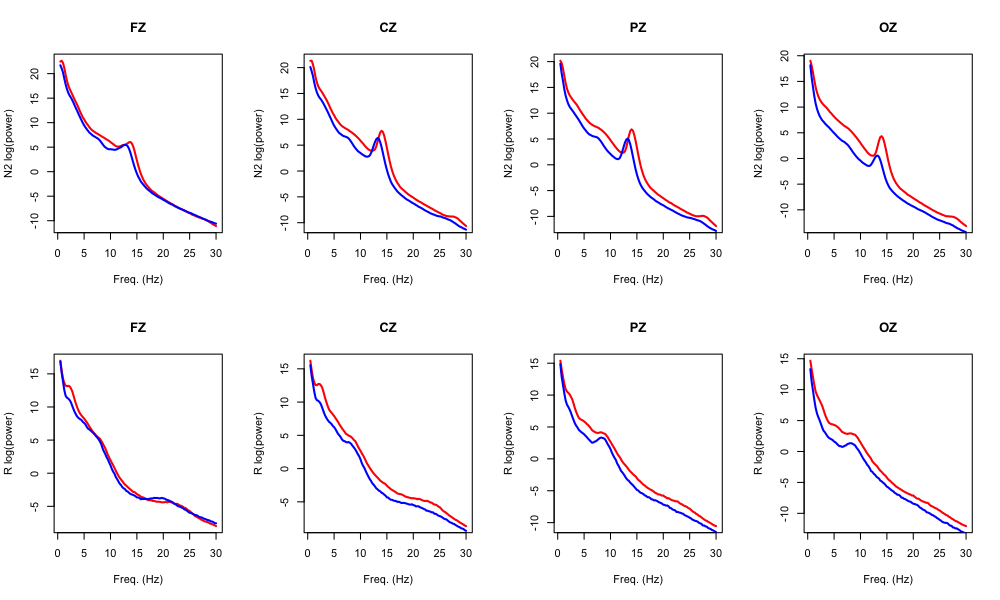
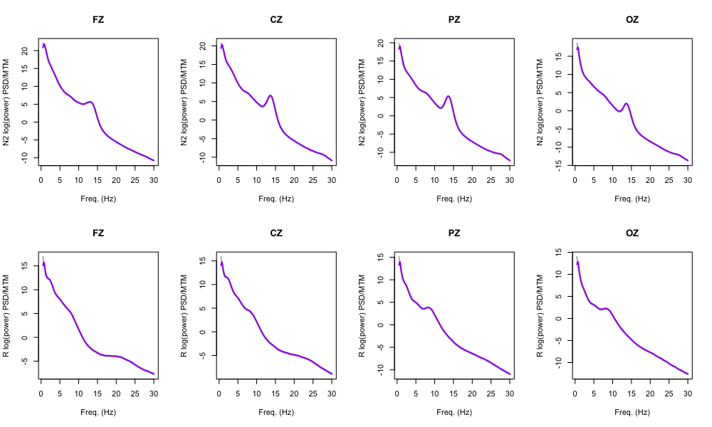
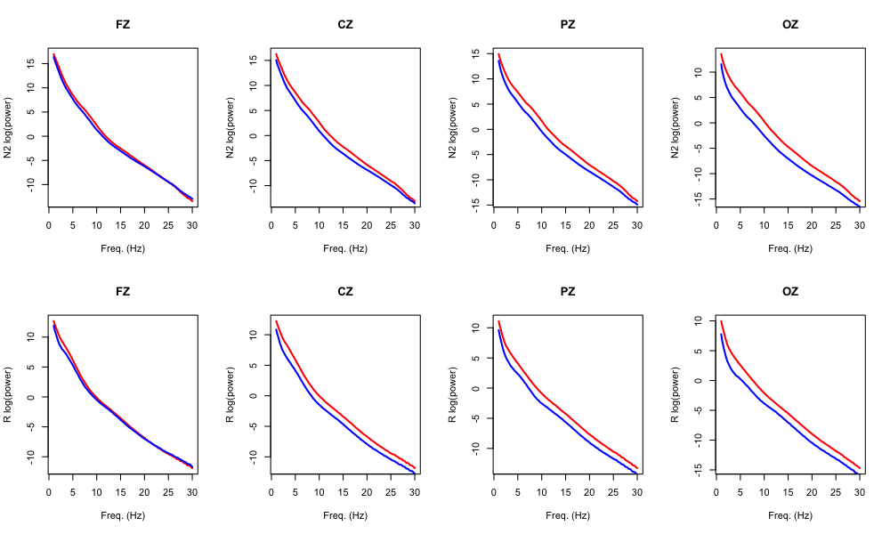
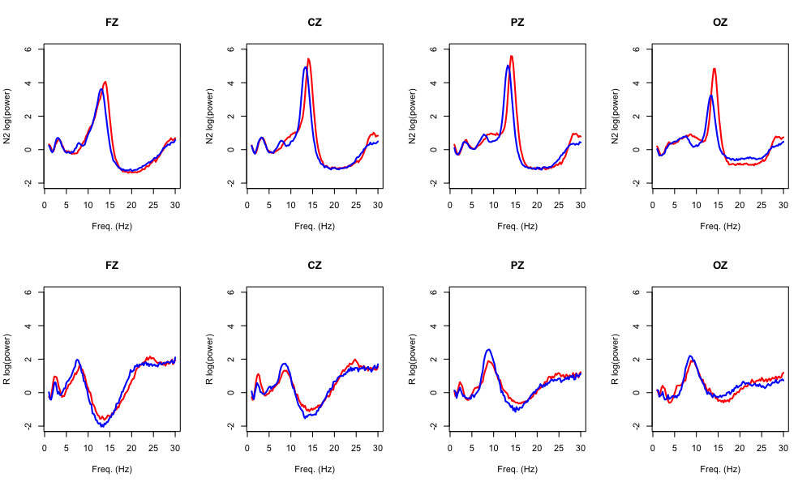
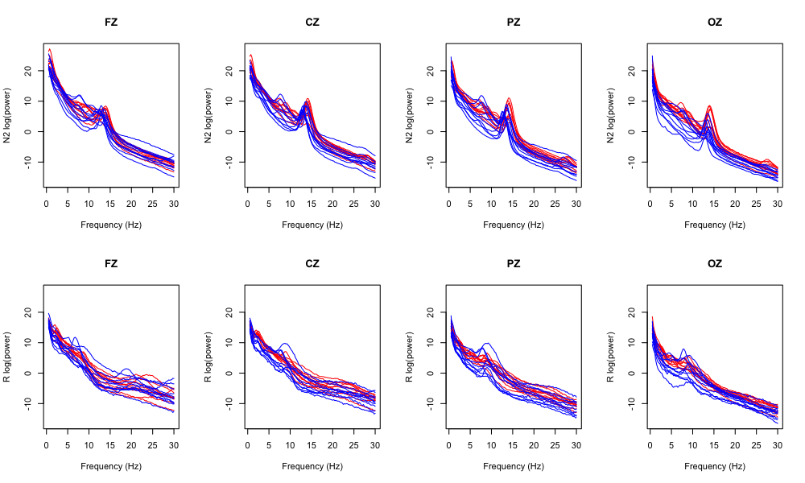
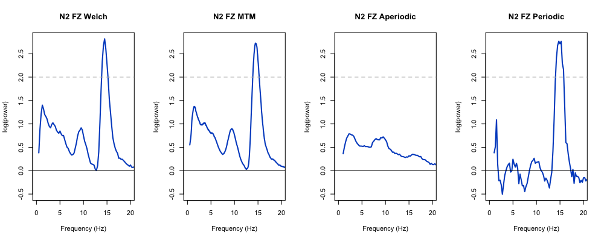

# 5.2. Time/frequency statistics

We'll now move on to consider the spectral (frequency-domain)
properties of the EEG signals.

## Spectral analysis

Here we'll run three flavors of spectral analysis implemented in Luna:

 - power from the [Welch
   method](https://en.wikipedia.org/wiki/Welch%27s_method) as
   implemented by the
   [`PSD`](https://zzz.bwh.harvard.edu/luna/ref/power-spectra/#psd)
   command

 - power from the [multitaper
 method](https://en.wikipedia.org/wiki/Multitaper) as implemented by
 the [`MTM`](https://zzz.bwh.harvard.edu/luna/ref/power-spectra/#mtm)
 command

 - estimates of periodic and aperiodic components of the power spectra, from the [irregular-resampling
   auto-spectral
   analysis](https://link.springer.com/article/10.1007/s10548-015-0448-0)
   method as implemented by the
   [`IRASA`](https://zzz.bwh.harvard.edu/luna/ref/power-spectra/#irasa)
   command

We'll run these separately for N2 and REM sleep, illustrating Luna's
[FREEZE/THAW mechanism](https://zzz.bwh.harvard.edu/luna/ref/freezes/)
to snapshot the data (rather than as separate jobs).  As IRASA is
relatively slow to run, we'll restrict these analyses to four midline
channels (FZ, CZ, PZ and OZ, defined as the Luna variable `${z}`):

```{ .sh .codeL }
luna c.lst  -o out/spectral.db \
 -s ' ${z=FZ,CZ,PZ,OZ}
      FILTER sig=${z} bandpass=0.3,60 tw=0.3,5 ripple=0.01,0.01
      FREEZE F1
      TAG stg/N2
      MASK ifnot=N2 & RE
      CHEP-MASK sig=${z} ep-th=3,3
      CHEP sig=${z} epochs & RE
      PSD sig=${z} dB spectrum max=30
      MTM sig=${z} epoch max=30 dB tw=15 mean-center
      IRASA sig=${z} dB
      THAW F1
      TAG stg/R
      MASK ifnot=R & RE
      CHEP-MASK sig=${z} ep-th=3,3
      CHEP sig=${z} epochs & RE
      PSD sig=${z} dB spectrum max=30 
      MTM sig=${z} epoch max=30 dB tw=15 mean-center
      IRASA sig=${z} dB '
```

Looking at the console log, we see the spectral parameters for MTM
(i.e. based on the number of tapers, time half-bandwidth and segment
duration) are given: i.e. setting 29 tapers gives a spectral resolution of 1 Hz
for a 30 second epoch:

```
  precomputing 29 tapers for 1 distinct sample rates
  epochwise analysis, iterating over 330 epochs
  assuming all channels have the same sample rate of 128Hz:
    time half-bandwidth (nw) = 15
    number of tapers (t)     = 29
    spectral resolution      = 1Hz
    segment duration         = 30s
    segment step             = 30s
    FFT size                 = 4096
    # segments per interval  = 1
    adjustment               = constant
```

We extract the three sets of outputs, with each spectrum
defined by channel (`CH`) and frequency (`F`), for either N2 or REM sleep (as indicated
by the `stg` factor, which was added by the `TAG` option in the script above):


```{ .sh .codeL }
destrat out/spectral.db +MTM -r F CH stg > res/spectral.mtm
destrat out/spectral.db +PSD -r F CH stg > res/spectral.welch
destrat out/spectral.db +IRASA -r F CH stg > res/spectral.irasa
```

In all cases, we have estimates up to 30 Hz for each channel/individual, for both N2 and REM sleep.

---

Loading these spectra into R:

```{ .R .codeR }
library(luna)

welch <- read.table("res/spectral.welch",header=T,stringsAsFactors=F)
mtm   <- read.table("res/spectral.mtm",header=T,stringsAsFactors=F)
irasa <- read.table("res/spectral.irasa",header=T,stringsAsFactors=F)
```

and merging with the demographic data:

```{ .R .codeR }
p <- read.table("work/data/auxiliary/master.txt",header=T, stringsAsFactors=F)
welch <- merge( welch , p , by="ID" )
mtm   <- merge( mtm , p , by="ID" )
irasa <- merge( irasa , p , by="ID" )
```

## Group averages

A good starting point is to plot whole-sample and group-specific
(male/female) means.  First for Welch/PSD, we get means stratified by
a) frequency bin, b) channel, c) sleep stage and d) sex:

```{ .R .codeR }
m.welch <- tapply(welch$PSD, list(welch$F, welch$CH, welch$stg, welch$male), mean )

```
That is, the returned `m.welch` is a four-dimensional object:
```{ .R .codeR }
dim(m.welch)
```
```
 119   4   2   2
```

We'll also get the frequency bins for plotting as follows (these vary
between the three different spectral methods, and so we'll save one
for each below):

```{ .R .codeR }
f.welch <- unique( welch$F ) 
```

```{ .R .codeR }
par( mfrow=c(2,4) )
# data are in alphabetical order: CZ FZ OZ PZ
# but we want to plot left-right as frontal-occipital
chs.idx <- c( 2 , 1 , 4 , 3 ) 
chs <- c( "FZ","CZ","PZ","OZ")
stgs <- c("N2","R")

for (stg in 1:2) 
for (ch in 1:4 ) { 
 plot( f.welch , m.welch[ , chs.idx[ch] , stg , 1 ] ,
       main = chs[ch] , lwd=2 , type="l", col="red",
       ylab = paste( stgs[stg] , "log(power)" ) , xlab="Freq. (Hz)" )
 lines( f.welch , m.welch[ , chs.idx[ch] , stg , 2 ] , lwd=2 , col="blue" )
}
```

<!---
png( file="vig/docs/imgs/welch-mf.png" , width=1000, height=600 , res=100 )
dev.off()
--->

The top row is N2 power (separately by males and females); the bottom
row are the equivalent power values but for REM sleep:




---

We'll next compare the outputs from Welch/PSD and the multitaper/MTM analyses.   Here we won't additionally stratify by sex, for for PSD:

```{ .R .codeR }
m.welch <- tapply( welch$PSD , list( welch$F , welch$CH , welch$stg ) , mean )
f.welch <- unique( welch$F )
```

and equivalently for MTM:

```{ .R .codeR }
m.mtm   <- tapply( mtm$MTM , list( mtm$F , mtm$CH , mtm$stg ) , mean )
f.mtm <- unique( mtm$F ) 
```

```{ .R .codeR }
par( mfrow=c(2,4) )
for (stg in 1:2) 
for (ch in 1:4 ) { 
 plot( f.welch , m.welch[ , chs.idx[ch] , stg  ] ,
       main = chs[ch] , lwd=2 , type="l", col="gray",
       ylab = paste( stgs[stg] , "log(power) PSD/MTM" ) , xlab="Freq. (Hz)" )
 lines( f.mtm , m.mtm[ , chs.idx[ch] , stg ] , lwd=2 , col="purple" )
}
```

<!---
png( file="vig/docs/imgs/welch-mtm.png" , width=1000, height=600 , res=100 )
dev.off()
--->

Here the two methods give effectively identical outputs in this
particular scenario (i.e. gray and purple lines are virtually
indistinguishable).




---

We'll next turn to IRASA, which implements a conceptually different
approach, attempting to partition the spectrum into periodic
(i.e. oscillatory) and aperiodic (i.e. background, 1/f "noise"), which
correspond to the variables `PER` and `APER` respectively.

We'll extract these stratified by sex as well as stage and channel:

```{ .R .codeR }
m.aper <- tapply( irasa$APER , list( irasa$F , irasa$CH , irasa$stg , irasa$male ) , mean )
m.per  <- tapply( irasa$PER  , list( irasa$F , irasa$CH , irasa$stg , irasa$male ) , mean )
f.irasa <- unique( irasa$F )
```

We'll use the same type of code as above to generate plots for
males/females (N2 top, REM bottom rows), for showing the aperiodic
component:

```{ .R .codeR }
par( mfrow=c(2,4) )
# data are in alphabetical order: CZ FZ OZ PZ
# but we want to plot left-right as frontal-occipital
chs.idx <- c( 2 , 1 , 4 , 3 )
chs <- c( "FZ","CZ","PZ","OZ")
stgs <- c("N2","R")

for (stg in 1:2)
for (ch in 1:4 ) {
 plot( f.irasa , m.aper[ , chs.idx[ch] , stg , 1 ] ,
       main = chs[ch] , lwd=2 , type="l", col="red",
       ylab = paste( stgs[stg] , "log(power)" ) , xlab="Freq. (Hz)" )
 lines( f.irasa , m.aper[ , chs.idx[ch] , stg , 2 ] , lwd=2 , col="blue" )
}
```


<!---

png( file="vig/docs/imgs/irasa-aper.png" , width=1000, height=600 , res=100 )
par( mfrow=c(2,4) )
# data are in alphabetical order: CZ FZ OZ PZ
# but we want to plot left-right as frontal-occipital
chs.idx <- c( 2 , 1 , 4 , 3 )
chs <- c( "FZ","CZ","PZ","OZ")
stgs <- c("N2","R")

for (stg in 1:2)
for (ch in 1:4 ) {
 plot( f.irasa , m.aper[ , chs.idx[ch] , stg , 1 ] ,
       main = chs[ch] , lwd=2 , type="l", col="red",
       ylab = paste( stgs[stg] , "log(power)" ) , xlab="Freq. (Hz)" )
 lines( f.irasa , m.aper[ , chs.idx[ch] , stg , 2 ] , lwd=2 , col="blue" )
}
dev.off()

png( file="vig/docs/imgs/irasa-per.png" , width=1000, height=600 , res=100 )
par( mfrow=c(2,4) )
# data are in alphabetical order: CZ FZ OZ PZ
# but we want to plot left-right as frontal-occipital
chs.idx <- c( 2 , 1 , 4 , 3 )
chs <- c( "FZ","CZ","PZ","OZ")
stgs <- c("N2","R")

for (stg in 1:2)
for (ch in 1:4 ) {
 plot( f.irasa , m.per[ , chs.idx[ch] , stg , 1 ] ,
       ylim = c(-2,6),
       main = chs[ch] , lwd=2 , type="l", col="red",
       ylab = paste( stgs[stg] , "log(power)" ) , xlab="Freq. (Hz)" )
 lines( f.irasa , m.per[ , chs.idx[ch] , stg , 2 ] , lwd=2 , col="blue" )
}
dev.off()

--->



Second, repeating the above but for the periodic measures:



The periodic components pick up very clear oscillatory peaks around
sigma, indicating potentially lower peaks in males than
females. (We'll return to this point later in the walkthrough.)

With respect to REM, the periodic components are reduced versus REM,
and potentially some issues in (implicitly) fitting the 1/f slope,
given the negative values for some of the periodic components.
Particularly for PZ and OZ there is some suggestion of alpha wave
activity, which are known to appear in the occipital lobe during REM.


## Individual spectra

Next, given the small sample size, we can conveniently review
individual (N2) spectra.  We'll first get a list of all individual
IDs:

```{ .R .codeR }
ids <- unique( welch$ID )
```

Displaying Welch values by channel (each plot showing all individuals
as separate spectra, colored by sex):

```{ .R .codeR }
par(mfrow=c(2,4))
for (stg in stgs)
for (ch in 1:4 ) {
 xx <- welch[ welch$CH == chs[ch] & welch$stg == stg , ] 
 plot( f.welch , f.welch , type="n" ,
       xlab = "Frequency (Hz)" , ylab = paste( stg, "log(power)") ,
       ylim = range( welch$PSD ) , main = chs[ch] )
 for (id  in ids)
  lines( f.welch , xx$PSD[ xx$ID == id ] ,
         col = ifelse( grepl("^M",id),"blue","red") , lwd=1 )
}
```

<!---
png(file="vig/docs/imgs/welch-indiv.png", res=100, width=1000, height=600)
dev.off()
--->




## Sex differences

Finally, we can ask about potential sex differences in absolute power.  Here
we'll consider just the FZ channel for N2 sleep:

```{ .R .codeR }
ch = "FZ"
stg = "N2"
```

We'll define a simple function to perform the test of sex differences (via a _t_-test)::
```{ .R .codeR }
f1 <- function(d,var,ch,stg) {
 r <- numeric()
 dd <- d[ d$CH == ch & d$stg == stg , ]
 for (f in sort(unique(dd$F))) {
  tt <- t.test( dd[dd$F==f,var] ~ dd$male[dd$F==f] )
  z <- sign( tt$statistic ) * -log10( tt$p.value )
  r <- rbind( r , c( f , tt$estimate , tt$p.value , z ) )
 }
r <- as.data.frame( r )
return(r)
}

```

We'll then apply this to the four different spectral estimates:

```{ .R .codeR }
r.welch <- f1( welch , "PSD" , "FZ", "N2" )
r.mtm   <- f1( mtm   , "MTM" , "FZ", "N2" )
r.aper  <- f1( irasa , "APER" , "FZ", "N2" )
r.per   <- f1( irasa , "PER" , "FZ", "N2" )
```

and annotate the resulting data-frames:
```{ .R .codeR }
names( r.welch ) <- names( r.mtm ) <-
  names( r.aper ) <- names( r.per ) <-
  c("F","FEMALE","MALE","P","logP")
```


We'll then plot the results (here the `logP` values, which are signed
log10-scaled p-values), where the dotted line at 2 equals a p-value
threshold of 0.01 (for positive effects meaning in this context
_higher scores in females_):

```{ .R .codeR }
par(mfcol=c(1,4))
ylim = range( r.welch$logP , r.mtm$logP , r.per$logP , r.aper$logP )
xlim = c(0,20)

plot( f.welch , r.welch$logP , lwd=2 , col = lstgcols(stg) , type="l" ,
      xlab = "Frequency (Hz)" , ylab = "log(power)",
      main = paste( stg, ch , "Welch" ) ,
      ylim = ylim , xlim=xlim )
abline(h=0) ; abline( h=c(-2,2) , lty=2 , col="gray" )

plot( f.mtm   , r.mtm$logP , lwd=2 , col = lstgcols(stg) , type="l" ,
      xlab = "Frequency (Hz)" , ylab = "log(power)",
      main = paste( stg, ch , "MTM" ) ,
      ylim = ylim  , xlim=xlim )
abline(h=0) ; abline( h=c(-2,2) , lty=2 , col="gray" )

plot( f.irasa , r.aper$logP , lwd=2 , col = lstgcols(stg) , type="l" ,
      xlab = "Frequency (Hz)" , ylab = "log(power)",
      main = paste( stg, ch , "Aperiodic" ) ,
      ylim = ylim  , xlim=xlim )
abline(h=0) ; abline( h=c(-2,2) , lty=2 , col="gray" )

plot( f.irasa , r.per$logP , lwd=2 , col = lstgcols(stg) , type="l" ,
      xlab = "Frequency (Hz)" , ylab = "log(power)",
      main = paste( stg, ch , "Periodic" ) ,
      ylim = ylim  , xlim=xlim )
abline(h=0) ; abline( h=c(-2,2) , lty=2 , col="gray" )
```

<!---
png(file="vig/docs/imgs/tf-sex1.png",width=1000,height=400,res=100)

dev.off()
-->



In this instance, all three methods suggest higher spectral power
around 15 Hz in females compared to males; the IRASA aperiodic
component appears to be similar between the sexes in this sample.

## Summary

We've applied three different spectral methods to a subset of channels
during N2 and REM sleep.  We've observed the expected differences
between stages (e.g. in particular increased sigma/spindle activity
during N2 sleep).  Further, there is a suggestion of sex differences in
power between females and males.

---

These analyses considered only _average_ power values, across the
whole night (conditional on sleep stage). In the next section we'll
consider a slightly more refined [quantification of ultradian
dynamics](dynam.md) in EEG power.
